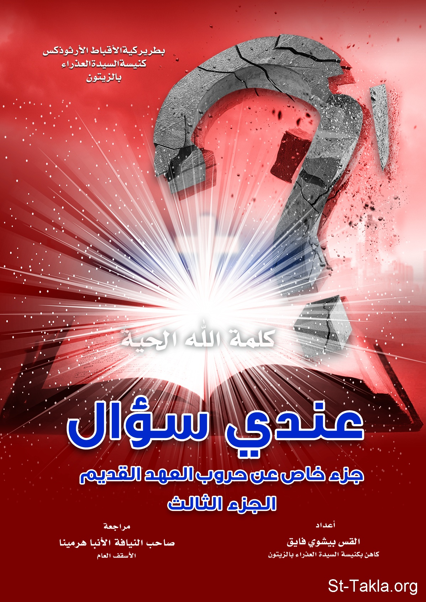

# عندي سؤال (الجزء الثالث: جزء خاص عن حروب العهد القديم)

**المؤلف / Author:** القس بيشوي فايق
**المصدر / Source:** [st-takla.org](https://st-takla.org/books/fr-bishoy-fayek/question-3/index.html)
**الموضوعات / Topics:** —

📘 **[Download EPUB / تحميل الكتاب](question-3.epub)**

## نبذة

نشكر القس بيشوي فايق يوسف على السماح لنا في موقع الأنبا تكلا هيمانوت بوضع هذا الكتاب هنا.

## الفصول / Chapters (6)

1. [المقدمة - كتاب عندي سؤال (الجزء الثالث)](chapters/01-introduction/)
2. [هل تندرج حروب العهد القديم تحت مسمى: "العنف باسم الدين"؟ وما الفرق بين هذه الحروب، وبين ما نراه في العصر الحديث من حروب وأعمال وحشية باسم الدين غرضها الحقيقي فرض الهيمنة وترويع البشر؟ - كتاب عندي سؤال (الجزء الثالث)](chapters/02-01/)
3. [لماذا يسمح الله بهلاك مدينة بأكملها كمدينة نينوى؟ وما ذنب من فيها من أطفال ونساء وعجائز؟ - كتاب عندي سؤال (الجزء الثالث)](chapters/03-02/)
4. [كيف يتفق صلاح الله وحبه مع أمره، وسماحه بالحروب المدمرة، أليست هذه الحروب شرًا؟ - كتاب عندي سؤال (الجزء الثالث)](chapters/04-03/)
5. [قاد الله شعبه إسرائيل من مصر إلى كنعان، وأمرهم بمحاربة سكان تلك البلاد، وطردهم من بلادهم؛ فهل هناك مبررات منطقية لتلك الحروب؟ - كتاب عندي سؤال (الجزء الثالث)](chapters/05-04/)
6. [كيف يأمر الله بتحريم أريحا أي: بقتل كل إنسان وحيوان، وتدمير الممتلكات، ولماذا يأمر الله بقتل عاخان بن كرمي، بسبب أخذه بعض الأمتعة، التي كانت ستحرق؟ - كتاب عندي سؤال (الجزء الثالث)](chapters/06-05/)

---
*هذا الكتاب مجاني للنشر والتوزيع لخلاص كل نفس. This book is free to share and distribute for the salvation of every soul.*
