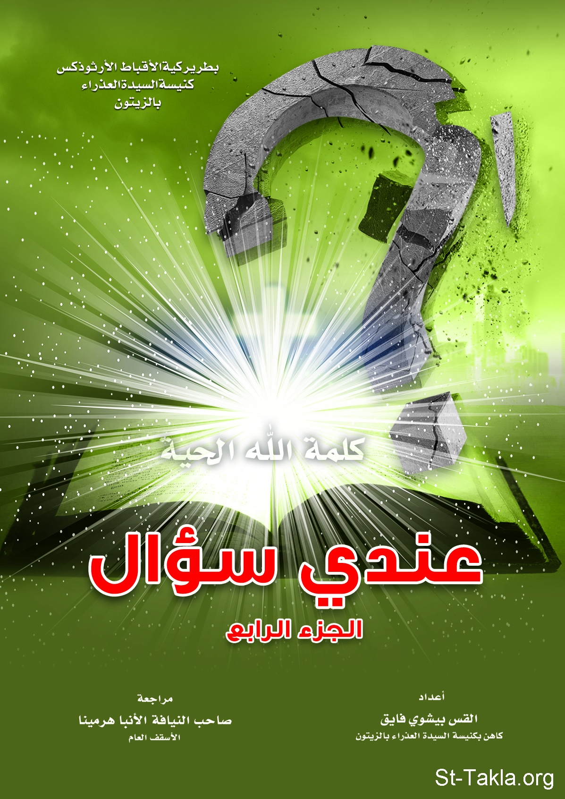

# عندي سؤال (الجزء الرابع)

**المؤلف / Author:** القس بيشوي فايق
**المصدر / Source:** [st-takla.org](https://st-takla.org/books/fr-bishoy-fayek/question-4/index.html)
**الموضوعات / Topics:** —

📘 **[Download EPUB / تحميل الكتاب](question-4.epub)**

## نبذة

نشكر القس بيشوي فايق يوسف على السماح لنا في موقع الأنبا تكلا هيمانوت بوضع هذا الكتاب هنا (1) .

## الفصول / Chapters (14)

1. [مقدمة](chapters/01-introduction/)
2. [هل تُرغم المسيحية كل مسيحي على الاقتناع بكل تعاليم المسيح وأفكاره؟ وتعتبر كل تصرفاته خلال فترة حياته على الأرض هي المثلى؟](chapters/02-01/)
3. [كيف يخلق الله الشر: "مُصَوِّرُ ٱلنُّورِ وَخَالِقُ ٱلظُّلْمَةِ، صَانِعُ ٱلسَّلَامِ وَخَالِقُ ٱلشَّرِّ. أَنَا ٱلرَّبُّ صَانِعُ كُلِّ هَذِهِ"؟ وهل يعتبر ما يسمح به الله من حروب وكوارث شرًّا موجهًا لبني البشر؟ وهل يتناقض ذلك مع قوله: "فَمَنْ يَعْرِفُ أَنْ يَعْمَلَ حَسَنًا وَلاَ يَعْمَلُ، فَذلِكَ خَطِيَّةٌ لَهُ"؟](chapters/03-02/)
4. [إن كان الله كلي الصلاح فلماذا خلق الشر؟ وإن كان الله لم يخلقه فلماذا يسمح بوجوده؟ ولماذا يسمح الله بحياة من يعلم بسابق علمه أنهم سيهلكون بسبب كثرة شرورهم؟!](chapters/04-03/)
5. [هل سماح الله بحدوث الشر يعني تركه للأشرار يواصلون فعل شرورهم بحرية، دون تدخل منه؟ وإن كان الله يتدخل أحيانًا لإيقاف شر الإنسان، ألا يعتبر ذلك سلبًا لحريته التي سبق، ومنحها الله له؟](chapters/05-04/)
6. [إن كان الأشرار هم المتسببون في الكثير من الشدائد، التي تضر بإخوتهم في البشرية، فما هي الحكمة من وراء سماح الله لهم بالتسبب في الضيق، والضرر لإخوتهم؟](chapters/06-05/)
7. [هل لن يكون لدى الإنسان في الحياة الأبدية إمكانية للتفكير بحرية في الشر؟ وألا يعتبر ذلك تحكمًا في حرية الأمناء من البشر، الذين ينتظرون المكافأة من الله؟ وهل يجبر الله بني البشر على التسبيح الدائم في الملكوت؟ ألا يعتبر ذلك أيضًا نوعًا من العبودية؟!](chapters/07-06/)
8. [ماذا يفعل البسطاء والعامة من الناس أمام فلسفات الديانات الكثيرة، التي قد تبدو منطقية؟ وماذا يميز الإيمان المسيحي؟ وهل على مَنْ يبحث عن الحق أن يدرس كل هذه الفلسفات؟ وهل نحن مسيحيون لأننا وُلدنا هكذا في الإيمان المسيحي؟](chapters/08-07/)
9. [ظهورات الله في سفر التكوين متعددة، للآباء البطاركة (إبراهيم وإسحق ويعقوب)، وفي حياة موسى النبي، ولكن لا يوجد مثيلٌ لمثل هذه الظهورات في عددها وتنوعها مع شخصيات الكتاب اللاحقين. فلماذا هؤلاء بالذات؟ وما هي مدلولاتها؟](chapters/09-08/)
10. [هل قال الرب يسوع للمرأة التي أُمسكت في ذات الفعل (الزنا): "ولا أنا أدينك"، لأن فداءه المقدم على الصليب لم يكن قد تم بعد؟ أم لأنها كانت تائبة؟ وهل خالف الرب شريعة العهد القديم، لأنه لم يحكم برجمها؟](chapters/10-11/)
11. [هل الله يجرب البشر؟ وإن كانت الإجابة بالنفي، فكيف يتفق ذلك مع امتحان الله أب الآباء إبراهيم بحسب قول الكتاب: "وَحَدَثَ بَعْدَ هذِهِ الأُمُورِ أَنَّ اللهَ امْتَحَنَ إِبْرَاهِيمَ، فَقَالَ لَهُ: "يَا إِبْرَاهِيمُ!". فَقَالَ: "هأَنَذَا".](chapters/11-12/)
12. [هل الله هو المسبب للضيقات (الأمراض، الحروب، والاضطهادات، المجاعات والكوارث..) أم الشيطان؟](chapters/12-13/)
13. [هل يعتمد عمل الله مع النفس البشرية على صلوات، وطلبات أحبائها؟ وإن لم يوجد أحد من البشر يصلي لأجل الضالين، والبعيدين، هل لا يخلصهم الله، أم يُأخر تدخله انتظارًا منه لصلوات البشر؟ وهل هناك قيمة للصلوات، التي نقدمها لأجل الآخرين؟](chapters/13-14/)
14. [هل الصلاة لأجل الخاطئين البعيدين عن الله أمر واجب على أولاد لله؟ وهل نصلي لأجل الضالين بالرغم من إصرارهم على عدم التوبة؟ وما فائدة الصلاة لأجل الرافضين للتوبة؟ وبماذا نصلي أو نطلب لأجلهم؟](chapters/14-15/)

---
*هذا الكتاب مجاني للنشر والتوزيع لخلاص كل نفس. This book is free to share and distribute for the salvation of every soul.*
