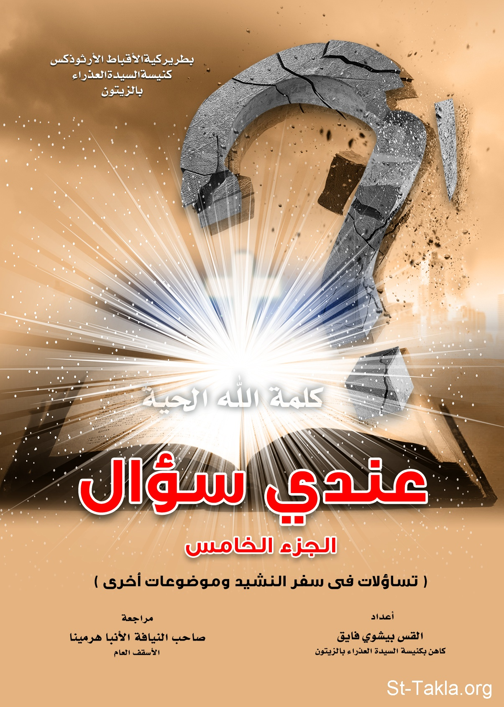

# عندي سؤال (الجزء الخامس)

**المؤلف / Author:** القس بيشوي فايق
**المصدر / Source:** [st-takla.org](https://st-takla.org/books/fr-bishoy-fayek/question-5/index.html)
**الموضوعات / Topics:** —

📘 **[Download EPUB / تحميل الكتاب](question-5.epub)**

## نبذة

نشكر القس بيشوي فايق يوسف على السماح لنا في موقع الأنبا تكلا هيمانوت بوضع هذا الكتاب هنا.

## الفصول / Chapters (16)

1. [المقدمة](chapters/01-introduction/)
2. [لماذا يعبر الوحي الإلهي عن حب الله للنفس أو للكنيسة بقصص شعرية بين حبيب، وحبيبته في سفر نشيد الأنشاد؟ ولماذا لم يستخدم الوحي الإلهي أي أسلوب آخر للتعبير عن هذه المحبة؟ وما أهمية دراسة مثل هذا السفر؟](chapters/02-01/)
3. [كُتبَ سفر نشيد الأنشاد بأسلوب شعري رمزي، وهو حوار خاص بين عريس وعروسه (شولميت)؟ فما هي الطريقة المثلى لدراسته، وفك رموزه الكثيرة، حتى نحقق الاستفادة المثلى من دراسته؟](chapters/03-02/)
4. [إن كان ليس عند الله محاباة؛ فلماذا جاء الرب يسوع ابن الله الحي إلى اليهود، ولماذا اعتَبَر الوحي الإلهي اليهود خاصة للرب يسوع بحسب قول الكتاب المقدس: "إلى خاصته جاء وخاصته لم تقبله"؟ ولماذا وجه الرب يسوع رسالته لهم أولًا، كما هو ثابت في هذا النص الإنجيلي؟!](chapters/04-03/)
5. ["وَلأَجْلِ هذَا سَيُرْسِلُ إِلَيْهِمُ اللهُ عَمَلَ الضَّلاَلِ، حَتَّى يُصَدِّقُوا الْكَذِبَ" (2تس2: 11). في النص السابق يذكر الوحي الإلهي صراحة أن الله سيرسل للناس عمل الضلال؛ فهل يتفق هذا مع صلاح الله؟! وإن كنا نؤمن بصلاح الله المطلق فكيف يرسل الله الصالح عمل الضلال، وهو قدوس لا يعرف شرًا؟](chapters/05-04/)
6. ["اَلْحَقَّ أَقُولُ لَكُمْ: "لِكَيْ يَأْتِيَ عَلَيْكُمْ كُلُّ دَمٍ زكِيٍّ سُفِكَ عَلَى الأَرْضِ، مِنْ دَمِ هَابِيلَ الصِّدِّيقِ إِلَى دَمِ زَكَرِيَّا بْنِ بَرَخِيَّا الَّذِي قَتَلْتُمُوهُ بَيْنَ الْهَيْكَلِ وَالْمَذْبَحِ. اَلْحَقَّ أَقُولُ لَكُمْ: إِنَّ هذَا كُلَّهُ يَأْتِي عَلَى هذَا الْجِيلِ!" (مت23: 36). لماذا عاقب الرب يسوع بحسب النص السابق ذلك الجيل بأكمله؟ ولماذا يتحمل هذا الجيل بالذات مسؤولية قتل كل الأنبياء السابقين الذين لم يكونوا معاصرين لهم؟](chapters/06-05/)
7. [أحب قيافا أمته، ولهذا دفعه حبه لتسليم الرب يسوع للرومان حفاظًا على وطنه وأهله. فلماذا يعتبره الكثيرون مجرمًا في حق الرب يسوع، ولا يعتبرونه قد تصرف بحكمة، ليٌجنِّب بلاده أي خطر؟ ولماذا يُعتبرمجرمًا مع أن السماء قد أعلنت له أن موت الرب يسوع سيكون خيرًا للأمة كلها؟ وهل يستحق الدينونة على حبه لأٌمَّتِه؟](chapters/07-06/)
8. [يصف موسى النبي الله في سفر العدد، أنه طويل الروح كثير الإحسان، غافر الإثم والسيئة، لكنه في سياق الحديث يعود، وينسب لله محاسبته الأبناء عن ذنوب آبائهم، فكيف يتفق الأمرين معًا؟! ألا يعتبر هذا تناقض؟](chapters/08-07/)
9. [تبهر المعجزات الناس ويعتبرها الكثيرون وسيلة فعالة للكرازة. لماذا لم يستغل الرب يسوع المسيح معجزة قيامته في الكرازة بصورة أكثر فاعلية، وذلك بظهوره بعد القيامة بطريقة علنية فوق أحد جبال أورشليم مثلًا، لكي يراه الكثيرون ويؤمنوا به؟](chapters/09-08/)
10. [لماذا لم يعطِ الله فرصة توبة ثانية لحنانيا وسفيرة، مع أنه قد أعطى فرصة ثانية لبطرس الرسول، بعد إنكاره للمسح؟ وإن كان الله قد تعامل معهما بحزم، لأن الكنيسة في زمن نشأتها المبكر كانت تحتاج إلى تأكيد مهابة ومخافة الله، فلماذا يكونان ضحية من أجل تعليم الشعب درسًا روحيًا؟ وما ذنبهما ليموتا في ذلك الوقت؟ وهل دخلا حنانيا وسفيرة الفردوس؟](chapters/10-09/)
11. [وُصِفَ إيليا النبي بالنبي الناري، فهل هذه الصفة دليل قسوة النبي، الذي طلب انقطاع سقوط المطر على أرضه، وتسبب في مجاعة كارثية لبلاده؟ وكيف نفسر حرقه لخمسين رجلًا (جندي) مع قائدهم، لأنهم أتوا لاستدعائه من قبل الملك، وتكرار الأمر مع خمسين آخرين مع قائدهم. ما ذنب الجنود الذين أتوا لينفذوا أمرًا ملكيًا؟!](chapters/11-10/)
12. [أمر الرب يسوع تلاميذه الأطهار بعمل العشاء الرباني، وذلك تذكارًا لموته، وفدائه العظيم، ولكن البعض يتساءل كيف يُذَكِرّنا الخبز والخمر بموت الرب؟ وأي ذكرى قصدها الرب من وراء هذا العشاء؟ وهل يُعتَبر عيد الفصح اليهودي تذكارًا ورمزًا أعظم لموت الرب وفدائه، وذلك لما يتضمنه طقسه من خروف يذبح، ويسفك دمه، ويشوى على النار؟](chapters/12-11/)
13. [لماذا تتمسك الكنيسة في عبادتها بأمور قد تبدو شكلية مثل طلب الشماس من المصلين الوقوف، أو السجود أثناء القداس الإلهي؟ ولماذا تطّالب الكنيسة أبناءها بالانقطاع عن الطعام قبل التناول، مع أن الرب وتلاميذه أكلوا الفصح قبل العشاء الرباني؟ ولماذا يتدخل الآباء في حرية الناس بمطالبتهم بالالتزام بحشمة الملبس؟ أليس كل هذه الأمور خارجية، ولا تمس القلب، وتصعب على الناس التناول من الأسرار الإلهية؟](chapters/13-12/)
14. [التناول من الأسرار المقدسة أمرٌ واجب وحيوي لكل مسيحي، ولكن الكنيسة ممثلة في آبائها تصر على ممارسة سر التوبة والاعتراف للراغبين في التناول، وتؤكد على المتناولين ضرورة الحضور للقداس مبكرًا، وتطالب المتخاصمين بالصلح مع من خاصموه أولًا. أليس غرض الحضور هو التناول لنوال الحياة الأبدية؟ فلماذا التركيز على مثل هذه الأمور؟! أليس من الأفضل التساهل لاجتذاب الكثيرين؟](chapters/14-13/)
15. [هناك كثير من الملحدين، الذين يتمتعون بأخلاق حميدة، ويُشهد لهم برقة المشاعر، وهم يعملون الخير دون توقع مكافأة سماوية؟ فهل وجود الخير خارج نطاق المؤمنين بالله يؤكد فكرة إنكار وجود الله، الذي يعتبره المؤمنون المحرك، والدافع لكل ما يفعلونه من خير؟](chapters/15-14/)
16. [هل سينعم الكثيرون من البشر، ممن ولدوا فاقدي الإدراك الذهني بالنعيم الأبدي، بالرغم من عدم إدراكهم للمفاهيم الإيمانية، التي تُمَكَّن الإنسان من اختيار الطريق إلى الحياة الأبدية؟](chapters/16-15/)

---
*هذا الكتاب مجاني للنشر والتوزيع لخلاص كل نفس. This book is free to share and distribute for the salvation of every soul.*
