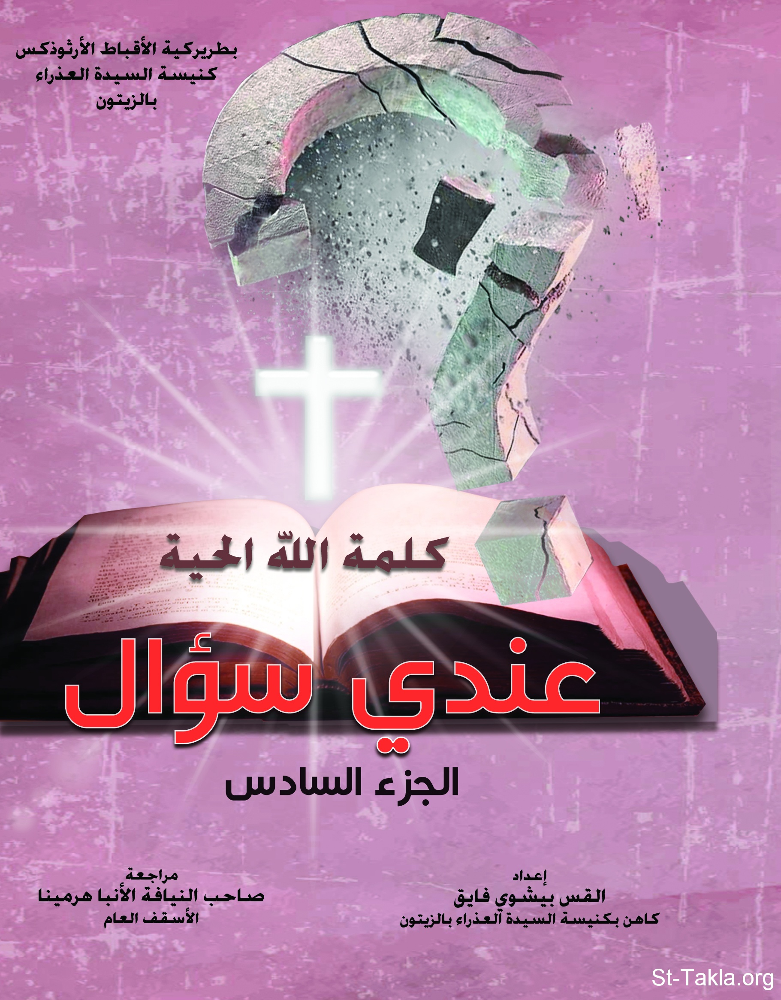

# عندي سؤال (الجزء السادس)

**المؤلف / Author:** القس بيشوي فايق
**المصدر / Source:** [st-takla.org](https://st-takla.org/books/fr-bishoy-fayek/question-6/index.html)
**الموضوعات / Topics:** —

📘 **[Download EPUB / تحميل الكتاب](question-6.epub)**

## نبذة

نشكر القس بيشوي فايق يوسف على السماح لنا في موقع الأنبا تكلا هيمانوت بوضع هذا الكتاب هنا.

## الفصول / Chapters (17)

1. [- كتاب عندي سؤال (الجزء السادس)](chapters/01-introduction/)
2. [لماذا عاقب الله زكريا الكاهن، عندما تساءل عن كيفية إنجاب طفل وهو في سن الشيخوخة، بينما لم يحدث هذا مع القديسة مريم العذراء، عندما سألت الملاك عن كيفية حبلها، وولادتها للسيد المسيح؟](chapters/02-01/)
3. ["إنْ كُنْتُ أَشْهَدُ لِنَفْسِي فَشَهَادَتِي لَيْسَتْ حَقًّا"، فهل شهادة الرب عن نفسه ليست حق؟ ولماذا عاد الرب وقال: "إن كنت أشهد لنفسي فشهادتي حق". ألاَّ يعتبر ذلك تناقض؟](chapters/03-02/)
4. [أوصى الرسول بولس المتزوجون قائلًا: "فأوصيهم لا أنا بل الرب" (عدد 10)، ثم عاد وقال "فأقول لهم أنا لا الرب". ولكنه عاد ليؤكد أنه أيضًا عنده روح الرب. هل معلمنا بولس الرسول يبدي أرائه الشخصية، أم يتكلم بوحي إلهي؟](chapters/04-03/)
5. [كيف قدم يفتاح الجلعادي ابنته ذبيحة محرقة لله، أليس في ذلك وحشية وقساوة؟! وإن لم يكن يفتاح قد قدمها ذبيحة بشرية فلماذا تبكي الصبية وصاحباتها على عذراويتها؟](chapters/05-04/)
6. [كيف تمكنت امرأة عرافة من إحضار روح صموئيل النبي إلى شاول الملك، والذي استشاره فأخبره بأمور مستقبلية؟ وهل اعتقاد البعض أن الله هو الذي سمح للعرافة بإحضار روح صموئيل لشاول صحيح؟](chapters/06-05/)
7. [يتسائل البعض قائلًا: لماذا يصب الرب يسوع اللعنات والويلات على الأمة الإسرائيلية التي سبق وبارك الكثيرين من آباء وملوك وأنبياء شعبها؟ وهل تخرج اللعنات من فم الرب القدوس، الذي علمنا أن نُبارك، ولا نَلعن؟](chapters/07-06/)
8. [لماذا يستخدم الله شعبه في إقامة القضاء على شعوب أخرى، ولماذا لا يبيد الله الأشرار بضربات من السماء؟](chapters/08-07/)
9. [لماذا يسمح الله بموت الأطفال الأبرياء المولودين من آباء أشرار مع آبائهم أثناء حروب العهد القديم؟ ولماذا يموت أطفال رضع مع من ماتوا ضمن ضربة أبكار مصر؟ ولماذا لم يُنَجّ الله الكثير من أطفال العبرانيين، كما نجى الطفل موسى النبي من الموت؟](chapters/09-08/)
10. [ما هو المقصود بكلمة الغيبيات؟ وكيف أميز بينها وبين موهبة التنبؤ، وماذا عن أشخاص يدَّعون معرفتهم الغيب؟](chapters/10-09/)
11. [لماذا يطالب الكتاب المقدس الناس بالقناعة والتقوى بدلًا من حثهم على الطموح في الحياة؟ هل هو ضد الطموح والنجاح؟ وما هو موقفه من الطموح؟ وهل من الممكن أن يتسبب الطموح في ضرر أو شر؟ وهل الشخص الروحاني هو شخص طموح؟](chapters/11-10/)
12. [لماذا يتخذ الكتاب المقدس موقفًا عدائيًا من المال؛ فيعتبره أصل كل الشرور، ويطالب المؤمنين بعدم إلقاء رجائهم على الغنى، ثم يعود ويقول أن الله يمنحنا كل شيء بغنى للتمتع؟ فإن كان الغنى للتمتع فلماذا هذا التناقض؟](chapters/12-11/)
13. [يُعَّلم الإنجيل بمبدأ الاتكال على الله، فهل هذا المبدأ يتعارض مع التدبير والتخطيط لأمور الحياة؟ وهل علينا أن نترك أمر المستقبل لمشيئة الله بدلًا من العمل، متكلين على أمر الله بعدم الاهتمام بالغد؟](chapters/13-12/)
14. [هل خدام الإنجيل يُسَكِّنون الناس بالكلام المعسول، ويوحون لهم بتدخل الله ورعايته؛ ففي الخير يسارعون بالحديث عن حب الله وصلاحه، وفي الضرر يطالبونهم بحمد الله، وإذا أصاب الناس مكروه عظيم برروا حدوثه بالفائدة الروحية؟](chapters/14-13/)
15. [هل الاختبار الشخصي أو العلاقة الشخصية مع الرب يسوع المسيح هي ثمرة وهم وإيحاء، وليس لها أساس من الصحة؟](chapters/15-14/)
16. [حول رسائل: "أن العذراء قد ظهرت لأحد الأشخاص وكلفته إبلاغ الناس بقرب مجيء الرب يسوع المسيح، ثم يأمر المُبلغ المرسل إليهم بضرورة نسخ هذه الرسالة، وإرسالها لعدد 20 شخصًا، ثم يذكر الراسل عقوبات لمن لا يطيع أمره بإبلاغ الرسالة للآخرين، ومكافآت لمن يطيع أوامره"](chapters/16-15/)
17. [لماذا لا يستجيب الله أحيانًا لطلبات البشر من المرضى والمتضايقين، مع أنه قد وعد بالاستجابة وهو صالح ورحوم ومحب للبشر؟ وهل عندما يصلي الإنسان يُغَيّر المشيئة الإلهية، وإن كانت المشيئة الإلهية لا تتغير أبدًا فلماذا نصلي إذًا؟](chapters/17-16/)

---
*هذا الكتاب مجاني للنشر والتوزيع لخلاص كل نفس. This book is free to share and distribute for the salvation of every soul.*
