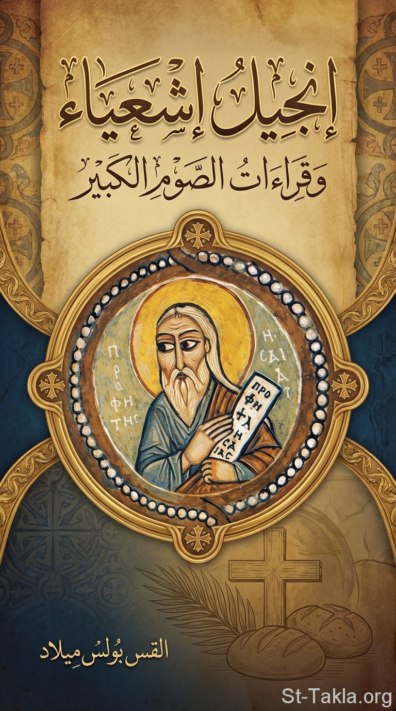

# إنجيل إشعياء وقراءات الصوم الكبير

**المؤلف / Author:** القس بولس ميلاد يوسف
**المصدر / Source:** [st-takla.org](https://st-takla.org/books/fr-boles-milad/isaiah-great-lent/index.html)
**الموضوعات / Topics:** —

📘 **[Download EPUB / تحميل الكتاب](isaiah-great-lent.epub)**

## نبذة

نشكر قدس أبونا القس بولس ميلاد يوسف لسماحه لموقع الأنبا تكلاهيمانوت بوضع هذا الكتاب هنا (وهو نشر إلكتروني غير مطبوع، منشور في الصوم الكبير 2026 م.) .

## الفصول / Chapters (8)

1. [مقدمة](chapters/01-introduction/)
2. [إشعياء في الأسبوع الأول من الصوم: أسبوع الاستعداد](chapters/02-treasures/)
3. [إشعياء في الأسبوع الثاني من الصوم: التجربة والنصرة](chapters/03-temptation/)
4. [إشعياء في الأسبوع الثالث من الصوم: أسبوع الابن الضال](chapters/04-prodigal-son/)
5. [إشعياء في الأسبوع الرابع من الصوم: أسبوع السامرية](chapters/05-samaritan-woman/)
6. [إشعياء في الأسبوع الخامس من الصوم: المخلع](chapters/06-paralyzed-man/)
7. [إشعياء في الأسبوع السادس من الصوم: المولود أعمى](chapters/07-man-born-blind/)
8. [إشعياء في الأسبوع السابع من الصوم: ختام الصوم](chapters/08-last-week/)

---
*هذا الكتاب مجاني للنشر والتوزيع لخلاص كل نفس. This book is free to share and distribute for the salvation of every soul.*
