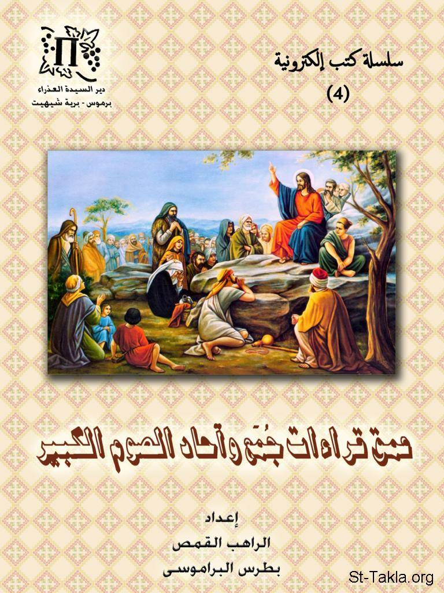

# عمق قراءات جمع وآحاد الصوم الكبير

**المؤلف / Author:** إعداد الراهب القمص بطرس البراموسي
**المصدر / Source:** [st-takla.org](https://st-takla.org/books/fr-botros-elbaramosy/great-lent-readings/index.html)
**الموضوعات / Topics:** —

📘 **[Download EPUB / تحميل الكتاب](great-lent-readings.epub)**

## نبذة

نشكر قدس أبونا الراهب القمص بطرس البراموسي على السماح لنا في موقع الأنبا تكلا هيمانوت بوضع هذا الكتاب هنا. وقد تم إعداده من خلال وضع قراءات الجُمَع والآحاد مع تفاسير وتأملات عليها من كتب ومراجع أخرى ، كمنشور إليكتروني غير مطبوع.

## الفصول / Chapters (16)

1. [مراجع](chapters/01-references/)
2. [الجمعة الأولي من الصوم الكبير: الاتكال على الله](chapters/02-friday-1/)
3. [أحد الكنوز: الأحد الأول من الصوم الكبير: الهداية إلى ملكوت الله](chapters/03-sunday-1/)
4. [الجمعة الثانية من الصوم الكبير: ثبات الجهاد](chapters/04-friday-2/)
5. [أحد التجربة: الأحد الثاني من الصوم الكبير: نصرة الجهاد](chapters/05-sunday-2/)
6. [الجمعة الثالثة من الصوم الكبير: أمان التوبة](chapters/06-friday-3/)
7. [أحد الابن الشاطر: الأحد الثالث من الصوم الكبير: قبول التوبة](chapters/07-sunday-3/)
8. [الجمعة الرابعة من الصوم الكبير: الإيمان بالإنجيل](chapters/08-friday-4/)
9. [أحد السامرية: الأحد الرابع من الصوم الكبير: عزة الإنجيل](chapters/09-sunday-4/)
10. [الجمعة الخامسة من الصوم الكبير: قصاص الإيمان](chapters/10-friday-5/)
11. [أحد المخلع: الأحد الخامس من الصوم الكبير: تشديد الإيمان](chapters/11-sunday-5/)
12. [الجمعة السادسة من الصوم الكبير: قيامة المعمودية](chapters/12-friday-6/)
13. [أحد المولود أعمى: الأحد السادس من الصوم الكبير: إنارة المعمودية](chapters/13-sunday-6/)
14. [جمعة ختام الصوم: الجمعة السابعة من الصوم الكبير: دينونة المخلص](chapters/14-friday-7/)
15. [أحد الشعانين: الأحد السابع من الصوم الكبير: دخول السيد المسيح إلى أورشليم هو طريق للقيامة](chapters/15-sunday-7/)
16. [عمق قراءات تذكار ظهور الصليب المحيي: أهمية وقوة الصليب](chapters/16-holy-cross/)

---
*هذا الكتاب مجاني للنشر والتوزيع لخلاص كل نفس. This book is free to share and distribute for the salvation of every soul.*
