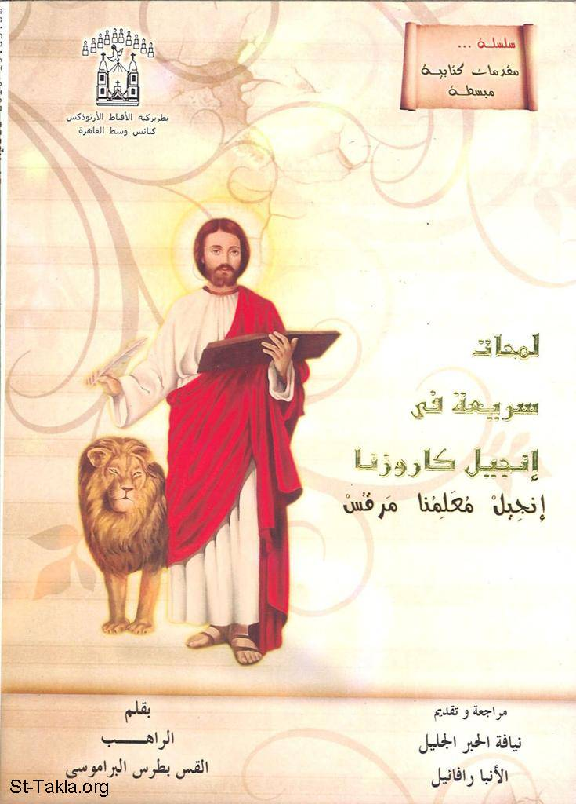

# لمحات سريعة في إنجيل كاروزنا

**المؤلف / Author:** الراهب القمص بطرس البراموسي
**المصدر / Source:** [st-takla.org](https://st-takla.org/Full-Free-Coptic-Books/FreeCopticBooks-025-Father-Botrous-El-Baramousy/002-Lamahat-Fy-Engeel-Morkos/Gospel-of-St-Mark-Study-00-index.html)
**الموضوعات / Topics:** —

📘 **[Download EPUB / تحميل الكتاب](lamahat-fy-engeel-morkos.epub)**

## نبذة

نشكر قدس أبونا الراهب القمص بطرس البرموسي على السماح لنا في موقع الأنبا تكلا بوضع هذا الكتاب هنا، وهو من سلسلة "مقدمات كتابية مبسطة".

## الفصول / Chapters (44)

1. [مقدمة لنيافة الحبر الجليل الأنبا رافائيل](chapters/01-Gospel-of-St-Mark-Study-01-Intro/)
2. [نشأة القديس مارمرقس](chapters/02-Gospel-of-St-Mark-Study-02-Start/)
3. [الأسد ومارمرقس](chapters/03-Gospel-of-St-Mark-Study-03-Lion/)
4. [تاريخ كتابة الإنجيل](chapters/04-Gospel-of-St-Mark-Study-04-History/)
5. [الدقة في إنجيل مار مرقس](chapters/05-Gospel-of-St-Mark-Study-05-Accuracy/)
6. [مارمرقس والرومان](chapters/06-Gospel-of-St-Mark-Study-06-Romans/)
7. [كيف قدَّم مارمرقس السيد المسيح للأمم](chapters/07-Gospel-of-St-Mark-Study-07-Gentiles/)
8. [السيد المسيح هو ابن الله](chapters/08-Gospel-of-St-Mark-Study-08-Son-of-God/)
9. [سلطان المسيح على الطبيعة وعلى الموت](chapters/09-Gospel-of-St-Mark-Study-09-Power/)
10. [التفاف الشعب حول السيد المسيح](chapters/10-Gospel-of-St-Mark-Study-10-People/)
11. [المسيح الملك](chapters/11-Gospel-of-St-Mark-Study-11-King/)
12. [المسيح المعلم](chapters/12-Gospel-of-St-Mark-Study-12-Teacher/)
13. [سلطان السيد المسيح على الشياطين](chapters/13-Gospel-of-St-Mark-Study-13-Devil/)
14. [سلطان السيد المسيح على الأمراض](chapters/14-Gospel-of-St-Mark-Study-14-Sick/)
15. [السرعة المذهلة في عرض أحداث حياة المسيح](chapters/15-Gospel-of-St-Mark-Study-15-Fast/)
16. [قصة الصليب والفداء](chapters/16-Gospel-of-St-Mark-Study-16-Salvation/)
17. [ما بين القديسين مرقس و بطرس](chapters/17-Gospel-of-St-Mark-Study-17-Peter/)
18. [أقسام السفر](chapters/18-Gospel-of-St-Mark-Study-18-Chapters/)
19. [أقسام الأصحاح الأول](chapters/19-Gospel-of-St-Mark-Study-19-Chapter-1/)
20. [أقسام الأصحاح الثاني](chapters/20-Gospel-of-St-Mark-Study-20-Chapter-2/)
21. [أقسام الأصحاح الثالث](chapters/21-Gospel-of-St-Mark-Study-21-Chapter-3/)
22. [أقسام الأصحاح الرابع](chapters/22-Gospel-of-St-Mark-Study-22-Chapter-4/)
23. [أقسام الأصحاح الخامس](chapters/23-Gospel-of-St-Mark-Study-23-Chapter-5/)
24. [أقسام الأصحاح السادس](chapters/24-Gospel-of-St-Mark-Study-24-Chapter-6/)
25. [أقسام الأصحاح السابع](chapters/25-Gospel-of-St-Mark-Study-25-Chapter-7/)
26. [أقسام الأصحاح الثامن](chapters/26-Gospel-of-St-Mark-Study-26-Chapter-8/)
27. [أقسام الأصحاح التاسع](chapters/27-Gospel-of-St-Mark-Study-27-Chapter-9/)
28. [أقسام الأصحاح العاشر](chapters/28-Gospel-of-St-Mark-Study-28-Chapter-10/)
29. [أقسام الأصحاح الحادي عشر](chapters/29-Gospel-of-St-Mark-Study-29-Chapter-11/)
30. [أقسام الأصحاح الثاني عشر](chapters/30-Gospel-of-St-Mark-Study-30-Chapter-12/)
31. [أقسام الأصحاح الثالث عشر](chapters/31-Gospel-of-St-Mark-Study-31-Chapter-13/)
32. [أقسام الأصحاح الرابع عشر](chapters/32-Gospel-of-St-Mark-Study-32-Chapter-14/)
33. [أقسام الأصحاح الخامس عشر](chapters/33-Gospel-of-St-Mark-Study-33-Chapter-15/)
34. [أقسام الأصحاح السادس عشر](chapters/34-Gospel-of-St-Mark-Study-34-Chapter-16/)
35. [بعض أمثال السيد المسيح في إنجيل مرقص](chapters/35-Gospel-of-St-Mark-Study-35-Proverbs/)
36. [مثل البذار](chapters/36-Gospel-of-St-Mark-Study-36-Seeds/)
37. [مثل الزارع](chapters/37-Gospel-of-St-Mark-Study-37-Plant/)
38. [رفض السيد المسيح في وطنه](chapters/38-Gospel-of-St-Mark-Study-38-Rejection/)
39. [مثل الكرم والكرامين الأشرار](chapters/39-Gospel-of-St-Mark-Study-39-Vineyard/)
40. [السيد المسيح يتحدث عن خراب العالم وعلامات المجيء والنهاية](chapters/40-Gospel-of-St-Mark-Study-40-End/)
41. [بعض أحداث مشتركة في إنجيل القديس مرقس وإنجيل القديس لوقا](chapters/41-Gospel-of-St-Mark-Study-41-Common-/)
42. [أحداث مرقس 1 المشتركة مع إنجيل لوقا](chapters/42-Gospel-of-St-Mark-Study-42-Common-1/)
43. [أحداث مرقس 3 المشتركة مع إنجيل لوقا](chapters/43-Gospel-of-St-Mark-Study-43-Common-3/)
44. [أحداث مرقس 4 المشتركة مع إنجيل لوقا](chapters/44-Gospel-of-St-Mark-Study-44-Common-4/)

---
*هذا الكتاب مجاني للنشر والتوزيع لخلاص كل نفس. This book is free to share and distribute for the salvation of every soul.*
