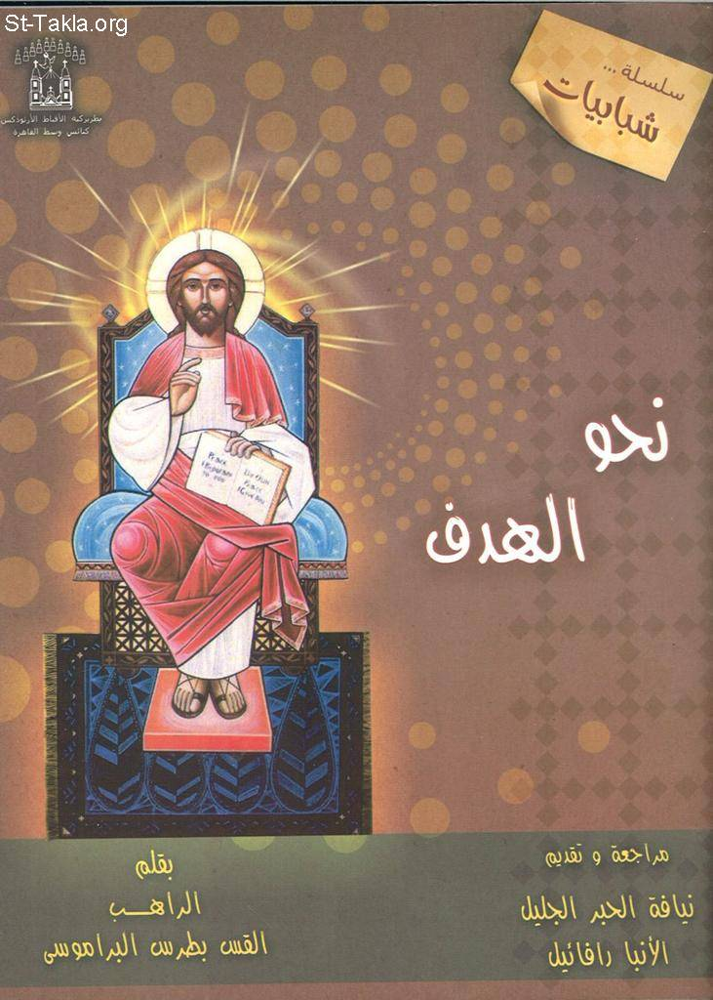

# نحو الهدف

**المؤلف / Author:** الراهب القمص بطرس البراموسي
**المصدر / Source:** [st-takla.org](https://st-takla.org/books/fr-botros-elbaramosy/target/index.html)
**الموضوعات / Topics:** —

📘 **[Download EPUB / تحميل الكتاب](target.epub)**

## نبذة

نشكر قدس أبونا الراهب القمص بطرس البراموسي على السماح لنا في موقع الأنبا تكلا بوضع هذا الكتاب هنا. وكانت طبعته الأولى في مارس 2010 .

## الفصول / Chapters (21)

1. [مقدمة الأنبا رافائيل الأسقف العام](chapters/01-intro/)
2. [أسباب نجاح الكثيرين](chapters/02-success/)
3. [هدفنا الوحيد هو الله](chapters/03-target/)
4. [أهداف زائفة](chapters/04-fake/)
5. [الذات](chapters/05-ego/)
6. [الحب هو بذل الذات](chapters/06-love/)
7. [الإنسان الذي هدفه الله لا يتأذى](chapters/07-god/)
8. [بدأ بالخدمة وانتهى بالذات](chapters/08-service/)
9. [ثبات الهدف](chapters/09-steady/)
10. [لا تكن متزعزعًا](chapters/10-shaky/)
11. [لا يجتمع النور مع الظلمة](chapters/11-light/)
12. [هل أنت سمكة أم قطعة خشب؟!](chapters/12-fish/)
13. [هل هدفك هو الله؟](chapters/13-only/)
14. [الوعود الكثيرة](chapters/14-promises/)
15. [أسباب البدء](chapters/15-reasons/)
16. [أهم شيء أن تبدأ وتستمر](chapters/16-continue/)
17. [لا تكن كثير الوعود](chapters/17-many/)
18. [أقوم الآن](chapters/18-now/)
19. [متى تقول "أقوم الآن"](chapters/19-when/)
20. [عليك بالإصلاح الداخلي](chapters/20-inside/)
21. [نق أولًا داخل الكأس](chapters/21-cup/)

---
*هذا الكتاب مجاني للنشر والتوزيع لخلاص كل نفس. This book is free to share and distribute for the salvation of every soul.*
