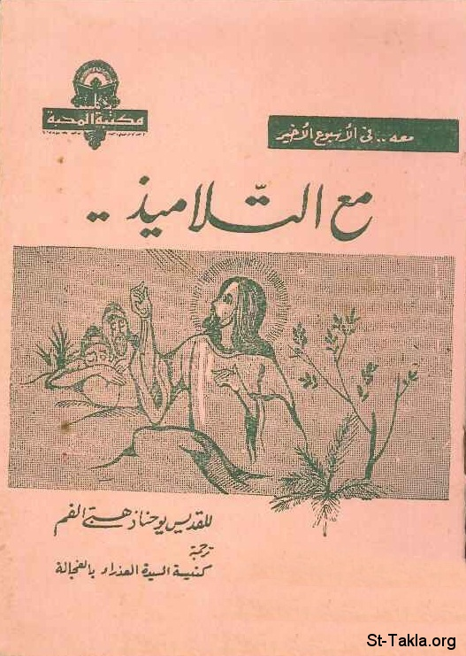

# مع التلاميذ.. (للقديس يوحنا ذهبي الفم)

**المؤلف / Author:** تعريب: القمص متياس فريد وهبة
**المصدر / Source:** [st-takla.org](https://st-takla.org/books/fr-matthias-farid/disciples/index.html)
**الموضوعات / Topics:** —

📘 **[Download EPUB / تحميل الكتاب](disciples.epub)**

## نبذة

نشكر أسرة قدس أبونا القمص متياس فريد وهبة على السماح لنا في موقع الأنبا تكلا هيمانوت بوضع هذه الكتب هنا (وذلك من خلال ابنه أ. جون وهبة).

## الفصول / Chapters (5)

1. [مقدمة: معه.. في الأسبوع الأخير](chapters/01-introduction/)
2. [مع التلاميذ.. في بيت عنيا](chapters/02-bethany/)
3. [مع يهوذا الخائن](chapters/03-judas/)
4. [مع التلاميذ.. في الفصح الأخير](chapters/04-passover/)
5. [معهم في سر الشكر](chapters/05-eucharist/)

---
*هذا الكتاب مجاني للنشر والتوزيع لخلاص كل نفس. This book is free to share and distribute for the salvation of every soul.*
