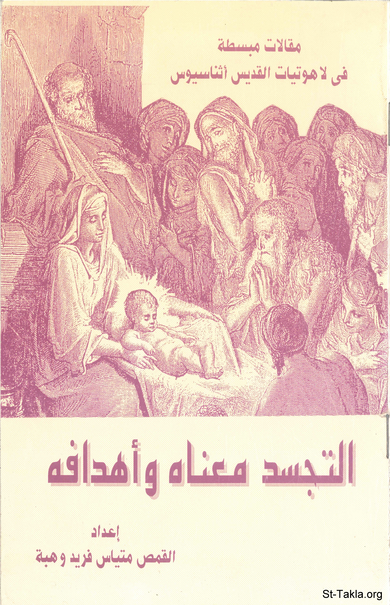

# التجسد: معناه وأهدافه

**المؤلف / Author:** القمص متياس فريد وهبة
**المصدر / Source:** [st-takla.org](https://st-takla.org/books/fr-matthias-farid/incarnation/index.html)
**الموضوعات / Topics:** —

📘 **[Download EPUB / تحميل الكتاب](incarnation.epub)**

## نبذة

نشكر أسرة قدس أبونا القمص متياس فريد وهبة على السماح لنا في موقع الأنبا تكلا هيمانوت بوضع هذا الكتاب هنا (وذلك من خلال ابنه أ. جون وهبة).

## الفصول / Chapters (6)

1. [مقدمة](chapters/01-introduction/)
2. [ما هو التجسد](chapters/02-meaning/)
3. [لماذا التجسد](chapters/03-why/)
4. [الخلاص](chapters/04-salvation/)
5. [معرفة الله](chapters/05-knowing-god/)
6. [خاتمة](chapters/06-epilogue/)

---
*هذا الكتاب مجاني للنشر والتوزيع لخلاص كل نفس. This book is free to share and distribute for the salvation of every soul.*
