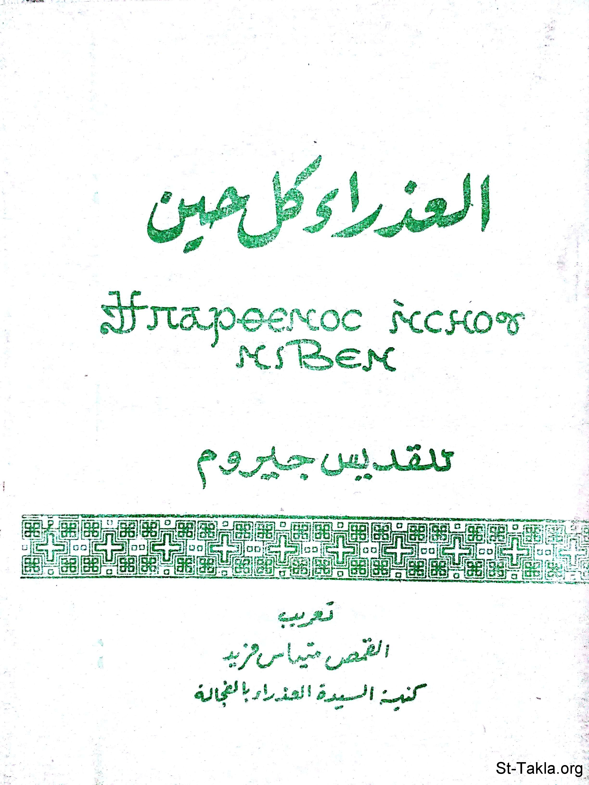

# العذراء كل حين (للقديس جيروم)

**المؤلف / Author:** القمص متياس فريد وهبة
**المصدر / Source:** [st-takla.org](https://st-takla.org/books/fr-matthias-farid/virgin/index.html)
**الموضوعات / Topics:** —

📘 **[Download EPUB / تحميل الكتاب](virgin.epub)**

## نبذة

نشكر أسرة قدس أبونا القمص متياس فريد وهبة على السماح لنا في موقع الأنبا تكلا هيمانوت بوضع هذا الكتاب هنا (وذلك من خلال ابنه أ. جون وهبة).

## الفصول / Chapters (5)

1. [مقدمة](chapters/01-introduction/)
2. [قبل أن يجتمعا](chapters/02-before/)
3. [حتى ولدت ابنها البكر](chapters/03-until/)
4. [ابنها البكر](chapters/04-firstborn/)
5. [لا نحتقر الزواج](chapters/05-marriage/)

---
*هذا الكتاب مجاني للنشر والتوزيع لخلاص كل نفس. This book is free to share and distribute for the salvation of every soul.*
