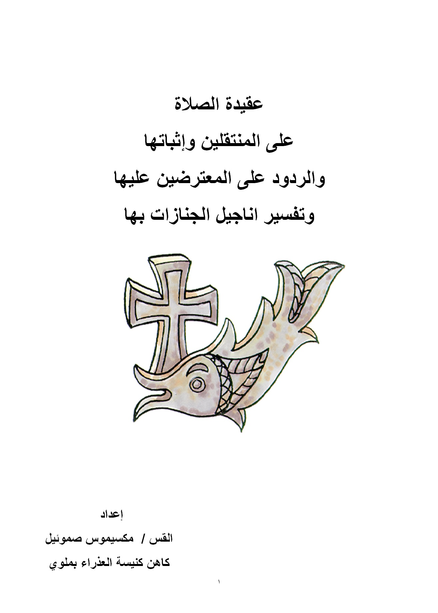

# عقيدة الصلاة على المنتقلين

**المؤلف / Author:** القس مكسيموس صموئيل
**المصدر / Source:** [st-takla.org](https://st-takla.org/books/fr-maximos-samuel/prayer-for-departed/index.html)
**الموضوعات / Topics:** —

📘 **[Download EPUB / تحميل الكتاب](prayer-for-departed.epub)**

## نبذة

نشكر القس مكسيموس صموئيل على السماح لنا في موقع الأنبا تكلا هيمانوت بوضع هذا الكتاب هنا.

## الفصول / Chapters (56)

1. [أسباب الصلاة على الراقدين](chapters/01-resons/)
2. [الصلاة لأجل الآخرين: أحياء وأموات](chapters/02-pray/)
3. [تقديم صلوات من أناس عن آخرين بدون طلب أو بطلب منهم وقبول الرب لوساطتهم](chapters/03-intercession/)
4. [المنتقلين كبشر لا يخلون من الخطايا العرضية لذا يجب أن يُصَلَّى من أجلهم](chapters/04-sins/)
5. [جميع المنتقلين لم يدانوا بعد بل هم في حالة انتظار سواء الأبرار أم الأشرار](chapters/05-still/)
6. [تغلب الرحمة على العدل يوم الدينونة](chapters/06-mercy-vs-justice/)
7. [تصريح السيد المسيح بوجود مغفرة في العالم الآتي](chapters/07-forgiving/)
8. [شهادة التقليد عن الصلاة على الموتى](chapters/08-tradition/)
9. [شهادة التقليد الرسولي من الكتاب المقدس والدسقولية وقوانين الآباء وبعض المجامع عن الصلاة على الموتى](chapters/09-laws/)
10. [تقليدات الآباء - أقوال الآباء في الصلاة علي الموتى](chapters/10-patristic/)
11. [مباشرة الكنيسة المسيحية في عصرها الرسولي للصلاة على المنتقلين](chapters/11-early-church/)
12. [التصريح بجواز الطلب عمن لم يخطئوا للموت](chapters/12-church-allow/)
13. [تقديم الصلاة من أجل الموتى في سفر المكابيين الثاني](chapters/13-2-maccabees/)
14. [ردودًا مبسطة على بدعة المطهر عند الكاثوليك](chapters/14-answering-purgatory/)
15. [إثباتات الصلاة على المنتقلين](chapters/15-proofs/)
16. [بعض الأدلة الكتابية على خلود النفس والقيامة](chapters/16-biblical-proofs/)
17. [ردودًا على بعض الاعتراضات في موضوعات متعلقة بالصلاة على المنتقلين](chapters/17-answers/)
18. [الأدلة الكتابية التي تؤيد عدم الحصول (بالنسبة للقديسين) على السعادة الكاملة الآن](chapters/18-not-fully-now/)
19. [الأدلة الكتابية التي تثبت أن هلاك الأشرار التام لا يكون إلا بعد الدينونة](chapters/19-doom-of-sinfuls/)
20. [الأدلة الكتابية التي تؤيد الجزاء التام لا يكون إلا بعد الدينونة وذلك للأبرار والأشرار على السواء](chapters/20-later/)
21. [اعتراضات في بعض الجوانب التي تتعلق بالصلاة على المنتقلين والراحة في الفردوس والرد عليها](chapters/21-paradise/)
22. [معنى آية: لي اشتهاء أن انطلق وأكون مع المسيح](chapters/22-go/)
23. [معنى آية: نتغرب عن الجسد ونستوطن عند الرب](chapters/23-body/)
24. [هل الأربعة والعشرون قسيسًا هم بشر موجودين في السماء الآن؟](chapters/24-24-priests/)
25. [هل الأربعة والعشرون قسيسًا هم بشر موجودين في السماء الآن؟](chapters/25-under-the-altar/)
26. [معنى: الجمع الكثير من كل الأمم والقبائل والشعوب والألسنة الواقفون أمام العرش](chapters/26-all/)
27. [المائة وأربعة وأربعون ألفًا في سفر الرؤيا](chapters/27-144000/)
28. [هل انتقل الغني ولعاز إلى مكان الدينونة والثواب النهائي بعد الموت؟](chapters/28-parable/)
29. [اعتراضات من الكتب الطقسية في الصلاة على المنتقلين والرد عليها](chapters/29-ritual-books/)
30. [هل إبراهيم وإسحق ويعقوب هم في الملكوت الأبدي الآن؟](chapters/30-abraham-isaac-jacob/)
31. [ما هي: "مواضع النياح التي لملكوتك" التي تُذكر في الجناز](chapters/31-resting-place/)
32. [ما هي "الوليمة الواسعة" في صلاة الجناز](chapters/32-banquet/)
33. [معنى "ميناء الحياة الأبدية" في صلاة الجناز](chapters/33-port/)
34. [متى تكون "الراحة والبرودة والنياح" المذكورين في صلاة الجناز](chapters/34-resting/)
35. [معنى طلبة "افتح لها يا رب باب الملكوت"](chapters/35-open/)
36. [الأدلة الطقسية التي تثبت أن نفوس الأبرار لم تنل بعد كمال المجد](chapters/36-souls/)
37. [نفوس الأبرار لم تنل بعد كمال المجد: في صلاة التجنيز للرجال الكبار](chapters/37-souls-men/)
38. [نفوس الأبرار لم تنل بعد كمال المجد: في الصلاة على النساء الكبار](chapters/38-souls-women/)
39. [نفوس الأبرار لم تنل بعد كمال المجد: في صلاة تجنيز الرهبان](chapters/39-souls-monks/)
40. [نفوس الأبرار لم تنل بعد كمال المجد: في صلاة الجناز على الراهبات](chapters/40-souls-nuns/)
41. [نفوس الأبرار لم تنل بعد كمال المجد: في أوشية الراقدين في رفع بخور عشية](chapters/41-souls-request/)
42. [نفوس الأبرار لم تنل بعد كمال المجد: من التراجم في القداس الباسيلي](chapters/42-souls-mass/)
43. [قراءات فصول الأناجيل في صلوات الجنازات وتفسيرها](chapters/43-readings/)
44. [تفسير إنجيل نياحة الرجال الكبار](chapters/44-readings-gospel-men/)
45. [تفسير إنجيل نياحة النساء الكبار](chapters/45-readings-gospel-women/)
46. [تفسير إنجيل نياحة النساء اللواتي يمتن عند الولادة](chapters/46-readings-gospel-women-birth/)
47. [تفسير إنجيل نياحة الأطفال الذكور](chapters/47-readings-gospel-boys/)
48. [تفسير إنجيل نياحة البنات](chapters/48-readings-gospel-girls/)
49. [تفسير إنجيل نياحة الرهبان](chapters/49-readings-gospel-monks/)
50. [تفسير إنجيل نياحة الراهبات](chapters/50-readings-gospel-nuns/)
51. [تفسير إنجيل نياحة الشمامسة](chapters/51-readings-gospel-deacons/)
52. [تفسير إنجيل نياحة القمامصة والقسوس](chapters/52-readings-gospel-priests/)
53. [تفسير إنجيل نياحة البطاركة والمطارنة والأساقفة](chapters/53-readings-gospel-bishops/)
54. [تفسير إنجيل صلاة الثالث بعد النياحة](chapters/54-readings-gospel-third-day/)
55. [تفسير إنجيل صلاة تذكارات المتنيحين](chapters/55-readings-gospel-annually/)
56. [المراجع](chapters/56-references/)

---
*هذا الكتاب مجاني للنشر والتوزيع لخلاص كل نفس. This book is free to share and distribute for the salvation of every soul.*
