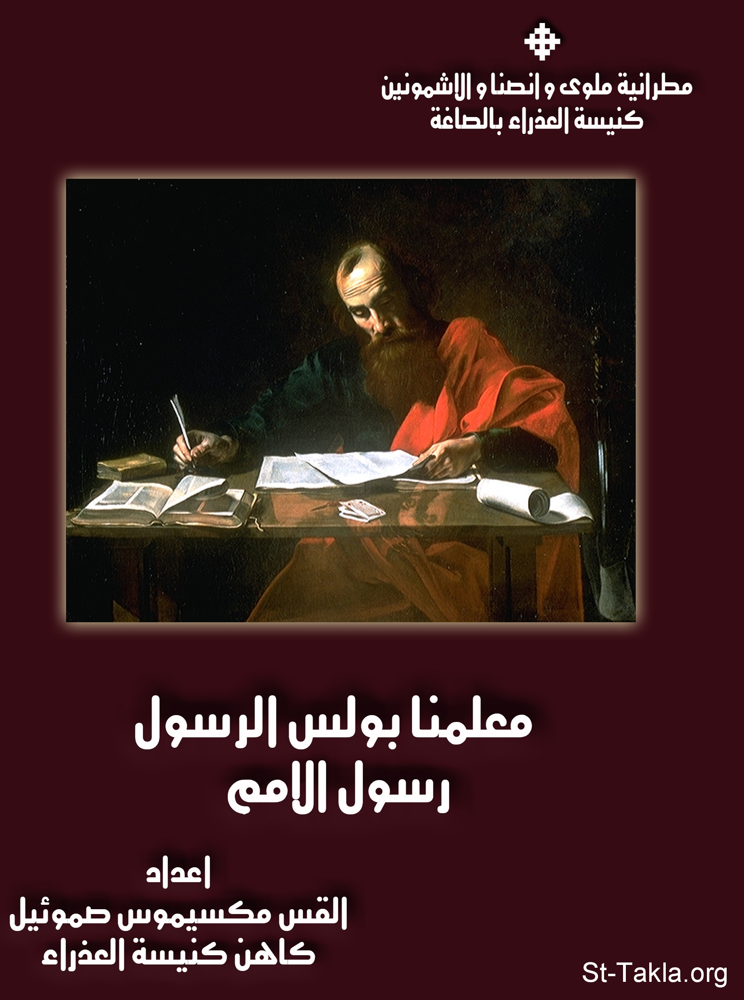

# شخصية معلمنا بولس الرسول

**المؤلف / Author:** القس مكسيموس صموئيل
**المصدر / Source:** [st-takla.org](https://st-takla.org/books/fr-maximos-samuel/st-paul/index.html)
**الموضوعات / Topics:** —

📘 **[Download EPUB / تحميل الكتاب](st-paul.epub)**

## نبذة

نشكر القس مكسيموس صموئيل على السماح لنا في موقع الأنبا تكلا هيمانوت بوضع هذا الكتاب هنا. وقد ظهر الكتاب في مصدر آخر باسم "حياة معلمنا بولس الرسول كما وردت في سفر الأعمال".

## الفصول / Chapters (88)

1. [شجرة حياة القديس بولس الرسول](chapters/01-life-summary/)
2. [مقدمة](chapters/02-introduction/)
3. [حياة بولس الرسول](chapters/03-section1-life/)
4. [نشأة بولس الرسول](chapters/04-early-life/)
5. [ثقافة بولس الرسول](chapters/05-culture/)
6. [اضطهاد شاول للمسيحيين](chapters/06-persecution/)
7. [اهتداء شاول الطرسوسي وتحوله](chapters/07-change/)
8. [كرازة بولس الرسول](chapters/08-proclamation/)
9. [شخصية الرسول بولس](chapters/09-section2-character/)
10. [منهج بولس الرسول](chapters/10-section3-method/)
11. [المنهج الإنجيلي لبولس الرسول](chapters/11-method-biblical/)
12. [المنهج اللاهوتي لبولس الرسول](chapters/12-method-theological/)
13. [المنهج الكنسي لبولس الرسول](chapters/13-method-clerical/)
14. [المنهج الكرازي الرعوي لبولس الرسول](chapters/14-method-service/)
15. [المنهج الروحي لبولس الرسول](chapters/15-method-spiritual/)
16. [رحلات بولس الرسول التبشيرية](chapters/16-section4-journeys/)
17. [الرحلة التبشيرية الأولى لبولس الرسول](chapters/17-first-missionary-journey/)
18. [معلمي كنيسة أنطاكية](chapters/18-antioch/)
19. [بولس في سلوكية، سلاميس، برجة بمفيلية، أنطاكية بيسيدية](chapters/19-4-cities/)
20. [بولس وبرنابا في أيقونية، لسترة، دربة، والعودة لتثبيت الكنائس](chapters/20-barnabas/)
21. [الرحلة التبشيرية الثانية لبولس الرسول](chapters/21-second-missionary-journey/)
22. [اختيار معلمنا بولس لتلميذه تيموثاوس للخدمة](chapters/22-timothy/)
23. [إيمان وعماد ليدية وأهل بيتها](chapters/23-lydia/)
24. [إخراج شيطان من عرافة فيلبي](chapters/24-philippians-witch/)
25. [شكوى موالي العرافة بفيلبي، ووضع الرسولين في السجن الداخلي في فيلبي](chapters/25-jail1/)
26. [بولس وسيلا، وتسبحة نصف الليل في السجن](chapters/26-silas/)
27. [كرازة معلمنا بولس في تسالونيكي وبيرية وأثينا](chapters/27-thessaloniki/)
28. [كرازة بولس الرسول في بيرية](chapters/28-berea/)
29. [الكرازة في أثينا](chapters/29-athens/)
30. [كرازة بولس الرسول في كورنثوس](chapters/30-corinth/)
31. [عودة معلمنا بولس إلى أنطاكية، مع زيارة كنخريا، أفسس](chapters/31-ephesus/)
32. [الرحلة التبشيرية الثالثة لبولس الرسول](chapters/32-third-missionary-journey/)
33. [بولس في غلاطية، فريجية، أفسس، كورنثوس](chapters/33-galatia/)
34. [كرازة معلمنا بولس في أفسس](chapters/34-ephesus-preaching/)
35. [بولس في أفسس](chapters/35-farewell/)
36. [إقامة أفتيخوس من الموت في ترواس](chapters/36-troas/)
37. [ذهاب معلمنا بولس إلى ميليتس](chapters/37-miletus/)
38. [نهاية رحلة بولس الثالثة](chapters/38-journy3-end/)
39. [قيصرية وفيلبس](chapters/39-caesarea/)
40. [دفاع معلمنا بولس أمام اليهود في أورشليم على درج قلعة أنطونيا](chapters/40-jerusalem/)
41. [دفاع معلمنا بولس أمام مجمع السنهدرين](chapters/41-sanhedrin/)
42. [احتجاج معلمنا بولس وعظة للوالي](chapters/42-protest/)
43. [احتجاج أو دفاع معلمنا بولس في قيصرية ورفع دعواه لقيصر](chapters/43-caesar/)
44. [شهادة ودفاع معلمنا بولس لربنا يسوع أمام هيرودس أغريباس الثاني وفستوس](chapters/44-herod/)
45. [رحلة الرسول بولس إلى روما](chapters/45-missionary-journey-rome/)
46. [معلمنا بولس في جزيرة مالطة (مليطة)، روما](chapters/46-malta/)
47. [كرازة بولس الرسول في روما](chapters/47-rome/)
48. [رسائل بولس الرسول](chapters/48-section5-epistles/)
49. [مقدمة عامة عن رسائل القديس بولس الرسول](chapters/49-epistles-intro/)
50. [تقسيم رسائل بولس الرسول حسب زمن الكتابة، والمضمون](chapters/50-epistles-division/)
51. [فضائل القديس بولس الرسول](chapters/51-boles-virtues/)
52. [الحياة المسيحية في عصر بولس الرسول](chapters/52-section6-christian-life/)
53. [قوة المسيحية الروحية ومظاهرها](chapters/53-christianity/)
54. [الكنيسة والرعاية في عصر بولس الرسول](chapters/54-care/)
55. [ميادين الرعاية في عصر بولس الرسول](chapters/55-care-fields/)
56. [العبادة الكنسية في عصر بولس الرسول](chapters/56-devotion/)
57. [البدع والهرطقات في عصر بولس الرسول](chapters/57-heresies/)
58. [الأسرار الكنسية في عصر بولس الرسول](chapters/58-section7-sacraments/)
59. [سر المعمودية في عصر بولس الرسول](chapters/59-baptism/)
60. [سر الميرون (التثبيت) في عصر بولس الرسول](chapters/60-chrism/)
61. [سر الإفخارستيا في عصر بولس الرسول](chapters/61-eucharist/)
62. [سر التوبة والاعتراف في عصر بولس الرسول](chapters/62-confession/)
63. [سر الزيجة في عصر بولس الرسول](chapters/63-matrimonry/)
64. [سر الكهنوت في عصر بولس الرسول](chapters/64-priesthood/)
65. [العقائد المسيحية في عصر بولس الرسول](chapters/65-section8-dogma/)
66. [عقيدة الفداء والصليب في عصر بولس الرسول](chapters/66-salvation/)
67. [عقيدة النعمة والخلاص في عصر بولس الرسول](chapters/67-grace/)
68. [عقيدة موت المسيح وقيامته في عصر بولس الرسول](chapters/68-christ/)
69. [عقيدة الإله الواحد المثلث الأقانيم في عصر بولس الرسول](chapters/69-trinity/)
70. [عقيدة قيامة الأجساد والدينونة العامة في عصر بولس الرسول](chapters/70-resurrection/)
71. [عقيدة لاهوت المسيح في عصر بولس الرسول](chapters/71-divinity-of-christ/)
72. [عقيدة الخلاص بالإيمان والأعمال في عصر بولس الرسول](chapters/72-faith-works/)
73. [عقائد أخرى في عصر بولس الرسول](chapters/73-creed/)
74. [التقليد في كنيسة الرسل](chapters/74-speaking-in-tongues/)
75. [المواهب والألسنة في كنيسة الرسل](chapters/75-gifts/)
76. [الشفاعة في كنيسة الرسل](chapters/76-intercession/)
77. [إكرام العذراء ودوام بتوليتها في كنيسة الرسل](chapters/77-saint-mary/)
78. [البخور في كنيسة الرسل](chapters/78-incense/)
79. [الاتجاه إلى الشرق في كنيسة الرسل](chapters/79-east/)
80. [الأنوار والشموع في كنيسة الرسل](chapters/80-light/)
81. [الهيكل والمذبح في كنيسة الرسل](chapters/81-altar/)
82. [الصور والأيقونات في كنيسة الرسل](chapters/82-icons/)
83. [إكرام الصليب في كنيسة الرسل](chapters/83-cross/)
84. [ربنا يسوع، الكنيسة، ثمار الروح في كتابات بولس الرسول وسفر الأعمال](chapters/84-three-points/)
85. [ربنا يسوع المسيح في كتابات معلمنا بولس الرسول وسفر أعمال الرسل](chapters/85-jesus-christ/)
86. [الكنيسة في كتابات معلمنا بولس الرسول وسفر أعمال الرسل](chapters/86-church/)
87. [ثمار الروح في كتابات معلمنا بولس الرسول وسفر أعمال الرسل](chapters/87-fruits-of-spirit/)
88. [المراجع](chapters/88-references/)

---
*هذا الكتاب مجاني للنشر والتوزيع لخلاص كل نفس. This book is free to share and distribute for the salvation of every soul.*
