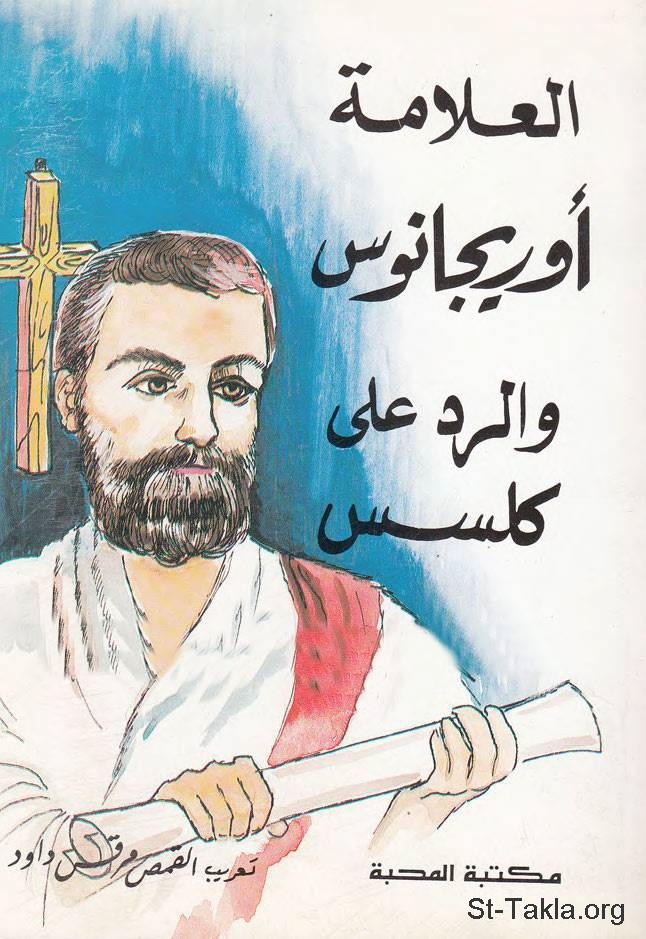

# العلامة أوريجانوس والرد على كلسس (الكتاب الأول)

**المؤلف / Author:** تعريب: القمص مرقس داود
**المصدر / Source:** [st-takla.org](https://st-takla.org/books/fr-morcos-dawoud/against-celsus/index.html)
**الموضوعات / Topics:** —

📘 **[Download EPUB / تحميل الكتاب](against-celsus.epub)**

## نبذة

نشكر أسرة القمص مرقس داود على السماح لنا في موقع الأنبا تكلا هيمانوت بوضع هذا الكتاب هنا. وهذه هي بيانات الطبعة الأولى: رقم الإيداع بدار الكتب: 2337/1973، إصدار: مكتبة المحبة القبطية الأرثوذكسية بالقاهرة.

## الفصول / Chapters (74)

1. [حياة العلامة أوريجانوس - كتاب العلامة أوريجانوس والرد على كلسس](chapters/01-origen/)
2. [مقدمة ناشري الترجمة الانكليزية: أوريجانوس يدافع عن المسيحية في عصر الرومان - كتاب العلامة أوريجانوس والرد على كلسس](chapters/02-romans/)
3. [المقدمة - كتاب العلامة أوريجانوس والرد على كلسس](chapters/03-introduction/)
4. [الادعاء بأن المسيحيون متقوقعون على ذواتهم ضد القانون - كتاب العلامة أوريجانوس والرد على كلسس](chapters/04-confined/)
5. [الادعاء بأن نظام التعليم المسيحي نظام وحشي المنشأ - كتاب العلامة أوريجانوس والرد على كلسس](chapters/05-christianity/)
6. [الادعاء بإتمام الطقوس المسيحية في الخفاء - كتاب العلامة أوريجانوس والرد على كلسس](chapters/06-secret/)
7. [هل المسيحية هي مجرد مرآة لتعاليم أخلاقية فلسفية أقدم؟ - كتاب العلامة أوريجانوس والرد على كلسس](chapters/07-mirror/)
8. [المسيحية تتفق مع الفلاسفة والمفكرين ببطلان الآلهة الوثنية - كتاب العلامة أوريجانوس والرد على كلسس](chapters/08-no-idols/)
9. [قوة المسيحية في صنع العجائب هو "اسم يسوع المسيح" - كتاب العلامة أوريجانوس والرد على كلسس](chapters/09-jewsus-christ/)
10. [التعاليم المسيحية السرية تعلن جهارًا في حينها - كتاب العلامة أوريجانوس والرد على كلسس](chapters/10-not-secret/)
11. [تعارض كلسس مع نفسه في إنكار الإيمان - كتاب العلامة أوريجانوس والرد على كلسس](chapters/11-anti-faith/)
12. [الانخداع بالتعاليم الباطلة وضرورة الفحص والدراسة - كتاب العلامة أوريجانوس والرد على كلسس](chapters/12-false-teachings/)
13. [يجب التأني في فحص جميع المذاهب قبل اعتناق إحداها - كتاب العلامة أوريجانوس والرد على كلسس](chapters/13-carefulness/)
14. [الإيمان والرجاء بمستقبل أفضل - كتاب العلامة أوريجانوس والرد على كلسس](chapters/14-hope/)
15. [إدعاء كلسس أنه عليم بكل التعاليم المسيحية - كتاب العلامة أوريجانوس والرد على كلسس](chapters/15-ignorance/)
16. [الحكمة الكاذبة للعالم الفاني هي جهالة في نظر المسيح - كتاب العلامة أوريجانوس والرد على كلسس](chapters/16-false-wisdom/)
17. [ازدواجية ومحاباة كلسس في الهجوم على المعتقدات - كتاب العلامة أوريجانوس والرد على كلسس](chapters/17-duplicity/)
18. [المؤلفون الآخرون منصفون ولكن كلسس لا يفعل - كتاب العلامة أوريجانوس والرد على كلسس](chapters/18-authors/)
19. [تجاهل كلسس للشعب اليهودي كشعب قديم - كتاب العلامة أوريجانوس والرد على كلسس](chapters/19-jews/)
20. [مهاجمة كلسس للتاريخ الموسوي وتفسيره 1 - كتاب العلامة أوريجانوس والرد على كلسس](chapters/20-history-moses-1/)
21. [مهاجمة كلسس للتاريخ الموسوي وتفسيره 2 - كتاب العلامة أوريجانوس والرد على كلسس](chapters/21-history-moses-2/)
22. [حقيقة خلق العالم - كتاب العلامة أوريجانوس والرد على كلسس](chapters/22-creation/)
23. [مقارنة بين عبادة اليهود للمسيح وعبادات المصريين القدماء - كتاب العلامة أوريجانوس والرد على كلسس](chapters/23-christ/)
24. [عبادة المسيح بين الضرورة والفساد - كتاب العلامة أوريجانوس والرد على كلسس](chapters/24-adoring-christ/)
25. [الختان عادة مصرية قديمة - كتاب العلامة أوريجانوس والرد على كلسس](chapters/25-circumcision/)
26. [هل يوجد إله واحد أم عدة آلهة؟ 1 - كتاب العلامة أوريجانوس والرد على كلسس](chapters/26-one-god-1/)
27. [هل يوجد إله واحد أم عدة آلهة؟ 2 - كتاب العلامة أوريجانوس والرد على كلسس](chapters/27-one-god-2/)
28. [أسماء المسيح وأسماء الآلهة المزيفة - كتاب العلامة أوريجانوس والرد على كلسس](chapters/28-christ-names/)
29. [عبادة اليهود للملائكة وتعلمهم السحر على يد موسى - كتاب العلامة أوريجانوس والرد على كلسس](chapters/29-angels/)
30. [قدرة يسوع المسيح تفوق طاقة البشر - كتاب العلامة أوريجانوس والرد على كلسس](chapters/30-christ-omnipotent/)
31. [دحض إدعاءات كلسس حول ميلاد وألوهية السيد المسيح 1: الميلاد والعذراء البتول - كتاب العلامة أوريجانوس والرد على كلسس](chapters/31-virgin/)
32. [دحض إدعاءات كلسس حول ميلاد وألوهية السيد المسيح 2: نشأة يسوع - كتاب العلامة أوريجانوس والرد على كلسس](chapters/32-jesus/)
33. [دحض إدعاءات كلسس حول ميلاد وألوهية السيد المسيح 3: عظمة يسوع - كتاب العلامة أوريجانوس والرد على كلسس](chapters/33-christ-greatness/)
34. [دحض إدعاءات كلسس حول ميلاد وألوهية السيد المسيح 4: الصلب والقيامة - كتاب العلامة أوريجانوس والرد على كلسس](chapters/34-crucifixion-resurrection/)
35. [دحض إدعاءات كلسس حول ميلاد وألوهية السيد المسيح 5: الرد على اتهامه للسيدة العذراء مريم - كتاب العلامة أوريجانوس والرد على كلسس](chapters/35-virgin-mary/)
36. [دحض إدعاءات كلسس حول ميلاد وألوهية السيد المسيح 6: إمكانية الحَبّل المعجزي - كتاب العلامة أوريجانوس والرد على كلسس](chapters/36-conception/)
37. [دحض إدعاءات كلسس حول ميلاد وألوهية السيد المسيح 7: تحقق النبوءات - كتاب العلامة أوريجانوس والرد على كلسس](chapters/37-prophesies/)
38. [دحض إدعاءات كلسس حول ميلاد وألوهية السيد المسيح 8: الولادة من عذراء - كتاب العلامة أوريجانوس والرد على كلسس](chapters/38-birth/)
39. [حتمية وجود أنبياء في وسط الشعب اليهودي - كتاب العلامة أوريجانوس والرد على كلسس](chapters/39-prophets/)
40. [ما بين ولادة الأنبياء وميلاد المسيح - كتاب العلامة أوريجانوس والرد على كلسس](chapters/40-christ-birth/)
41. [معجزات المسيح تبارك اسمه - كتاب العلامة أوريجانوس والرد على كلسس](chapters/41-christ-miracles/)
42. [العذراء مريم كلية الطهر - كتاب العلامة أوريجانوس والرد على كلسس](chapters/42-saint-mary/)
43. [إدعاءات أخرى لكلسس ضد المسيحية - كتاب العلامة أوريجانوس والرد على كلسس](chapters/43-other/)
44. [حلول الروح القدس على شكل حمامة في عماد المسيح - كتاب العلامة أوريجانوس والرد على كلسس](chapters/44-holy-spirit/)
45. [براهين وإثباتات الأحداث المدونة في الكتاب المقدس 1: ما بين التفسير الحرفي والروحي الرمزي - كتاب العلامة أوريجانوس والرد على كلسس](chapters/45-interpretation/)
46. [براهين وإثباتات الأحداث المدونة في الكتاب المقدس 2: السموات والروح القدس - كتاب العلامة أوريجانوس والرد على كلسس](chapters/46-heavens/)
47. [براهين وإثباتات الأحداث المدونة في الكتاب المقدس 3: ألوهية الروح القدس - كتاب العلامة أوريجانوس والرد على كلسس](chapters/47-divinity-spirit/)
48. [براهين وإثباتات الأحداث المدونة في الكتاب المقدس 4: ما بين موسى ويسوع - كتاب العلامة أوريجانوس والرد على كلسس](chapters/48-moses-jesus/)
49. [براهين وإثباتات الأحداث المدونة في الكتاب المقدس 5: لماذا يقبل اليهود معجزات كتابهم بينما يرفضون معجزات العهد الجديد؟! - كتاب العلامة أوريجانوس والرد على كلسس](chapters/49-jews-and-miracles/)
50. [براهين وإثباتات الأحداث المدونة في الكتاب المقدس 6: يوحنا المعمدان - كتاب العلامة أوريجانوس والرد على كلسس](chapters/50-john-the-baptist/)
51. [براهين وإثباتات الأحداث المدونة في الكتاب المقدس 7: انفتاح السموات وقت المعمودية - كتاب العلامة أوريجانوس والرد على كلسس](chapters/51-baptism/)
52. [براهين وإثباتات الأحداث المدونة في الكتاب المقدس 8: المسيا، ابن الله - كتاب العلامة أوريجانوس والرد على كلسس](chapters/52-messiah/)
53. [براهين وإثباتات الأحداث المدونة في الكتاب المقدس 9: النبوات عن المسيح - كتاب العلامة أوريجانوس والرد على كلسس](chapters/53-prophecies-about-christ/)
54. [براهين وإثباتات الأحداث المدونة في الكتاب المقدس 10: بيت لحم، مكان ميلاد يسوع - كتاب العلامة أوريجانوس والرد على كلسس](chapters/54-bethlehem/)
55. [براهين وإثباتات الأحداث المدونة في الكتاب المقدس 11 - كتاب العلامة أوريجانوس والرد على كلسس](chapters/55-bible/)
56. [براهين وإثباتات الأحداث المدونة في الكتاب المقدس 12: نبوات مسيانية - كتاب العلامة أوريجانوس والرد على كلسس](chapters/56-messianic-prophecies/)
57. [براهين وإثباتات الأحداث المدونة في الكتاب المقدس 13: آلام المسيح - كتاب العلامة أوريجانوس والرد على كلسس](chapters/57-christ-passion/)
58. [النبوات الخلاصية كانت عن شخص السيد المسيح ولم تكن عن كل الشعب - كتاب العلامة أوريجانوس والرد على كلسس](chapters/58-salvation-prophecies/)
59. [المجيء الأول والثاني للسيد المسيح - كتاب العلامة أوريجانوس والرد على كلسس](chapters/59-two-comings/)
60. [الفرق بين بنوة الابن للآب وبنوتنا نحن لله - كتاب العلامة أوريجانوس والرد على كلسس](chapters/60-sonship/)
61. [علاقة الكلدانيين والمجوس بالنجم الظاهر في ميلاد المسيح - كتاب العلامة أوريجانوس والرد على كلسس](chapters/61-star/)
62. [علاقة النجوم بالأحداث الزمنية - كتاب العلامة أوريجانوس والرد على كلسس](chapters/62-stars/)
63. [إرشاد النجم للمجوس - كتاب العلامة أوريجانوس والرد على كلسس](chapters/63-star-magi/)
64. [تآمر هيرودس لقتل المسيح - كتاب العلامة أوريجانوس والرد على كلسس](chapters/64-herod/)
65. [اختيار المسيح لجهال وأدنياء العالم للكرازة - كتاب العلامة أوريجانوس والرد على كلسس](chapters/65-evangelism/)
66. [اختيار السيد المسيح لرسله وتلاميذه - كتاب العلامة أوريجانوس والرد على كلسس](chapters/66-disciples/)
67. [الإنجيل للتغيير وليس للتعيير - كتاب العلامة أوريجانوس والرد على كلسس](chapters/67-gospel/)
68. [للفاعل أجرة وليس تسول - كتاب العلامة أوريجانوس والرد على كلسس](chapters/68-wages/)
69. [قبول الضعف قدرة إلهية - كتاب العلامة أوريجانوس والرد على كلسس](chapters/69-weakness/)
70. [قوة فاعلية أعمال واسم المسيح - كتاب العلامة أوريجانوس والرد على كلسس](chapters/70-name-of-jesus/)
71. [ما تسعى له المعجزة ضد السحر - كتاب العلامة أوريجانوس والرد على كلسس](chapters/71-magic/)
72. [تأنس بلا خطية - كتاب العلامة أوريجانوس والرد على كلسس](chapters/72-incarnation-no-sin/)
73. [شابهنا في كل شيء - كتاب العلامة أوريجانوس والرد على كلسس](chapters/73-alike/)
74. [الله محب خليقته - كتاب العلامة أوريجانوس والرد على كلسس](chapters/74-god-loves-his-creation/)

---
*هذا الكتاب مجاني للنشر والتوزيع لخلاص كل نفس. This book is free to share and distribute for the salvation of every soul.*
