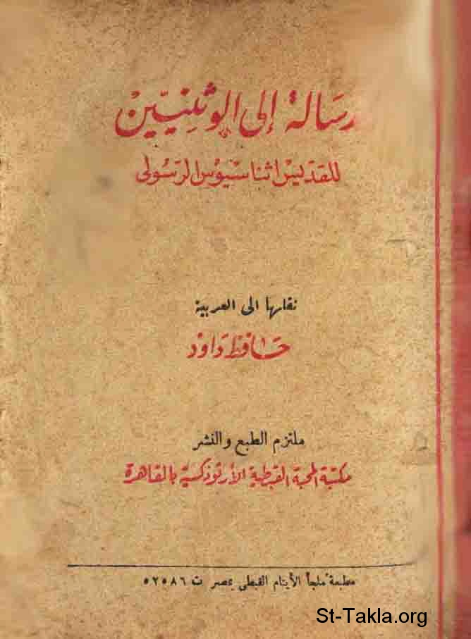

# رسالة إلى الوثنيين للقديس أثناسيوس الرسولي (ضد الوثنيين)

**المؤلف / Author:** القمص مرقس داود
**المصدر / Source:** [st-takla.org](https://st-takla.org/books/fr-morcos-dawoud/against-the-heathens/index.html)
**الموضوعات / Topics:** —

📘 **[Download EPUB / تحميل الكتاب](against-the-heathens.epub)**

## نبذة

نشكر أسرة القمص مرقس داود على السماح لنا في موقع الأنبا تكلا هيمانوت بوضع هذا الكتاب هنا.

## الفصول / Chapters (51)

1. [مقدمة للرسالة - كتاب رسالة إلى الوثنيين للقديس أثناسيوس الرسولي](chapters/01-introduction/)
2. [غرض الكتاب توضيح العقيدة المسيحية سيما عقيدة الصليب - كتاب رسالة إلى الوثنيين للقديس أثناسيوس الرسولي](chapters/02-purpose/)
3. [الباب الأول - كتاب رسالة إلى الوثنيين للقديس أثناسيوس الرسولي](chapters/03-section-1/)
4. [ليس الشر عنصرًا أساسيًا في طبيعة الأشياء. خلقه الإنسان الأصلية، وتكوينه في النعمة، وفي معرفة الله - كتاب رسالة إلى الوثنيين للقديس أثناسيوس الرسولي](chapters/04-evil/)
5. [انحطاط الإنسان من الحالة السالف شرحها، بسبب انهماكه في الماديات - كتاب رسالة إلى الوثنيين للقديس أثناسيوس الرسولي](chapters/05-mans-degradation/)
6. [انحدار النفس تدريجيًا من الحق إلى الباطل بسبب إساءة استعمالها حقها نحو حرية الاختيار - كتاب رسالة إلى الوثنيين للقديس أثناسيوس الرسولي](chapters/06-gradual-decline/)
7. [الشر يتضمن جوهريًّا في اختيار الأمور السفلى وتفضيلها على الأمور السامية - كتاب رسالة إلى الوثنيين للقديس أثناسيوس الرسولي](chapters/07-choosing-lower-matters/)
8. [آراء باطلة عن طبيعة الشر - كتاب رسالة إلى الوثنيين للقديس أثناسيوس الرسولي](chapters/08-nature-of-evil/)
9. [دحض التعليم بوجود إلهين](chapters/09-refuting-two-gods/)
10. [أصل العبادة الوثنية أن النفس أصبحت مادية بتناسيها الله - كتاب رسالة إلى الوثنيين للقديس أثناسيوس الرسولي](chapters/10-pagan-worship/)
11. [امتداد العبادة الوثنية: عبادة الأجرام السماوية، والعناصر، والأشياء الطبيعية، والمخلوقات الخرافية، والشهوات المجسمة، والبشر الأحياء والأموات - كتاب رسالة إلى الوثنيين للقديس أثناسيوس الرسولي](chapters/11-worship-of-heavenly-bodies/)
12. [مصدر بشري مماثل لآلهة اليونان بأمر ثيسيوس. العملية التي بها تصبح الخليقة الفانية آلهة - كتاب رسالة إلى الوثنيين للقديس أثناسيوس الرسولي](chapters/12-greek-gods/)
13. [أعمال الآلهة الوثنية، سيما أعمال زفس - كتاب رسالة إلى الوثنيين للقديس أثناسيوس الرسولي](chapters/13-pagan-gods/)
14. [أعمال مخزية أخرى تنسب لآلهة الوثنيين. وكلها تبرهن على أنهم بشر عاشوا في الأزمنة السابقة، وليسوا حتى بشرًا صالحين - كتاب رسالة إلى الوثنيين للقديس أثناسيوس الرسولي](chapters/14-shameful-acts/)
15. [حماقة عبادة التماثيل وتحقيرها من شأن الفن - كتاب رسالة إلى الوثنيين للقديس أثناسيوس الرسولي](chapters/15-foolishness-of-worshiping-statues/)
16. [عبادة التماثيل يشجبها الكتاب المقدس - كتاب رسالة إلى الوثنيين للقديس أثناسيوس الرسولي](chapters/16-worship-of-images/)
17. [الأوثان والآلهة المصنوعة تدل على أنها عديمة الحياة، وأنها ليست آلهة - كتاب رسالة إلى الوثنيين للقديس أثناسيوس الرسولي](chapters/17-idols-gods/)
18. [حجج الوثنيين عن الأصنام وعبادة آلهة مصنوعة - كتاب رسالة إلى الوثنيين للقديس أثناسيوس الرسولي](chapters/18-pagans-idols/)
19. [الروايات المشينة عن الأصنام والأوثان صحيحة - كتاب رسالة إلى الوثنيين للقديس أثناسيوس الرسولي](chapters/19-slanderous-accounts-of-idols/)
20. [عبادة الأوثان بسبب اختراعها فنون الحياة، ولكن هذه أعمال بشرية طبيعية لا إلهية - كتاب رسالة إلى الوثنيين للقديس أثناسيوس الرسولي](chapters/20-worshiping-idols/)
21. [تناقض عبادة التماثيل - كتاب رسالة إلى الوثنيين للقديس أثناسيوس الرسولي](chapters/21-contradiction-worship-statues/)
22. [أين توجد الفضيلة المزعومة للتماثيل والأصنام؟ - كتاب رسالة إلى الوثنيين للقديس أثناسيوس الرسولي](chapters/22-statues-idols/)
23. [فكرة الاتصال عن طريق الملائكة تجر متناقضات شديدة، لا تبرر عبادة التماثيل - كتاب رسالة إلى الوثنيين للقديس أثناسيوس الرسولي](chapters/23-communication-through-angels/)
24. [التمثال لا يمكن أن يُمثل صورة الله الحقيقية، وإلا كان الله قابلًا للفساد - كتاب رسالة إلى الوثنيين للقديس أثناسيوس الرسولي](chapters/24-true-image-of-god/)
25. [تنوع العبادات الوثنية يبرهن على بطلانها - كتاب رسالة إلى الوثنيين للقديس أثناسيوس الرسولي](chapters/25-pagan-worship-invalidity/)
26. [التي تُدعى آلهة في مكان ما تستعمل كذبائح في مكان آخر - كتاب رسالة إلى الوثنيين للقديس أثناسيوس الرسولي](chapters/26-sacrifices/)
27. [الذبائح البشرية. سخافتها. كثرتها. نتائجها الوخيمة - كتاب رسالة إلى الوثنيين للقديس أثناسيوس الرسولي](chapters/27-human-sacrifices/)
28. [الفساد الأدبي بين الوثنيين ناشئ عن الآلهة حسب اعتراف الجميع - كتاب رسالة إلى الوثنيين للقديس أثناسيوس الرسولي](chapters/28-immorality/)
29. [دحض العبادة الوثنية الشعبية](chapters/29-refutation/)
30. [النظام الكوني لا يمكن أن يكون إلهًا، وهو خاضع للانحلال - كتاب رسالة إلى الوثنيين للقديس أثناسيوس الرسولي](chapters/30-cosmic-order/)
31. [توازن القوى في الطبيعة يبين أنها ليست هي الله، سواء كانت مجتمعة أو مجزأة - كتاب رسالة إلى الوثنيين للقديس أثناسيوس الرسولي](chapters/31-balance-of-forces-in-nature/)
32. [الباب الثاني - كتاب رسالة إلى الوثنيين للقديس أثناسيوس الرسولي](chapters/32-section-2/)
33. [تستطيع نفس الإنسان أن تعرف الله من تلقاء ذاتها، لأنها عاقلة، وذلك إن كانت أمينة لطبيعتها - كتاب رسالة إلى الوثنيين للقديس أثناسيوس الرسولي](chapters/33-human-soul/)
34. [البرهان على وجود النفس العاقلة: اختلاف الإنسان عن الحيوان، قوة الإنسان على التفكير الموضوعي - كتاب رسالة إلى الوثنيين للقديس أثناسيوس الرسولي](chapters/34-man-vs-animals/)
35. [الجسد البشري لا يمكنه أن يُبدع التفكير الموضوعي](chapters/35-human-body/)
36. [النفس خالدة: هي متميزة عن الجسد، مصدر الحركة، التأمل والتفكير - كتاب رسالة إلى الوثنيين للقديس أثناسيوس الرسولي](chapters/36-body-movement-thinking/)
37. [إن تخلصت النفس من أدران الخطية استطاعت أن تعرف الله مباشرة الذي خُلقت على صورته - كتاب رسالة إلى الوثنيين للقديس أثناسيوس الرسولي](chapters/37-soul-impurities-of-sin/)
38. [الباب الثالث - كتاب رسالة إلى الوثنيين للقديس أثناسيوس الرسولي](chapters/38-section-3/)
39. [الخليقة إعلان عن الله سيما في النظام والتناسق اللذين يسودان الكل - كتاب رسالة إلى الوثنيين للقديس أثناسيوس الرسولي](chapters/39-revelation-of-god/)
40. [التأمل في القوى المضادة بعضها لبعض، والتي عنها ينتج هذا النظام الحالي للخليقة - كتاب رسالة إلى الوثنيين للقديس أثناسيوس الرسولي](chapters/40-contemplation/)
41. [نظام الخليقة يظهر من الأشياء المتنافرة المختلفة - كتاب رسالة إلى الوثنيين للقديس أثناسيوس الرسولي](chapters/41-order-of-creation/)
42. [تتضح وحدة الله من تناسق نظام الطبيعة - كتاب رسالة إلى الوثنيين للقديس أثناسيوس الرسولي](chapters/42-unity-of-god/)
43. [استحالة تعدد الآلهة - كتاب رسالة إلى الوثنيين للقديس أثناسيوس الرسولي](chapters/43-impossibility-of-multiple-gods/)
44. [أن معقولية الكون ونظامه يبرهنان على أنه من صنع العقل، أو كلمة الله - كتاب رسالة إلى الوثنيين للقديس أثناسيوس الرسولي](chapters/44-reasonableness-order-of-universe/)
45. [وجود (الكلمة) في الطبيعة ضروري ليس فقط لخلقتها أصلًا، بل أيضًا لدوامها - كتاب رسالة إلى الوثنيين للقديس أثناسيوس الرسولي](chapters/45-word-in-nature/)
46. [وصف عمل الكلمة هذا بتوسع - كتاب رسالة إلى الوثنيين للقديس أثناسيوس الرسولي](chapters/46-the-word/)
47. [ثلاثة تشبيهات لإيضاح علاقة الكلمة بالكون - كتاب رسالة إلى الوثنيين للقديس أثناسيوس الرسولي](chapters/47-three-similes/)
48. [تطبيق التشبيهات على كل الكون، ما يُرى وما لا يُرى - كتاب رسالة إلى الوثنيين للقديس أثناسيوس الرسولي](chapters/48-entire-universe/)
49. [تعليم الكتاب المقدس عن الله الكلمة وعمله - كتاب رسالة إلى الوثنيين للقديس أثناسيوس الرسولي](chapters/49-bible-god/)
50. [تعليم الكتاب المقدس عن الله الكلمة الخالق - كتاب رسالة إلى الوثنيين للقديس أثناسيوس الرسولي](chapters/50-bible-word/)
51. [ضرورة الرجوع إلى الكلمة إن أردنا تجديد طبيعتنا الفاسدة - كتاب رسالة إلى الوثنيين للقديس أثناسيوس الرسولي](chapters/51-renew-corrupt-nature/)

---
*هذا الكتاب مجاني للنشر والتوزيع لخلاص كل نفس. This book is free to share and distribute for the salvation of every soul.*
