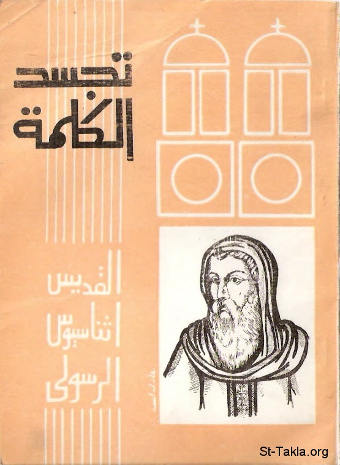

# تجسد الكلمة للقديس أثناسيوس الرسولي

**المؤلف / Author:** القمص مرقس داود
**المصدر / Source:** [st-takla.org](https://st-takla.org/books/fr-morcos-dawoud/incarnation-of-the-word/index.html)
**الموضوعات / Topics:** —

📘 **[Download EPUB / تحميل الكتاب](incarnation-of-the-word.epub)**

## نبذة

نشكر أسرة القمص مرقس داود على السماح لنا في موقع الأنبا تكلا هيمانوت بوضع هذا الكتاب هنا.

## الفصول / Chapters (60)

1. [تقديم](chapters/01-introduction/)
2. [مقدمة المترجم](chapters/02-preface/)
3. [مقدمة الترجمة الإنكليزية](chapters/03-preface-en/)
4. [اتضاع وتجسد الكلمة](chapters/04-humility/)
5. [دحض بعض الآراء الخاطئة عن عملية الخِلْقَة: مذاهب الأبيكوريين، الأفلاطونيين، اللاأدريين أو الأغنسطيين](chapters/05-wrong/)
6. [خِلْقَة الكائنات من العدم](chapters/06-creation/)
7. [اتصال خِلقتنا والتجسد الإلهي اتصالُا وثيقًا](chapters/07-incarnation/)
8. [تدبير الخلاص من الخطية لمن يتوب](chapters/08-salvation/)
9. [إنقاذ الله للجنس البشري من الفناء، وإحياء صورة الله فيه](chapters/09-men/)
10. [هل كان يكفي توبة آدم عن التعدي؟](chapters/10-adam/)
11. [افتقاد الله الكلمة للبشرية](chapters/11-gods-word-lacks/)
12. [أخذ الكلمة جسد قابل للموت كذبيحة لأجلنا](chapters/12-mortal-body/)
13. [إيضاح معقولة الفداء](chapters/13-redemption/)
14. [سبب آخر للتجسد](chapters/14-image-of-his-word/)
15. [ميل الإنسان لنسيان النعمة، وإعداد الله الخليقة والناموس والأنبياء لتذكيره](chapters/15-forget-grace/)
16. [حاشا أن يسكت الله على هلاك الإنسان في العبادة الوثنية](chapters/16-pagan-worship/)
17. [الكلمة تجسد لكي يطلب ويخلص ويجدد الحياة، بعد أن فسد الإنسان وضاعت بصيرته](chapters/17-seek-save-renew-life/)
18. [تنازل الكلمة لمستوى البشر واتخاذه جسدًا](chapters/18-condescension/)
19. [جاء الكلمة لكي يجذب أنظار البشر الحِسّيَّة إليه كإنسان وبذلك يقودهم لكي يعرفوه كإله](chapters/19-god/)
20. [كيف أن التجسد لم يحدّ من وجود "الكلمة" في كل مكان ولم ينقص من نقاوته مثل الشمس](chapters/20-no-limit/)
21. [كيف عمل كلمة الله وقوته في أعماله البشرية: بإخراج الشياطين، وبالمعجزات، وبميلاده من العذراء](chapters/21-word-power/)
22. [كيف تعلّم الإنسان معرفة الله من ناسوت المسيح المقدس، حيث اعترفت كل الطبيعة بلاهوته، خصوصًا عند موته](chapters/22-humanity-of-christ/)
23. [لا يستطيع أحد أن يهب عدم الفساد إلاّ الخالق، ولن يستطيع أحد أن يرد مثال الله إلاّ صورته، ولن يستطيع أحد أن يحيي إلاّ رب الحياة، ولن يستطيع أحد أن يُعلِّم إلاّ الكلمة](chapters/23-grant-incorruption/)
24. [أُبيد الموت بموت المسيح](chapters/24-death-was-abolished/)
25. [لماذا لم يحفظ المسيح جسده من اليهود فيمنع عنه الموت](chapters/25-his-body/)
26. [ضرورة الموت علانية لأجل عقيدة القيامة](chapters/26-publicly-dying/)
27. [المسيح لم يختر طريقة موته لأنه كان يجب أن يُبَرْهِن على أنه قاهر للموت في كل صوره وأشكاله](chapters/27-not-choose-the-method/)
28. [ولماذا تم الموت بالصليب من بين كل أنواع الموت؟](chapters/28-by-the-cross/)
29. [أسباب قيامة السيد المسيح في اليوم الثالث](chapters/29-resurrection-on-the-third-day/)
30. [التغير الذي أتمه الصليب في علاقة بالموت بالإنسان](chapters/30-cross/)
31. [النصرة على الموت وغلبته بواسطة السيد المسيح](chapters/31-victory-over-death/)
32. [الموت يُداس بعلامة الصليب وبالإيمان بالمسيح](chapters/32-death-is-trampled/)
33. [البرهان على حقيقة القيامة ببعض الوقائع](chapters/33-reality-of-resurrection/)
34. [ضعف الأوثان وعجزها](chapters/34-powerlessness-of-idols/)
35. [الله معروف بأعماله](chapters/35-faith-in-god/)
36. [عدم إيمان اليهود واستهزاء اليونانيين](chapters/36-unbelief-of-jews/)
37. [نبوات عن آلام السيد المسيح وموته في كل ظروفه](chapters/37-prophecies-death/)
38. [نبوات عن الصليب، وكيف تمت هذه النبوات في المسيح وحده](chapters/38-prophecies-cross/)
39. [نبوات عن عظمة المسيح، والهرب إلى مصر](chapters/39-prophecies-egypt/)
40. [عظمة ميلاد المسيح وموته](chapters/40-christs-birth-death/)
41. [نبوات واضحة عن مجيء الله في الجسد](chapters/41-coming-in-the-flesh/)
42. [نبوات دانيال وغيره من الأنبياء عن مجيء الكلمة المخلص](chapters/42-prophecies-daniel/)
43. [إبطال النبوة وخراب أورشليم](chapters/43-destruction-of-jerusalem/)
44. [هل اليونانيين يعترفون بالكلمة؟ إن كان الله يعلن نفسه في نظام وترتيب الكون، فماذا يمنع ظهوره في جسد ما؟](chapters/44-appearance-in-a-body/)
45. [إن اتحاده بالجسد مؤسَّس على علاقته بالخليقة بوجه الإجمال. وهو استخدم جسدًا بشريًا لأنه أراد أن يعلن نفسه للإنسان](chapters/45-union-with-the-body/)
46. [لقد جاء في شكل بشري وليس في شكل اسمي، ليخلص الإنسان الذي أخطأ](chapters/46-human-form/)
47. [إن كان الله قد خلق الإنسان بكلمة، فلماذا لا يرده بكلمة؟](chapters/47-just-a-word/)
48. [كل جزء من الخليقة يعلن مجد الله. فالطبيعة تقدم شهادة بالمعجزات للإله المتجسد](chapters/48-glory-of-god/)
49. [منذ وقت التجسد افتضحت العِبَادة الوثنية، واستشارة الأوثان، والتكهُّن بالغيب (العِرافة)، والأساطير الخرافية، والأعمال الشيطانية، والسحر، والفلسفة الوثنية](chapters/49-pagan-philosophy-exposed/)
50. [القضاء بعلامة الصليب على العِرَافات المتعددة: البرهان على أن الآلهة القديمة ما هي إلاّ مجرد بشر](chapters/50-expose-magic/)
51. [عِفَّة العَذَارَى المسيحيات والرهبان والشهداء](chapters/51-chastity-of-christians/)
52. [ميلاد المسيح ومعجزاته](chapters/52-his-miracles/)
53. [بموت المسيح افْتُضِحَ ضعف المُغَالِطين ومنافساتهم. قيامته لا مثيل لها](chapters/53-rivalries-of-deceivers-exposed/)
54. [الفضيلة الجديدة عن العفة. تهدئة الثورة الاجتماعية، وتطهيرها بواسطة المسيحية](chapters/54-virtue-of-chastity/)
55. [الحرب.. التي حركتها الشياطين أبطلتها المسيحية](chapters/55-the-war-by-demons/)
56. [قد هبطت إلى أسفل السافلين كل عملية العبادة الوثنية بضربة واحدة من المسيح](chapters/56-pagan-worships/)
57. ["الكلمة" المتجسد يُعْرَف لنا بأعماله كما هي الحال مع الله غير المنظور. وبأعماله ندرك رسالته](chapters/57-incarnate/)
58. [إبطال العِرافة الوثنية وانتشار الإيمان](chapters/58-abolition-of-pagan-divination/)
59. [فتّش الكتب](chapters/59-examine-the-books/)
60. [عِشْ الحياة التي تُؤَهِّلَك للأكل من شجرة المعرفة والحياة، وهكذا تأتي إلى الأفراح الأبدية](chapters/60-tree-of-knowledge-and-life/)

---
*هذا الكتاب مجاني للنشر والتوزيع لخلاص كل نفس. This book is free to share and distribute for the salvation of every soul.*
