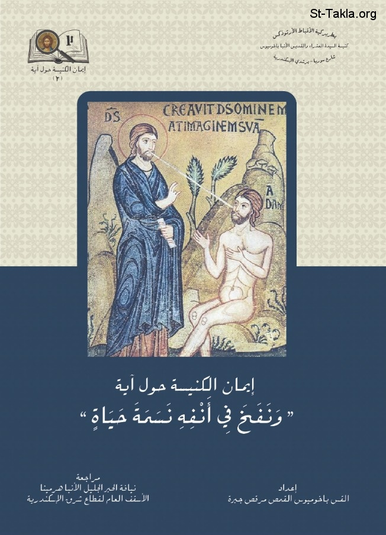

# نفخ في أنفه نسمة حياة

**المؤلف / Author:** القس باخوميوس القمص مرقص جبرة
**المصدر / Source:** [st-takla.org](https://st-takla.org/books/fr-pakhomius-marcos/breath-of-life/index.html)
**الموضوعات / Topics:** —

📘 **[Download EPUB / تحميل الكتاب](breath-of-life.epub)**

## نبذة

نشكر القس باخوميوس القمص مرقص جبرة على السماح لنا في موقع الأنبا تكلا هيمانوت بوضع هذا الكتاب هنا

## الفصول / Chapters (6)

1. [مقدمة](chapters/01-introduction/)
2. [تمهيد وبحث: بداية ذكر الحياة والموت في الكتاب المقدس](chapters/02-preface/)
3. [ماذا يقول أيضًا الكتاب المقدس عن مفهوم الحياة والموت](chapters/03-meaning/)
4. [الإنسان العاقل بحسب الكتاب المقدس والآباء](chapters/04-fathers/)
5. [تفسير الآباء لنسمة الحياة](chapters/05-patristic/)
6. [الخاتمة](chapters/06-epilogue/)

---
*هذا الكتاب مجاني للنشر والتوزيع لخلاص كل نفس. This book is free to share and distribute for the salvation of every soul.*
