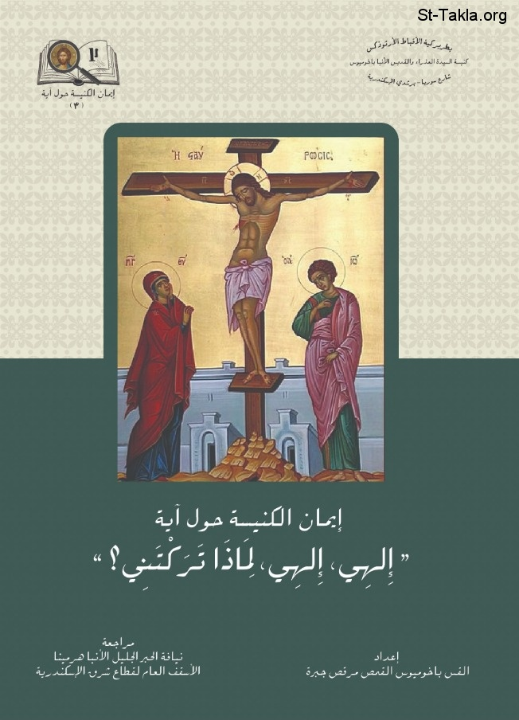

# إلهي، إلهي، لماذا تركتني

**المؤلف / Author:** القس باخوميوس القمص مرقص جبرة
**المصدر / Source:** [st-takla.org](https://st-takla.org/books/fr-pakhomius-marcos/god-forsaken-me/index.html)
**الموضوعات / Topics:** —

📘 **[Download EPUB / تحميل الكتاب](god-forsaken-me.epub)**

## نبذة

نشكر القس باخوميوس القمص مرقص جبرة على السماح لنا في موقع الأنبا تكلا هيمانوت بوضع هذا الكتاب هنا

## الفصول / Chapters (11)

1. [مقدمة](chapters/01-introduction/)
2. [تمهيد وبحث](chapters/02-preface/)
3. [الكلمات واللغة](chapters/03-meaning/)
4. [هل ترك الآب الابن؟ شرح آباء الكنيسة](chapters/04-fathers/)
5. [شرح العلامة ترتليان للآية](chapters/05-jerome/)
6. [شرح العلامة أوريجانوس والقديس أغسطينوس للآية](chapters/06-origen/)
7. [شرح الشهيد يوستين للآية](chapters/07-justin/)
8. [شرح القديس يوحنا ذهبي الفم للآية](chapters/08-chrysostom/)
9. [شرح القديسين أثناسيوس وهيلاري للآية](chapters/09-athanasius/)
10. [شرح القديس أمبروسيوس للآية](chapters/10-ambrose/)
11. [شرح القديسين غريغوريوس وكيرلس للآية](chapters/11-gregory-cyril/)

---
*هذا الكتاب مجاني للنشر والتوزيع لخلاص كل نفس. This book is free to share and distribute for the salvation of every soul.*
