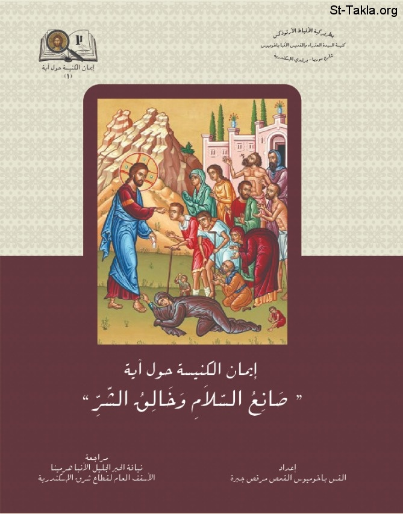

# صانع السلام وخالق الشر

**المؤلف / Author:** القس باخوميوس القمص مرقص جبرة
**المصدر / Source:** [st-takla.org](https://st-takla.org/books/fr-pakhomius-marcos/god-peace-vs-calamity/index.html)
**الموضوعات / Topics:** —

📘 **[Download EPUB / تحميل الكتاب](god-peace-vs-calamity.epub)**

## نبذة

نشكر القس باخوميوس القمص مرقص جبرة على السماح لنا في موقع الأنبا تكلا هيمانوت بوضع هذا الكتاب هنا

## الفصول / Chapters (12)

1. [مقدمة](chapters/01-introduction/)
2. [تمهيد وبحث: مختصر تاريخ فكر الإنسان حول علة وجود الشر](chapters/02-preface/)
3. [شرح من الكتاب المقدس حول علة وجود الشر](chapters/03-evil/)
4. [الآية ضمن سياق الإصحاح](chapters/04-verse/)
5. [ماذا يقول الكتاب المقدس عن وجود الشر](chapters/05-bible/)
6. [معنى الآية ضمن الترجمات المختلفة](chapters/06-meaning/)
7. [شرح مختصر لعلة وجود الشر بحسب آباء كنيسة إسكندرية](chapters/07-patristic/)
8. [شرح لأقوال الآباء في تفسير الآية محل البحث](chapters/08-fathers/)
9. [شرح العلامة ترتليان عن الآية](chapters/09-tertullian/)
10. [شرح العلامة أوريجانوس عن الآية](chapters/10-origen/)
11. [شرح القديس يوحنا ذهبي الفم عن الآية](chapters/11-chrysostom/)
12. [شرح القديس يوحنا كاسيان عن الآية](chapters/12-cassian/)

---
*هذا الكتاب مجاني للنشر والتوزيع لخلاص كل نفس. This book is free to share and distribute for the salvation of every soul.*
