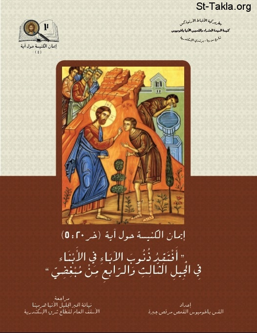

# أفتقد ذنوب الآباء في الأبناء في الجيل الثالث والرابع من مبغضي

**المؤلف / Author:** القس باخوميوس القمص مرقص جبرة
**المصدر / Source:** [st-takla.org](https://st-takla.org/books/fr-pakhomius-marcos/visiting-iniquity/index.html)
**الموضوعات / Topics:** —

📘 **[Download EPUB / تحميل الكتاب](visiting-iniquity.epub)**

## نبذة

نشكر القس باخوميوس القمص مرقص جبرة على السماح لنا في موقع الأنبا تكلا هيمانوت بوضع هذا الكتاب هنا ،

## الفصول / Chapters (11)

1. [مقدمة - كتاب أفتقد ذنوب الآباء في الأبناء](chapters/01-introduction/)
2. [تمهيد وبحث - كتاب أفتقد ذنوب الآباء في الأبناء](chapters/02-preface/)
3. [الآية ومثيلاتها في الكتاب المقدس - كتاب أفتقد ذنوب الآباء في الأبناء](chapters/03-similar/)
4. [الآية في إطار الأحداث - كتاب أفتقد ذنوب الآباء في الأبناء](chapters/04-verse/)
5. [كيف فهم اليهود هذه الآية؟ - كتاب أفتقد ذنوب الآباء في الأبناء](chapters/05-jews/)
6. [شرح آباء الكنيسة حول الآية - كتاب أفتقد ذنوب الآباء في الأبناء](chapters/06-patrology/)
7. [شرح العلامة أوريجانوس للآية - كتاب أفتقد ذنوب الآباء في الأبناء](chapters/07-origen/)
8. [شرح القديس كيرلس الكبير للآية - كتاب أفتقد ذنوب الآباء في الأبناء](chapters/08-cyril/)
9. [شرح القديسين يوحنا ذهبي الفم وأمبروسيوس للآية - كتاب أفتقد ذنوب الآباء في الأبناء](chapters/09-chrysostom/)
10. [شرح القديسين يعقوب السروجي وجيروم للآية - كتاب أفتقد ذنوب الآباء في الأبناء](chapters/10-jerome/)
11. [شرح القديس أغسطينوس للآية - كتاب أفتقد ذنوب الآباء في الأبناء](chapters/11-augustine/)

---
*هذا الكتاب مجاني للنشر والتوزيع لخلاص كل نفس. This book is free to share and distribute for the salvation of every soul.*
