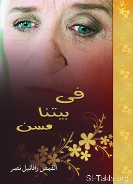

# في بيتنا مسن

**المؤلف / Author:** القمص رافائيل نصر
**المصدر / Source:** [st-takla.org](https://st-takla.org/books/fr-raphael-nasr/elders/index.html)
**الموضوعات / Topics:** —

📘 **[Download EPUB / تحميل الكتاب](elders.epub)**

## نبذة

نشكر القمص رافائيل نصر منقريوس على السماح لنا في موقع الأنبا تكلا هيمانوت بوضع هذا الكتاب هنا (1) .

## الفصول / Chapters (21)

1. [مقدمة](chapters/01-introduction/)
2. [الشيخوخة.. متى تبدأ؟](chapters/02-old-age/)
3. [الشيخوخة.. متى تبدأ؟](chapters/03-when/)
4. [مشاعر وانفعالات المُسِن](chapters/04-feelings/)
5. [المسن. كيف يفكر؟](chapters/05-thinking/)
6. [حياة المسن الاجتماعية](chapters/06-social-life/)
7. [الحياة الجنسية للمسن](chapters/07-sexual-life/)
8. [المسن.. ما مشكلاته؟](chapters/08-problems/)
9. [الألزهايمر: من مشاكل المسنين](chapters/09-alzheimer/)
10. [مشاكل المسنين المالية](chapters/10-financial/)
11. [الإمساك: من مشاكل المسنين](chapters/11-constipation/)
12. [اضطرابات النوم: من مشاكل المسنين](chapters/12-sleep-problems/)
13. [مشكلات الاتصال (التواصل) عند المسنين](chapters/13-connection/)
14. [تقرحات الفراش: من مشاكل المسنين](chapters/14-bed-ulcers/)
15. [الخوف من الموت: من مشاكل المسنين](chapters/15-fear-of-death/)
16. [مشكلات يسببها المسن](chapters/16-causing/)
17. [المسنون كيف نرعاهم؟ وكيف نتعامل معهم؟](chapters/17-care/)
18. [دور الكنيسة تجاه المسنين](chapters/18-church-role/)
19. [خادم المسنين.. من هو؟](chapters/19-servant/)
20. [كلمة أخيرة](chapters/20-finally/)
21. [المراجع](chapters/21-references/)

---
*هذا الكتاب مجاني للنشر والتوزيع لخلاص كل نفس. This book is free to share and distribute for the salvation of every soul.*
