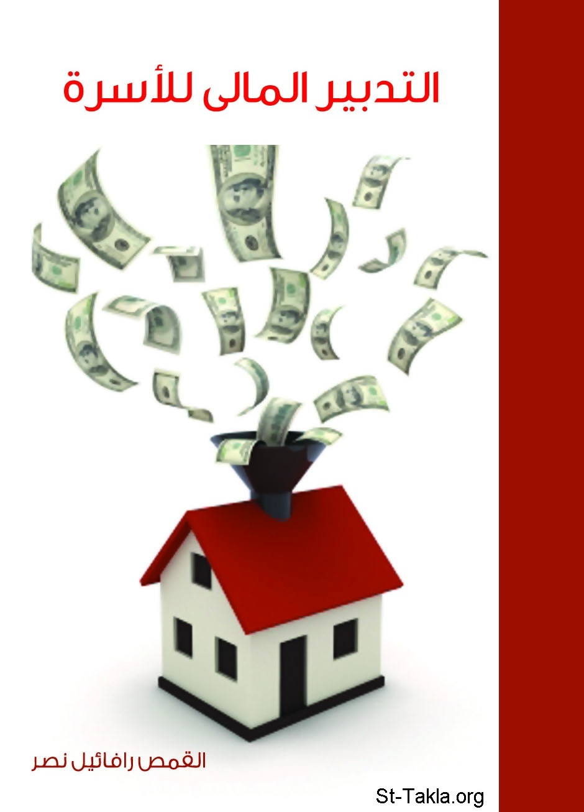

# التدبير المالي للأسرة

**المؤلف / Author:** القمص رافائيل نصر
**المصدر / Source:** [st-takla.org](https://st-takla.org/books/fr-raphael-nasr/family-economics/index.html)
**الموضوعات / Topics:** —

📘 **[Download EPUB / تحميل الكتاب](family-economics.epub)**

## نبذة

نشكر القمص رافائيل نصر منقريوس على السماح لنا في موقع الأنبا تكلا هيمانوت بوضع هذا الكتاب هنا.

## الفصول / Chapters (15)

1. [إهداء وتقدير](chapters/01-dedication/)
2. [مافيش فلوس](chapters/02-no-money/)
3. [لماذا نحن فقراء؟](chapters/03-poor/)
4. [هل الأغنياء أشرار؟](chapters/04-are-rich-bad/)
5. [المال.. هل هو خير أم شر؟](chapters/05-money/)
6. [العمل ثم العمل](chapters/06-work/)
7. [الاحتياج](chapters/07-need/)
8. [زيادة الدخل](chapters/08-income/)
9. [سلفني شكرًا](chapters/09-borrow/)
10. [ضغط النفقات](chapters/10-pressure/)
11. [احذر الطوارئ والأزمات](chapters/11-be-cautious/)
12. [العشور أولًا](chapters/12-tithe/)
13. [البركة.. ماذا تعني؟](chapters/13-blessing/)
14. [أفكار من أجل تدبير مالي أفضل](chapters/14-ideas/)
15. [وفي النهاية](chapters/15-end/)

---
*هذا الكتاب مجاني للنشر والتوزيع لخلاص كل نفس. This book is free to share and distribute for the salvation of every soul.*
