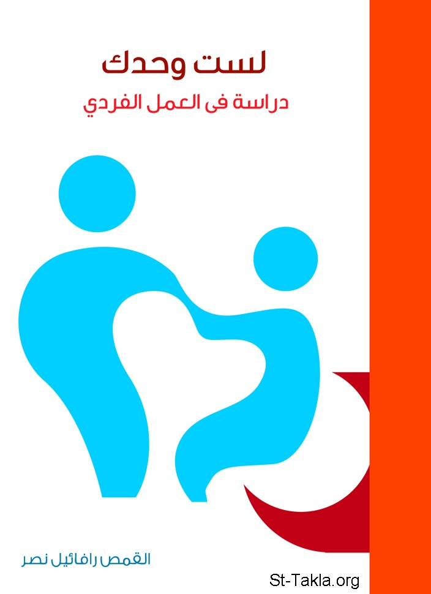

# لست وحدك: دراسة في العمل الفردي

**المؤلف / Author:** القمص رافائيل نصر
**المصدر / Source:** [st-takla.org](https://st-takla.org/books/fr-raphael-nasr/not-alone/index.html)
**الموضوعات / Topics:** —

📘 **[Download EPUB / تحميل الكتاب](not-alone.epub)**

## نبذة

نشكر القمص رافائيل نصر منقريوس على السماح لنا في موقع الأنبا تكلا هيمانوت بوضع هذا الكتاب هنا.

## الفصول / Chapters (16)

1. [المقدمة](chapters/01-introduction/)
2. [لِمَنْ هذا الكتاب؟](chapters/02-for-whom/)
3. [وماذا بعد؟](chapters/03-then/)
4. [ما هي الكنيسة؟](chapters/04-church/)
5. [مَنْ هم؟](chapters/05-who/)
6. [ماذا أعمل؟](chapters/06-act/)
7. [العمل الفردي: ماذا يعني؟](chapters/07-one-on-one-services/)
8. [صنارة أم شبكة](chapters/08-fishing/)
9. [العمل الفردي مهم، بل مهم جدًا](chapters/09-important/)
10. [العمل الفردي في الكتاب المقدس](chapters/10-bible/)
11. [خصائص العمل الفردي](chapters/11-characteristics/)
12. [كيف ينجح العمل الفردي؟](chapters/12-succeed/)
13. [مهارات لازمة لخادم العمل الفردي](chapters/13-skills/)
14. [ثمار العمل الفردي](chapters/14-fruits/)
15. [خطة ناجحة للعمل الفردي](chapters/15-plan/)
16. [في النهاية: لنبدأ](chapters/16-start/)

---
*هذا الكتاب مجاني للنشر والتوزيع لخلاص كل نفس. This book is free to share and distribute for the salvation of every soul.*
