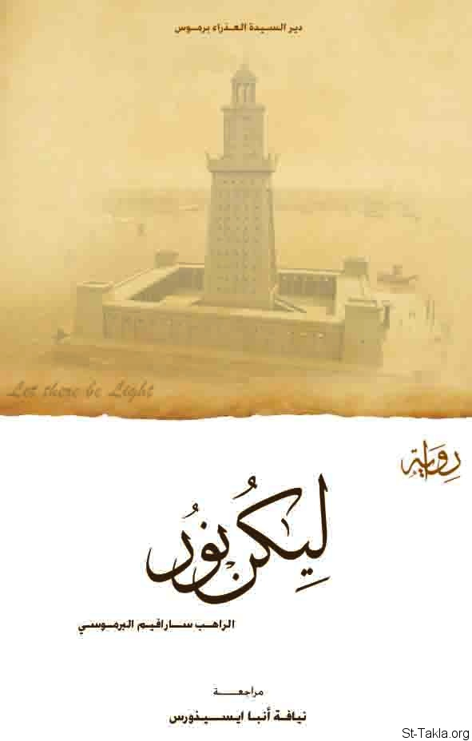

# رواية ليكن نور

**المؤلف / Author:** الراهب سارافيم البرموسي
**المصدر / Source:** [st-takla.org](https://st-takla.org/books/fr-sarafim-elbaramousy/light/index.html)
**الموضوعات / Topics:** —

📘 **[Download EPUB / تحميل الكتاب](light.epub)**

## نبذة

نشكر قدس أبونا الراهب سارافيم البرموسي على السماح لنا في موقع الأنبا تكلا هيمانوت بوضع هذا الكتاب هنا.

## الفصول / Chapters (16)

1. [مدخل](chapters/01-intro/)
2. [الموسيون](chapters/02-moses/)
3. [رواق المسيحيين](chapters/03-loggia/)
4. [أبشالوم](chapters/04-absalom/)
5. [المواجهة](chapters/05-confrontation/)
6. [كليمندس](chapters/06-clement/)
7. [المحنة](chapters/07-ordeal/)
8. [الكنيسة](chapters/08-church/)
9. [في السجن](chapters/09-prison/)
10. [قسوة الذكريات](chapters/10-memories/)
11. [مخطط السماء](chapters/11-plan/)
12. [ضريبة الحب](chapters/12-tax/)
13. [خيوط الغفران الأولى](chapters/13-forgiveness/)
14. [الحيرة الخلاقة](chapters/14-confusion/)
15. [إشراقة المسيا](chapters/15-messiah/)
16. [ليكن نور](chapters/16-light/)

---
*هذا الكتاب مجاني للنشر والتوزيع لخلاص كل نفس. This book is free to share and distribute for the salvation of every soul.*
