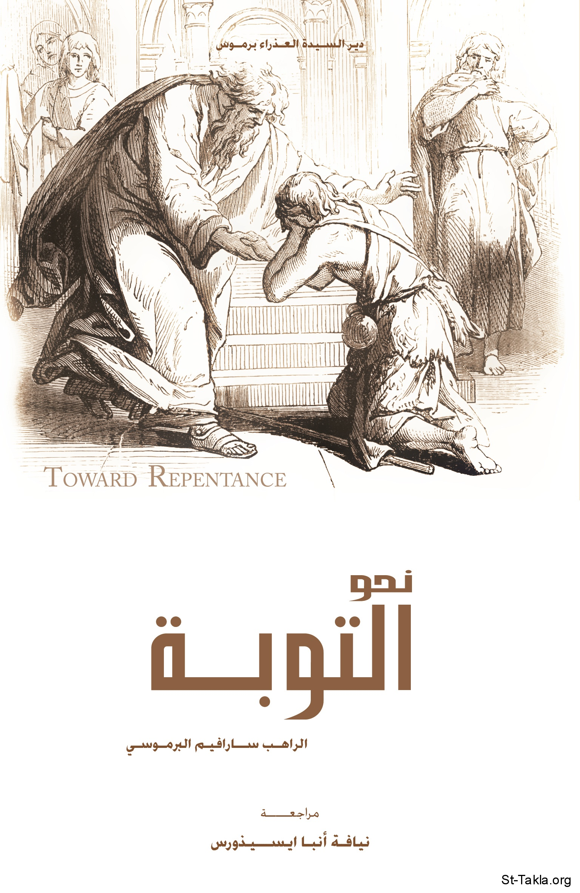

# نحو التوبة

**المؤلف / Author:** الراهب سارافيم البرموسي
**المصدر / Source:** [st-takla.org](https://st-takla.org/books/fr-sarafim-elbaramousy/toward-repentance/index.html)
**الموضوعات / Topics:** —

📘 **[Download EPUB / تحميل الكتاب](toward-repentance.epub)**

## نبذة

نشكر قدس أبونا الراهب سارافيم البرموسي على السماح لنا في موقع الأنبا تكلا هيمانوت بوضع هذا الكتاب هنا.

## الفصول / Chapters (17)

1. [مدخل](chapters/01-intro/)
2. [رجاء التوبة](chapters/02-hope/)
3. [لماذا الخطيئة؟](chapters/03-sin/)
4. [ثنائية الحياة](chapters/04-duality/)
5. [ثنائية التوبة](chapters/05-dualism/)
6. [الوعي](chapters/06-perception/)
7. [الخليقة الجديدة](chapters/07-creature/)
8. [التوبة](chapters/08-touba/)
9. [التحوُّل](chapters/09-change/)
10. [ولا أنا أدينك](chapters/10-judge/)
11. [لطف الله](chapters/11-god/)
12. [حالة الخطيئة](chapters/12-position/)
13. [ما بين سقطتين](chapters/13-between/)
14. [نور الرجاء](chapters/14-light/)
15. [الحرب للرب](chapters/15-war/)
16. [خاتمة](chapters/16-conclusion/)
17. [شذرات حول التوبة](chapters/17-fragments/)

---
*هذا الكتاب مجاني للنشر والتوزيع لخلاص كل نفس. This book is free to share and distribute for the salvation of every soul.*
