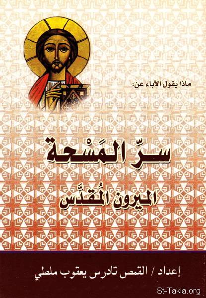

# ماذا يقول الآباء عن سر المسحة: الميرون المقدس

**المؤلف / Author:** القمص تادرس يعقوب ملطي
**المصدر / Source:** [st-takla.org](https://st-takla.org/books/fr-tadros-malaty/chrism/index.html)
**الموضوعات / Topics:** —

📘 **[Download EPUB / تحميل الكتاب](chrism.epub)**

## نبذة

نشكر قدس أبونا القمص تادرس يعقوب ملطي لسماحه لنا في موقع الأنبا تكلاهيمانوت بوضع هذا الكتاب هنا.

## الفصول / Chapters (18)

1. [المسحة المقدّسة والعُرس الأبدي](chapters/01-holy-anointing/)
2. [حلول الروح القدس ووضع الأيادي](chapters/02-laying-of-hands/)
3. [بين سرّ العماد وسرّ المسحة](chapters/03-baptism/)
4. [وضع الأيادي](chapters/04-laying-on-of-hands/)
5. [بين يد القدير واليد البشريَّة](chapters/05-hand-almighty-human/)
6. [النمو الروحي الدائم والنضوج](chapters/06-spiritual-growth/)
7. [سرّ التثبيت](chapters/07-confirmation/)
8. [مسحاء](chapters/08-christs/)
9. [ختم الله على النفس](chapters/09-gods-seal/)
10. [تدشين النفس والجسد وتكريسهما](chapters/10-consecration/)
11. [كهنة وملوك وأنبياء](chapters/11-priests-kings-prophets/)
12. [مسحة ربّانيّة كهنوتيّة](chapters/12-priestly-anointing/)
13. [مسحة ربّانيّة ملوكيّة](chapters/13-royal-anointing/)
14. [مسحة زيجيّة مفرحة](chapters/14-joyful-marital/)
15. [التبكيت على الخطية](chapters/15-benefits/)
16. [يقدم مواهب روحية](chapters/16-spiritual-gifts/)
17. [لاَ تُحْزِنُوا رُوحَ اللهِ الْقُدُّوسَ](chapters/17-holy-spirit/)
18. [يجدد أرواحنا](chapters/18-renew-joy/)

---
*هذا الكتاب مجاني للنشر والتوزيع لخلاص كل نفس. This book is free to share and distribute for the salvation of every soul.*
