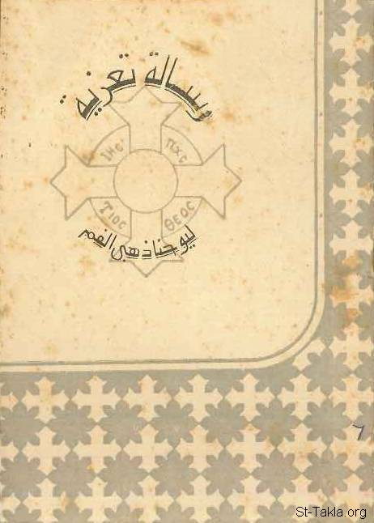

# رسالة تعزية إلى أرملة شابة، للقديس يوحنا الذهبي الفم

**المؤلف / Author:** تعريب: القمص تادرس يعقوب ملطي
**المصدر / Source:** [st-takla.org](https://st-takla.org/books/fr-tadros-malaty/consolation/index.html)
**الموضوعات / Topics:** —

📘 **[Download EPUB / تحميل الكتاب](consolation.epub)**

## نبذة

نشكر قدس أبونا القمص تادرس يعقوب ملطي لسماحه لنا في موقع الأنبا تكلاهيمانوت بوضع هذا الكتاب هنا. وهذه النسخة عن الطبعة المنقحة التي صدرت عام 2007 م.

## الفصول / Chapters (8)

1. [مفهوم التَرَمُّل في الكنيسة](chapters/01-widowhood/)
2. [الترمل نكبة فادحة!](chapters/02-disaster/)
3. [ربنا يسوع عريس نفسكِ!](chapters/03-christ-bridegroom/)
4. [هل تخجلين من دعوتك "أرملة"؟](chapters/04-widow/)
5. [ستلتقين به ممجدًا!](chapters/05-meet-in-glory/)
6. [أتندبين مجد العالم؟!](chapters/06-world/)
7. [هل تطلبين الغنى؟](chapters/07-money/)
8. [حياة مُتَقَلِّبة!](chapters/08-life/)

---
*هذا الكتاب مجاني للنشر والتوزيع لخلاص كل نفس. This book is free to share and distribute for the salvation of every soul.*
