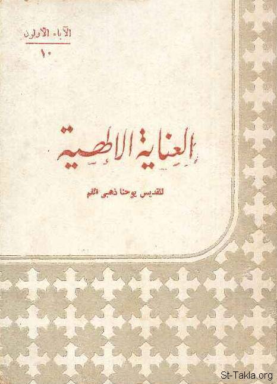

# العناية الإلهية، للقديس يوحنا الذهبي الفم

**المؤلف / Author:** القمص تادرس يعقوب ملطي، تعريب: عايدة حنا بسطا
**المصدر / Source:** [st-takla.org](https://st-takla.org/books/fr-tadros-malaty/divine-providence/index.html)
**الموضوعات / Topics:** —

📘 **[Download EPUB / تحميل الكتاب](divine-providence.epub)**

## نبذة

نشكر قدس أبونا القمص تادرس يعقوب ملطي لسماحه لنا في موقع الأنبا تكلاهيمانوت بوضع هذا الكتاب هنا. وهذه النسخة هي طبعة منقحة صدرت عام 2007 م. (إصدار كنيسة الشهيد مار جرجس باسبورتنج).

## الفصول / Chapters (14)

1. [تقديم](chapters/01-preface/)
2. [مقدّمة](chapters/02-introduction/)
3. [أحكام الله](chapters/03-gods-judgement/)
4. [أحكام الله والسمائيون](chapters/04-heavenly-creatures/)
5. [الخليقة وعناية الله](chapters/05-creation/)
6. [الله يحبك](chapters/06-love-you/)
7. [خَلَقَ الكل لأجلِك](chapters/07-for-you/)
8. [قدَّم لنا خلاصًا](chapters/08-salvation/)
9. [تأمل نهاية الأمر](chapters/09-end/)
10. [أناس وثقوا في المواعيد](chapters/10-promises/)
11. [تَرَقَّبْ الأبدية!](chapters/11-enternity/)
12. [الشر وعناية الله](chapters/12-evil/)
13. [أناس لم يتعثروا بالرغم من عدم وجود معلمين](chapters/13-teachers/)
14. [هل تعثرت النفوس بسبب الاضطهادات في العصر الرسولي؟](chapters/14-persecution/)

---
*هذا الكتاب مجاني للنشر والتوزيع لخلاص كل نفس. This book is free to share and distribute for the salvation of every soul.*
