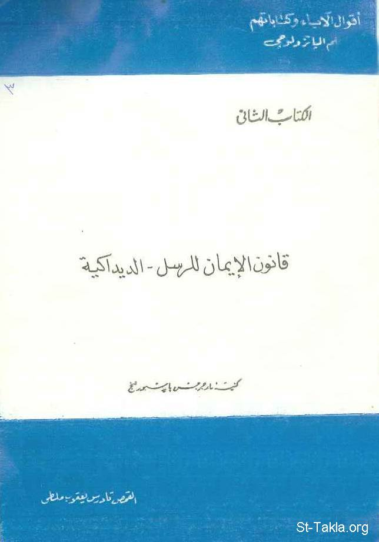

# قانون الإيمان للرسل: الديداكية

**المؤلف / Author:** القمص تادرس يعقوب ملطي
**المصدر / Source:** [st-takla.org](https://st-takla.org/Full-Free-Coptic-Books/FreeCopticBooks-020-Father-Tadros-Yaacoub-Malaty/001-El-Didakeya/Didache-Apostles-Faith-Canon-00-index.html)
**الموضوعات / Topics:** —

📘 **[Download EPUB / تحميل الكتاب](el-didakeya.epub)**

## نبذة

نشكر قدس أبونا القمص تادرس يعقوب ملطي لسماحه لموقع الأنبا تكلاهيمانوت بوضع هذا الكتاب هنا.

## الفصول / Chapters (37)

1. [الحواشي والمراجع - كتاب قانون الإيمان للرسل - الديداكية](chapters/01-Didache-Apostles-Faith-Canon-37-References/)
2. [نص الديداكية - كتاب قانون الإيمان للرسل - الديداكية](chapters/02-Didache-Apostles-Faith-Canon-20-Text/)
3. [مقدمة وتأمل - كتاب قانون الإيمان للرسل - الديداكية](chapters/03-Didache-Apostles-Faith-Canon-01-Intro/)
4. [قانون الإيمان في العهد الجديد - كتاب قانون الإيمان للرسل - الديداكية](chapters/04-Didache-Apostles-Faith-Canon-02-New-Testament/)
5. [فكرة تاريخية عن قانون الإيمان في العهد الجديد - كتاب قانون الإيمان للرسل - الديداكية](chapters/05-Didache-Apostles-Faith-Canon-03-History/)
6. [قانون الإيمان الرسولي - كتاب قانون الإيمان للرسل - الديداكية](chapters/06-Didache-Apostles-Faith-Canon-04-Apostolic-Creed/)
7. [مصدر قانون الإيمان الرسولي - كتاب قانون الإيمان للرسل - الديداكية](chapters/07-Didache-Apostles-Faith-Canon-05-Source/)
8. [حول قوانين الإيمان الأولى - كتاب قانون الإيمان للرسل - الديداكية](chapters/08-Didache-Apostles-Faith-Canon-06-About/)
9. [محتويات قانون الإيمان الرسولي - كتاب قانون الإيمان للرسل - الديداكية](chapters/09-Didache-Apostles-Faith-Canon-07-Content/)
10. [النص: أؤمن بالله الآب - كتاب قانون الإيمان للرسل - الديداكية](chapters/10-Didache-Apostles-Faith-Canon-08-Al-Rosol/)
11. [قوانين الإيمان ما قبل نيقية وعلاقتها بقانون الإيمان للرسل والقانون النيقي - كتاب قانون الإيمان للرسل - الديداكية](chapters/11-Didache-Apostles-Faith-Canon-09-Creeds-Table/)
12. [الديداكية](chapters/12-Didache-Apostles-Faith-Canon-10-Didakhy/)
13. [محتويات الديداخية - كتاب قانون الإيمان للرسل - الديداكية](chapters/13-Didache-Apostles-Faith-Canon-11-Contents/)
14. [القسم الأول](chapters/14-Didache-Apostles-Faith-Canon-12-I-Behavior/)
15. [القسم الثاني](chapters/15-Didache-Apostles-Faith-Canon-13-II-Liturgy/)
16. [القسم الثالث](chapters/16-Didache-Apostles-Faith-Canon-14-III-Order/)
17. [الخاتمة](chapters/17-Didache-Apostles-Faith-Canon-15-About-Prosia/)
18. [كاتب الرسالة](chapters/18-Didache-Apostles-Faith-Canon-16-Writer/)
19. [مكان كتابة الرسالة - كتاب قانون الإيمان للرسل - الديداكية](chapters/19-Didache-Apostles-Faith-Canon-17-Place/)
20. [الديداكي والكتابات الآبائية الأولى - كتاب قانون الإيمان للرسل - الديداكية](chapters/20-Didache-Apostles-Faith-Canon-18-First/)
21. [النصوص التقليدية - كتاب قانون الإيمان للرسل - الديداكية](chapters/21-Didache-Apostles-Faith-Canon-19-Texts/)
22. [الطريقان](chapters/22-Didache-Apostles-Faith-Canon-21-Two-Ways/)
23. [الوصية الثانية للتعليم - كتاب قانون الإيمان للرسل - الديداكية](chapters/23-Didache-Apostles-Faith-Canon-22-Second/)
24. [الهروب من الخطايا - كتاب قانون الإيمان للرسل - الديداكية](chapters/24-Didache-Apostles-Faith-Canon-23-Sins/)
25. [اللهج في كلام الله واتباع الفضائل الروحية - كتاب قانون الإيمان للرسل - الديداكية](chapters/25-Didache-Apostles-Faith-Canon-24-Words/)
26. [طريق الموت - كتاب قانون الإيمان للرسل - الديداكية](chapters/26-Didache-Apostles-Faith-Canon-25-Death/)
27. [التعليم](chapters/27-Didache-Apostles-Faith-Canon-26-Education/)
28. [الحياة الليتورچية و السرائرية](chapters/28-Didache-Apostles-Faith-Canon-27-Baptism/)
29. [الصوم والصلاة - كتاب قانون الإيمان للرسل - الديداكية](chapters/29-Didache-Apostles-Faith-Canon-28-Prayer/)
30. [الأفخارستيا - كتاب قانون الإيمان للرسل - الديداكية](chapters/30-Didache-Apostles-Faith-Canon-29-Eukharist/)
31. [الشكر - كتاب قانون الإيمان للرسل - الديداكية](chapters/31-Didache-Apostles-Faith-Canon-30-Thanks/)
32. [الترتيبات والتنظيمات الكنسية](chapters/32-Didache-Apostles-Faith-Canon-31-Order/)
33. [الرسل - كتاب قانون الإيمان للرسل - الديداكية](chapters/33-Didache-Apostles-Faith-Canon-32-Apostles/)
34. [الأنبياء - كتاب قانون الإيمان للرسل - الديداكية](chapters/34-Didache-Apostles-Faith-Canon-33-Prophets/)
35. [الاجتماعات - كتاب قانون الإيمان للرسل - الديداكية](chapters/35-Didache-Apostles-Faith-Canon-34-Meetings/)
36. [المعلمون - كتاب قانون الإيمان للرسل - الديداكية](chapters/36-Didache-Apostles-Faith-Canon-35-Teaching/)
37. [بروسيا الرب - كتاب قانون الإيمان للرسل - الديداكية](chapters/37-Didache-Apostles-Faith-Canon-36-Brosia/)

---
*هذا الكتاب مجاني للنشر والتوزيع لخلاص كل نفس. This book is free to share and distribute for the salvation of every soul.*
