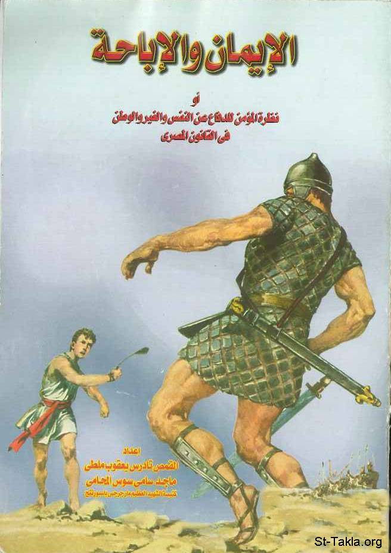

# الإيمان والإباحة (أو نظرة المؤمن للدفاع عن النفس والغير والوطن في القانون المصري، وفي العهدين القديم والجديد)

**المؤلف / Author:** القمص تادرس يعقوب ملطي، مع ماجد سامي سوس المحامي
**المصدر / Source:** [st-takla.org](https://st-takla.org/books/fr-tadros-malaty/faith-vs-allowance/index.html)
**الموضوعات / Topics:** —

📘 **[Download EPUB / تحميل الكتاب](faith-vs-allowance.epub)**

## نبذة

نشكر قدس أبونا القمص تادرس يعقوب ملطي لسماحه لنا في موقع الأنبا تكلاهيمانوت بوضع هذا الكتاب هنا. وقد تم نشره عام 1998 م. ولاحقًا استخدم الأب تادرس أجزاء من هذا الكتاب في كتابه الخط الاجتماعي عند آباء الكنيسة الأولى ، مع بعض التعديلات.

## الفصول / Chapters (11)

1. [تساؤلات حول الدفاع عن النفس والغير والوطن - كتاب الإيمان والإباحة](chapters/01-questions/)
2. [الإباحة والقانون - كتاب الإيمان والإباحة](chapters/02-law/)
3. [الفصل الأول: ممارسة الحق - كتاب الإيمان والإباحة](chapters/03-right/)
4. [الفصل الثاني: الدفاع الشرعي - كتاب الإيمان والإباحة](chapters/04-defense/)
5. [الفصل الثالث: أداء الواجب - كتاب الإيمان والإباحة](chapters/05-duty/)
6. [الفصل الرابع: رضا المجني عليه - كتاب الإيمان والإباحة](chapters/06-victim/)
7. [الإيمان والإباحة في الكتاب المقدس - كتاب الإيمان والإباحة](chapters/07-bible/)
8. [الإيمان والإباحة في العهد القديم - كتاب الإيمان والإباحة](chapters/08-old-testament/)
9. [الإيمان والإباحة في العهد الجديد - كتاب الإيمان والإباحة](chapters/09-new-testament/)
10. [الإيمان والإباحة في عصر ما قبل الإمبراطور قسطنطين - كتاب الإيمان والإباحة](chapters/10-before-constantine/)
11. [الإيمان والإباحة في عصور ما بعد الإمبراطور قسطنطين - كتاب الإيمان والإباحة](chapters/11-after-constantine/)

---
*هذا الكتاب مجاني للنشر والتوزيع لخلاص كل نفس. This book is free to share and distribute for the salvation of every soul.*
