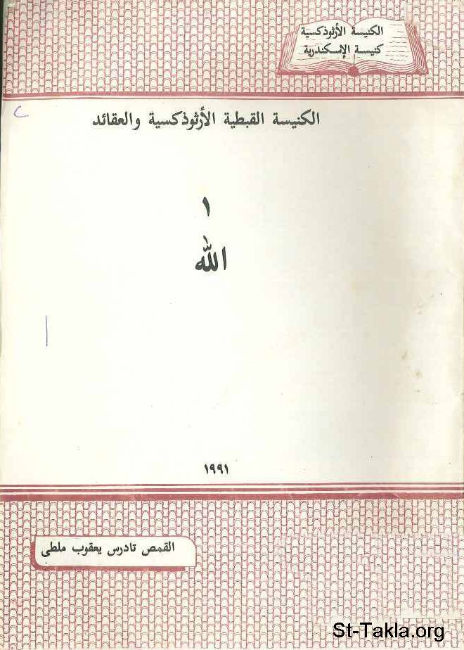

# الله

**المؤلف / Author:** القمص تادرس يعقوب ملطي
**المصدر / Source:** [st-takla.org](https://st-takla.org/books/fr-tadros-malaty/god/index.html)
**الموضوعات / Topics:** —

📘 **[Download EPUB / تحميل الكتاب](god.epub)**

## نبذة

نشكر قدس أبونا القمص تادرس يعقوب ملطي لسماحه لنا في موقع الأنبا تكلاهيمانوت بوضع هذا الكتاب هنا. وهو من سلسلة الكنيسة القبطية الأرثوذكسية والعقائد "1".

## الفصول / Chapters (41)

1. [الله محبة](chapters/01-is-love/)
2. [استعلان الله](chapters/02-god/)
3. [يهوه](chapters/03-jehovah/)
4. [ثيؤس](chapters/04-theos/)
5. [الله الذي نؤمن به](chapters/05-believe/)
6. [سر الله](chapters/06-secret/)
7. [وحدانية الله والإيمان الثالوثي](chapters/07-one/)
8. [العقيدة الثالوثية والكتاب المقدس](chapters/08-trinity/)
9. [الصيغ الأولى الثالوثية](chapters/09-three/)
10. [الله والحب الأبدي](chapters/10-eternal-love/)
11. [الثالوث القدوس وبساطة الله](chapters/11-trinity-simple/)
12. [الإيمان الثالوثي وحياتنا اليومية](chapters/12-trinity-daily-life/)
13. [الثالوث القدوس والفلسفة](chapters/13-trinity-philosophy/)
14. [الثالوث القدوس والتشبيهات](chapters/14-trinity-examples/)
15. [الآب](chapters/15-the-father/)
16. [اللوغوس](chapters/16-logos/)
17. [الروح القدس](chapters/17-holy-spirit/)
18. [الله في كتابات الآباء الإسكندريين](chapters/18-writings/)
19. [الله في كتابات أثيناغوراس](chapters/19-writings-athinaghoras/)
20. [الله في كتابات القديس إكليمنضس الاسكندري](chapters/20-writings-eklemondos/)
21. [الله في كتابات العلامة أوريجينوس](chapters/21-writings-origanos/)
22. [الله في كتابات ثيؤغنسطس](chapters/22-writings-theoghnostos/)
23. [الله في كتابات بيريوس](chapters/23-writings-perios/)
24. [الله في كتابات القديس ديونسيوس الإسكندري](chapters/24-writings-dionesios/)
25. [الله في كتابات القديس الكسندر الإسكندري](chapters/25-writings-alexander/)
26. [الله في كتابات القديس أثناسيوس](chapters/26-writings-athanasious/)
27. [الله في كتابات آباء آخرون](chapters/27-writings-other/)
28. [ألوهية السيد المسيح في الكتاب المقدس](chapters/28-chirst-divinity/)
29. [المسيح هو الرب](chapters/29-chirst-is-lord/)
30. [المسيح هو الله](chapters/30-chirst-is-god/)
31. [يسوع المسيح هو كلمة "لوغوس" الله المتجسد](chapters/31-chirst-logos/)
32. [المسيح له خصائص الله ويقوم بأعمال الله](chapters/32-chirst-works/)
33. [إرسال المسيح الروح القدس روح الله](chapters/33-chirst-sends-holy-spirit/)
34. [علاقة المسيح بالروح القدس](chapters/34-chirst-holy-spirit/)
35. [نزول المسيح من السماء](chapters/35-chirst-heaven/)
36. [المسيح هو ابن الله](chapters/36-chirst-son-of-god/)
37. [الإيمان بالسيد المسيح كإله الكون](chapters/37-chirst-the-god/)
38. [المسيح هو المخلص](chapters/38-chirst-saviour/)
39. [علاقة المسيح مع الآب](chapters/39-chirst-father/)
40. [سلطان المسيح المطلق](chapters/40-chirst-power/)
41. [خاتمة](chapters/41-epilogue/)

---
*هذا الكتاب مجاني للنشر والتوزيع لخلاص كل نفس. This book is free to share and distribute for the salvation of every soul.*
