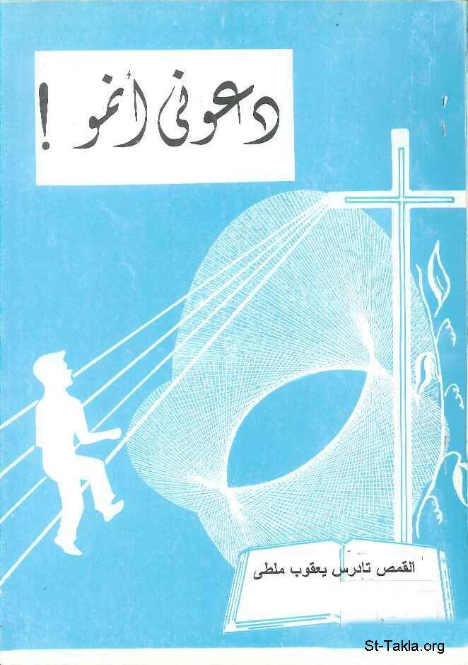

# دعوني أنمو: صرخة شبابية: كتاب دعوني أنمو! لمسات واقعية في عالم الشباب

**المؤلف / Author:** القمص تادرس يعقوب ملطي
**المصدر / Source:** [st-takla.org](https://st-takla.org/books/fr-tadros-malaty/grow/index.html)
**الموضوعات / Topics:** —

📘 **[Download EPUB / تحميل الكتاب](grow.epub)**

## نبذة

نشكر قدس أبونا القمص تادرس يعقوب ملطي لسماحه لنا في موقع الأنبا تكلاهيمانوت بوضع هذا الكتاب هنا.

## الفصول / Chapters (86)

1. [مقدمة - كتاب دعوني أنمو](chapters/01-introduction/)
2. [لازلتُ بتولًا! - كتاب دعوني أنمو](chapters/02-chaste/)
3. [دعوني أنمو](chapters/03-grow/)
4. [الجسد والجنس! - كتاب دعوني أنمو](chapters/04-sex/)
5. [لا أريد أن أكون شاذًا! - كتاب دعوني أنمو](chapters/05-abnormal/)
6. [إني أقل من أصحابي! إني في عزلة! - كتاب دعوني أنمو](chapters/06-lonely/)
7. [أريد أن أكون حرًا! - كتاب دعوني أنمو](chapters/07-free/)
8. [أريد أن أتعلم! - كتاب دعوني أنمو](chapters/08-learn/)
9. [لا طعم للجنس! - كتاب دعوني أنمو](chapters/09-taste/)
10. [الإلحاد المعاصر - كتاب دعوني أنمو](chapters/10-atheism/)
11. [شباب بلا شيخوخة - كتاب دعوني أنمو](chapters/11-youth/)
12. [روح الشباب - كتاب دعوني أنمو](chapters/12-spirit/)
13. [لا تهدروا كرامتي! - كتاب دعوني أنمو](chapters/13-dignity/)
14. [تحمل جنسًا... لكنك لست جنسًا مجردًا! - كتاب دعوني أنمو](chapters/14-not/)
15. [أرع جسدك ولا تؤلهه! - كتاب دعوني أنمو](chapters/15-care/)
16. [لست قبيحًا... أهتم بنموك النفسي - كتاب دعوني أنمو](chapters/16-psychological/)
17. [لتهتم بنموك العقلي! - كتاب دعوني أنمو](chapters/17-mind/)
18. [النمو العاطفي - كتاب دعوني أنمو](chapters/18-passion/)
19. [النضوج والحياة الجنسية - كتاب دعوني أنمو](chapters/19-maturity/)
20. [النمو الاجتماعي - كتاب دعوني أنمو](chapters/20-social/)
21. [لا تتجاهل روحك! - كتاب دعوني أنمو](chapters/21-soul/)
22. [المراهقة نمو وليس مشكلة - كتاب دعوني أنمو](chapters/22-adolescence/)
23. [لنصِغ إليهم ونقدّر قيمّهم وأفكارهم - كتاب دعوني أنمو](chapters/23-listen/)
24. [لا تتعجلوا نمّونا... ولا تتجاهلوه! - كتاب دعوني أنمو](chapters/24-haste/)
25. [نُقدّر نموكم المستمر... اقبلوا خبرات الغير! - كتاب دعوني أنمو](chapters/25-experiences/)
26. [استلم عجلة القيادة... لاحظ العلامات! - كتاب دعوني أنمو](chapters/26-drive/)
27. [لا تخجل من كلمة "لا" - كتاب دعوني أنمو](chapters/27-no/)
28. [ثانيا: تفهَّم الرجولة أو الأنوثة - كتاب دعوني أنمو](chapters/28-understand/)
29. [ثالثًا: الجنس... ليس تعويضًا ولا تنفيسًا ولا لذة ذاتية! - كتاب دعوني أنمو](chapters/29-compensation/)
30. [أريد أن تنمو؟ حِب! - كتاب دعوني أنمو](chapters/30-want/)
31. [النمو وتوازن الشخصية - كتاب دعوني أنمو](chapters/31-balance/)
32. [النمو البدني عطية إلهية... يصاحبه مشاكل! - كتاب دعوني أنمو](chapters/32-bodily/)
33. [أسئلة تكشف عن مدى نموك - كتاب دعوني أنمو](chapters/33-questions/)
34. [المراهقة والجسد - كتاب دعوني أنمو](chapters/34-teen/)
35. [الجسد والحياة الإنسانية - كتاب دعوني أنمو](chapters/35-life/)
36. [الجسد بين التأله والبغضة - كتاب دعوني أنمو](chapters/36-hate/)
37. [قدسية الجسد - كتاب دعوني أنمو](chapters/37-holy/)
38. [النظرة الآبائية للأعضاء الجسدية - كتاب دعوني أنمو](chapters/38-patristic/)
39. [الجسم الإنساني والشهوات الجسدية - كتاب دعوني أنمو](chapters/39-human/)
40. [التغيرات الجسدية والمراهقة - كتاب دعوني أنمو](chapters/40-changes/)
41. [العطش إلى الحب - كتاب دعوني أنمو](chapters/41-thirst/)
42. [الحب أسمى من اللغات البشرية - كتاب دعوني أنمو](chapters/42-eminence/)
43. [إحذر رحلة الأنا - كتاب دعوني أنمو](chapters/43-ego/)
44. [الحب... رحلة النفس - كتاب دعوني أنمو](chapters/44-selftrip/)
45. [شهوة... لا حب - كتاب دعوني أنمو](chapters/45-lust/)
46. [أحببت من أول لقاء! - كتاب دعوني أنمو](chapters/46-first/)
47. [اتجاهات خاطئة تحت ستار "الحب" - كتاب دعوني أنمو](chapters/47-wrong/)
48. [سريعو الانفعال.... ثائرون - كتاب دعوني أنمو](chapters/48-passivity/)
49. [دموع لا تجف... بسبب موت كلب! - كتاب دعوني أنمو](chapters/49-tears/)
50. [محتاج إلى حبكما وعاطفتكما وتقديركما لي! - كتاب دعوني أنمو](chapters/50-appreciation/)
51. [الجنس والكيان الإنساني - كتاب دعوني أنمو](chapters/51-entity/)
52. [الجنس والحياة الفردوسية - كتاب دعوني أنمو](chapters/52-paradise/)
53. [الغريزة الجنسية في حياة المؤمن - كتاب دعوني أنمو](chapters/53-instinct/)
54. [النظرة الآبائية للجنس الآخر - كتاب دعوني أنمو](chapters/54-patrology/)
55. [التربية الروحية والجنس - كتاب دعوني أنمو](chapters/55-education/)
56. [الزهد في العلاقات الجسدية - كتاب دعوني أنمو](chapters/56-asceticism/)
57. [المربي والتربية الجنسية - كتاب دعوني أنمو](chapters/57-teacher/)
58. [العلاقات الأسرية - كتاب دعوني أنمو](chapters/58-family/)
59. [جماعة حب - كتاب دعوني أنمو](chapters/59-group/)
60. [قدسية العلاقات الزوجية في الفردوس - كتاب دعوني أنمو](chapters/60-marriage/)
61. [الحب في الزواج أو البتولية - كتاب دعوني أنمو](chapters/61-virginal/)
62. [بين الرجولة والأنوثة - كتاب دعوني أنمو](chapters/62-women/)
63. [الرجولة في الحياة الزوجية - كتاب دعوني أنمو](chapters/63-men/)
64. [الأنوثة والحياة الزوجية - كتاب دعوني أنمو](chapters/64-feminine/)
65. [العفة الإنجيلية والشباب المعاصر - كتاب دعوني أنمو](chapters/65-bible/)
66. [وصية مستحيلة وعذبة - كتاب دعوني أنمو](chapters/66-counsel/)
67. [مفهوم العفة في المسيحية - كتاب دعوني أنمو](chapters/67-definition/)
68. [الله واهب العفة - كتاب دعوني أنمو](chapters/68-god/)
69. [إمكانيات الإنسان الجديدة - كتاب دعوني أنمو](chapters/69-possibilities/)
70. [ارتفاع القلب إلى السماويات - كتاب دعوني أنمو](chapters/70-heart/)
71. [الوقاية المستمرة من السقوط - كتاب دعوني أنمو](chapters/71-fall/)
72. [العفة للجميع - كتاب دعوني أنمو](chapters/72-all/)
73. [أولًا: الفكر وتقديسه - كتاب دعوني أنمو](chapters/73-thoughts/)
74. [تقديس الحواس - كتاب دعوني أنمو](chapters/74-sanctify/)
75. [الجهاد في تقديس الحواس - كتاب دعوني أنمو](chapters/75-strife/)
76. [الثمرة وصراع الأجيال - كتاب دعوني أنمو](chapters/76-fruit/)
77. [إنصتا إليَّ... حاوراني منذ طفولتي - كتاب دعوني أنمو](chapters/77-talk/)
78. [الشباب وعالمه الخاص - كتاب دعوني أنمو](chapters/78-special/)
79. [معالجة "الحاجة إلى الاتصالات" - كتاب دعوني أنمو](chapters/79-communication/)
80. [عالم البالغين - كتاب دعوني أنمو](chapters/80-adults/)
81. [الانحرافات الجنسية - كتاب دعوني أنمو](chapters/81-deviation/)
82. [تزايد نسبة ممارسة الانحرافات الجنسية - كتاب دعوني أنمو](chapters/82-percentage/)
83. [أنواع الانحرافات - كتاب دعوني أنمو](chapters/83-kinds/)
84. [ممارسات خاصة بالشخص نفسه - كتاب دعوني أنمو](chapters/84-autosexual/)
85. [الشذوذ الجنسي ومرض الإيدز - كتاب دعوني أنمو](chapters/85-homosexual/)
86. [ممارسات مع الجنس الآخر - كتاب دعوني أنمو](chapters/86-hetersexual/)

---
*هذا الكتاب مجاني للنشر والتوزيع لخلاص كل نفس. This book is free to share and distribute for the salvation of every soul.*
