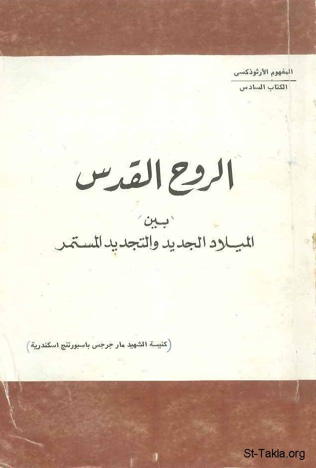

# الروح القدس بين الميلاد الجديد والتجديد المستمر

**المؤلف / Author:** القمص تادرس يعقوب ملطي
**المصدر / Source:** [st-takla.org](https://st-takla.org/books/fr-tadros-malaty/holy-spirit/index.html)
**الموضوعات / Topics:** —

📘 **[Download EPUB / تحميل الكتاب](holy-spirit.epub)**

## نبذة

نشكر قدس أبونا القمص تادرس يعقوب ملطي لسماحه لنا في موقع الأنبا تكلاهيمانوت بوضع هذا الكتاب هنا..

## الفصول / Chapters (43)

1. [مقدمة](chapters/01-intro/)
2. [التجديد في العهد الجديد](chapters/02-renewal/)
3. [الله سر تجديدنا](chapters/03-secret/)
4. [المسيح والحياة الجديدة](chapters/04-christ/)
5. [الميلاد الجديد](chapters/05-birth/)
6. [المعمودية المسيحية والعهد القديم](chapters/06-baptism/)
7. [المعمودية المسيحية والإيمان المسيحي](chapters/07-faith/)
8. [المعمودية غسل للخطايا](chapters/08-sins/)
9. [المعمودية ختان روحي](chapters/09-circumcision/)
10. [المعمودية ولادة جديدة](chapters/10-new/)
11. [المعمودية سر العضوية الكنسية](chapters/11-membership/)
12. [المعمودية سرّ الاستنارة الروحية](chapters/12-illuminate/)
13. [المعمودية وعطية الروح القدس](chapters/13-gift/)
14. [معمودية الأطفال](chapters/14-babies/)
15. [الحاجة إلى الروح القدس](chapters/15-need/)
16. [الروح القدس كنز الصلاح](chapters/16-good/)
17. [الروح القدس والتبكيت على الخطيئة](chapters/17-blame/)
18. [الروح القدس والتقديس المستمر](chapters/18-spirit/)
19. [الروح القدس وتكريس القلب](chapters/19-heart/)
20. [الروح القدس والاستنارة الدائمة](chapters/20-always/)
21. [الروح القدس والتعزيات الإلهية](chapters/21-solace/)
22. [الروح القدس والأمجاد السمائية](chapters/22-heavenly/)
23. [الروح القدس والمواهب الروحية](chapters/23-ghost/)
24. [الاستعداد للمعمودية](chapters/24-preparing/)
25. [مراسيم العماد المقدس](chapters/25-rites/)
26. [من له حق التعميد؟](chapters/26-right/)
27. [الحياة الكنسية والروح القدس](chapters/27-life/)
28. [لماذا حلّ الروح القدس على السيد المسيح عند عماده؟](chapters/28-jesus/)
29. [ما هو الفارق بين معمودية يوحنا المعمدان والمعمودية المسيحية؟](chapters/29-john/)
30. [متى بدأت المعمودية المسيحية؟](chapters/30-start/)
31. [متى اعتمد التلاميذ والرسل؟](chapters/31-disciples/)
32. [في بيت كرنيليوس، لماذا حلّ الروح القدس على المستمعين قبل المعمودية؟](chapters/32-before/)
33. [ما معنى: الذين يعتمدون من أجل الأموات؟](chapters/33-dead/)
34. [ما هو موقف الأطفال غير المعمدين في يوم الرب؟](chapters/34-didnt/)
35. [ما هو موقف الشهداء الذين لم يعتمدوا؟](chapters/35-martyrs/)
36. [ما هو موقف الذي يفارق الحياة وهو في طريقه للمعمودية؟](chapters/36-die/)
37. [هل يجوز إعادة المعمودية؟](chapters/37-repeat/)
38. [الذين استُنِيروا مرَّةً وذاقوا الموهبة السماوَّية](chapters/38-repentants/)
39. [ما هي فكرة "اسم العماد"؟](chapters/39-name/)
40. [كيف يعمد الإنسان المريض؟](chapters/40-sick/)
41. [من هم "ملائكة العماد"؟](chapters/41-angels/)
42. [ماذا يعني تعميد الأشياء؟](chapters/42-things/)
43. [ما هو معنى الامتلاء من الروح؟](chapters/43-filled/)

---
*هذا الكتاب مجاني للنشر والتوزيع لخلاص كل نفس. This book is free to share and distribute for the salvation of every soul.*
