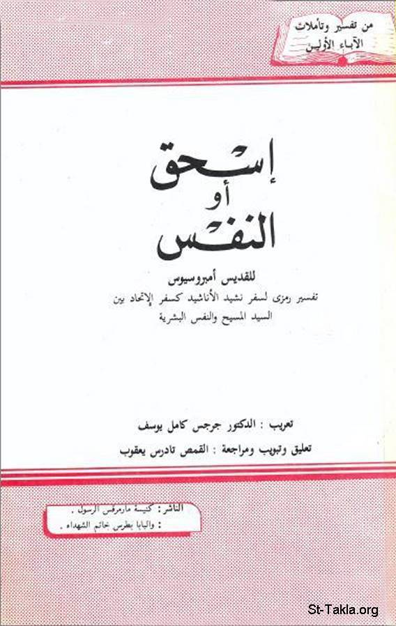

# إسحق

**المؤلف / Author:** تعريب: د. جرجس كامل يوسف، إعداد: القمص تادرس يعقوب ملطي
**المصدر / Source:** [st-takla.org](https://st-takla.org/books/fr-tadros-malaty/issac/index.html)
**الموضوعات / Topics:** —

📘 **[Download EPUB / تحميل الكتاب](issac.epub)**

## نبذة

نشكر قدس أبونا القمص تادرس يعقوب ملطي لسماحه لنا في موقع الأنبا تكلاهيمانوت بوضع هذا الكتاب هنا. وهذا الكتاب من تعريب: الدكتور جرجس كامل يوسف، وتعليق وتبويب ومراجعة: القمص تادرس يعقوب ملطي،

## الفصول / Chapters (9)

1. [يا لعظمة نفسك!](chapters/01-grace/)
2. [إسحق رمز المسيح](chapters/02-christ/)
3. [الإنسان الروحي والإنسان الجسداني](chapters/03-man/)
4. [رفقة رمز الكنيسة](chapters/04-rebecca/)
5. [تمتع النفس بحِجال الملك "الحياة السماوية"](chapters/05-king/)
6. [جهاد النفس المؤمنة](chapters/06-strife/)
7. [يقظة النفس الهائمة حبًا](chapters/07-love/)
8. [سمات النفس العروس](chapters/08-bride/)
9. [دور المسيح في كنيسته المتألمة](chapters/09-chruch/)

---
*هذا الكتاب مجاني للنشر والتوزيع لخلاص كل نفس. This book is free to share and distribute for the salvation of every soul.*
