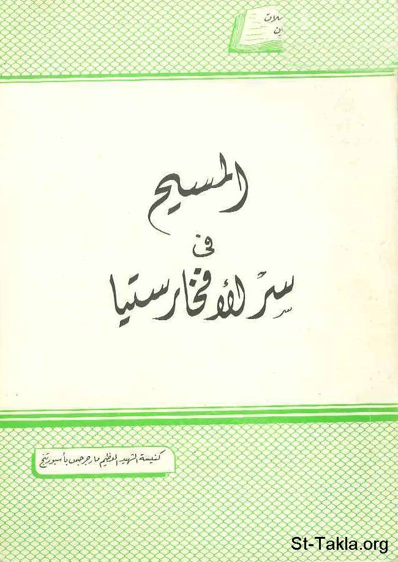

# المسيح في سر الإفخارستيا

**المؤلف / Author:** القمص تادرس يعقوب ملطي
**المصدر / Source:** [st-takla.org](https://st-takla.org/books/fr-tadros-malaty/jesus-eucharist/index.html)
**الموضوعات / Topics:** —

📘 **[Download EPUB / تحميل الكتاب](jesus-eucharist.epub)**

## نبذة

نشكر قدس أبونا القمص تادرس يعقوب ملطي لسماحه لنا في موقع الأنبا تكلاهيمانوت بوضع هذا الكتاب هنا.

## الفصول / Chapters (8)

1. [دفاع القديس يوستين من النصوص الليتورجية في القرن الثاني](chapters/01-youstin/)
2. [الديداكية من النصوص الليتورجية في القرن الثاني](chapters/02-didakia/)
3. [النصوص الليتورجية في القرن الثالث: التقليد الرسولي للقديس هيبوليتس](chapters/03-hipolitus/)
4. [النصوص الليتورجية في القرن الرابع](chapters/04-fourth-century/)
5. [خولاجي الأسقف سرابيون من النصوص الليتورجية في القرن الرابع](chapters/05-cerabion/)
6. [بردي ستاتسبورج "أنافورا مار مرقس" من النصوص الليتورجية في القرن الرابع](chapters/06-mark/)
7. [القوانين الرسولية أو الليتورچيا الاكلمنضية من النصوص الليتورجية في القرن الرابع](chapters/07-clement/)
8. [خولاجي دير بلوزة بأسيوط من النصوص الليتورجية في القرن السادس](chapters/08-bluza/)

---
*هذا الكتاب مجاني للنشر والتوزيع لخلاص كل نفس. This book is free to share and distribute for the salvation of every soul.*
