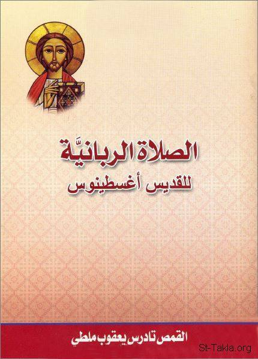

# الصلاة الربانيَّة للمستعدِّين للعماد، للقديس أغسطينوس

**المؤلف / Author:** ترجمة: القمص تادرس يعقوب ملطي
**المصدر / Source:** [st-takla.org](https://st-takla.org/books/fr-tadros-malaty/lords-prayer/index.html)
**الموضوعات / Topics:** —

📘 **[Download EPUB / تحميل الكتاب](lords-prayer.epub)**

## نبذة

نشكر قدس أبونا القمص تادرس يعقوب ملطي لسماحه لنا في موقع الأنبا تكلاهيمانوت بوضع هذا الكتاب هنا. وهذا النص عن الطبعة الثانية للكتاب الذي صدرت عام 2004 م. (إصدار كنيسة الشهيد مار جرجس باسبورتنج)، وقد نُشِرَت الطبعة الأولى من الكتاب عام 1980 م. (إصدار مدارس أحد كنيسة السيِّدة العذراء، بمحرم بك، الإسكندرية).

## الفصول / Chapters (11)

1. [مقدِّمة الطبعة الأولى](chapters/01-introduction/)
2. [الإيمان يسبق الصلاة](chapters/02-faith/)
3. [أولًا: أبانا الذي في السماوات (ممَّن نطلب؟)](chapters/03-our-father/)
4. [ثانيًا: الطلبات الست (ماذا نطلب؟)](chapters/04-six-requests/)
5. [ليتقدَّس اسمك](chapters/05-hallowed-be-thy-name/)
6. [ليأت ملكوتك](chapters/06-thy-kingdom-come/)
7. [لتكن مشيئتك كما في السماء كذلك على الأرض](chapters/07-thy-will-be-done/)
8. [خبزنا اليومي أعطنا يوميًا](chapters/08-daily-bread/)
9. [وأغفر لنا ذنوبنا، كما نغفر نحن أيضًا للمذنبين إلينا](chapters/09-forgive-us-our-trespasses/)
10. [ولا تدخلنا في تجربة لكن نجِّنا من الشرِّير](chapters/10-lead-us-not-into-temptation/)
11. [تقسيم الطلبات](chapters/11-demands/)

---
*هذا الكتاب مجاني للنشر والتوزيع لخلاص كل نفس. This book is free to share and distribute for the salvation of every soul.*
