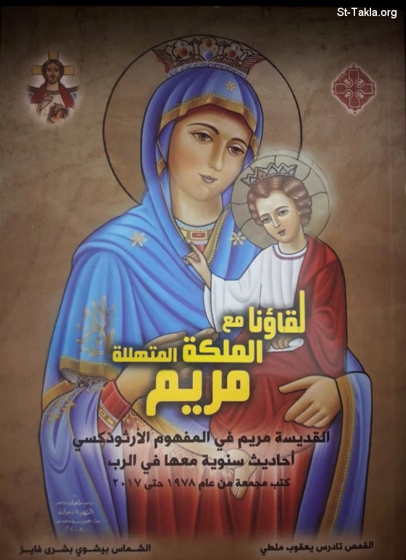

# لقاؤنا مع الملكة المتهللة مريم: القديسة مريم في المفهوم الأرثوذكسي - أحاديث سنوية معها في الرب

**المؤلف / Author:** القمص تادرس يعقوب ملطي
**المصدر / Source:** [st-takla.org](https://st-takla.org/books/fr-tadros-malaty/mary-meeting/index.html)
**الموضوعات / Topics:** —

📘 **[Download EPUB / تحميل الكتاب](mary-meeting.epub)**

## نبذة

نشكر قدس أبونا القمص تادرس يعقوب ملطي لسماحه لنا في موقع الأنبا تكلاهيمانوت بوضع هذا الكتاب هنا.

## الفصول / Chapters (1)

1. [- كتاب لقاؤنا مع الملكة المتهللة مريم](chapters/01-introduction/)

---
*هذا الكتاب مجاني للنشر والتوزيع لخلاص كل نفس. This book is free to share and distribute for the salvation of every soul.*
