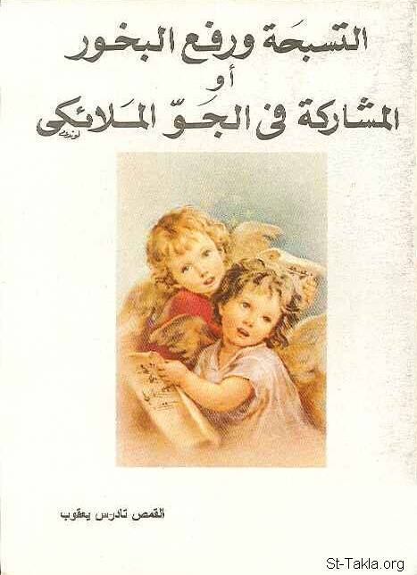

# أحاديث مبسطة عن التسبحة ورفع البخور، أو المشاركة في الجو الملائكي

**المؤلف / Author:** القمص تادرس يعقوب ملطي
**المصدر / Source:** [st-takla.org](https://st-takla.org/books/fr-tadros-malaty/praise/index.html)
**الموضوعات / Topics:** —

📘 **[Download EPUB / تحميل الكتاب](praise.epub)**

## نبذة

نشكر قدس أبونا القمص تادرس يعقوب ملطي لسماحه لنا في موقع الأنبا تكلاهيمانوت بوضع هذا الكتاب هنا.

## الفصول / Chapters (23)

1. [بدء الطريق الملوكي](chapters/01-royal-way/)
2. [التسبحة](chapters/02-praise/)
3. [التسبيح والإفخارستيا](chapters/03-eucharist/)
4. [التسبيح ذبيحة مستمرة](chapters/04-continuous-sacrifice/)
5. [التسبيح عمل كنسي جماعي](chapters/05-church-work/)
6. [التسبيح بين الطقس الكنسي والحياة اليومية](chapters/06-rite-life/)
7. [تسبحة عشية](chapters/07-vespers/)
8. [رفع بخور عشية](chapters/08-incense/)
9. [تسبيح وطلبات وتشفعات](chapters/09-intercessions/)
10. [رفع البخور](chapters/10-incense-raising/)
11. [عبادة شعبية](chapters/11-worship/)
12. [الصلوات السرية](chapters/12-secret-prayers/)
13. [الخط الروحي لطقس البخور](chapters/13-incense-rite/)
14. [طقس رفع البخور، ومناهجه اللاهوتية والروحية](chapters/14-spiritual-methods/)
15. [فتح ستر الهيكل في رفع البخور](chapters/15-veil/)
16. [صلاة الشكر (مع تقديم البخور) في رفع البخور](chapters/16-thanksgiving/)
17. [بعد صلاة الشكر يضع الكاهن خمسة أيادي بخور](chapters/17-5-incense/)
18. [التبخير حول المذبح](chapters/18-around-altar/)
19. [تقديم بخور عند باب الهيكل في رفع البخور](chapters/19-altar-door/)
20. [أرباع الناقوس](chapters/20-prayers/)
21. [دورة بخور عشية أو باكر](chapters/21-evening-morning/)
22. [ارحمنا يا اللّه](chapters/22-psalm-gospel/)
23. [التحاليل الثلاثة في رفع البخور](chapters/23-final/)

---
*هذا الكتاب مجاني للنشر والتوزيع لخلاص كل نفس. This book is free to share and distribute for the salvation of every soul.*
