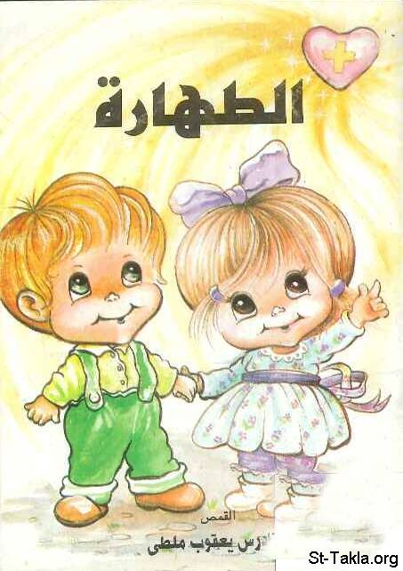

# الطهارة: أحاديث، أسئلة وإجابات

**المؤلف / Author:** القمص تادرس يعقوب ملطي
**المصدر / Source:** [st-takla.org](https://st-takla.org/books/fr-tadros-malaty/purity/index.html)
**الموضوعات / Topics:** —

📘 **[Download EPUB / تحميل الكتاب](purity.epub)**

## نبذة

نود أن نشكر قدس أبونا القمص تادرس يعقوب ملطي لسماحه لنا في موقع الأنبا تكلاهيمانوت بوضع هذا الكتاب هنا.

## الفصول / Chapters (54)

1. [هذا الكتاب - كتاب الطهارة](chapters/01-book/)
2. [مقدمة - كتاب الطهارة](chapters/02-intro/)
3. [الطهارة والتشبه بالسيد المسيح - كتاب الطهارة](chapters/03-christ/)
4. [الطهارة والشريعة الموسوية - كتاب الطهارة](chapters/04-law/)
5. [الجهاد الروحي والخضوع للشهوات الجسدية - كتاب الطهارة](chapters/05-strife/)
6. [الطهارة ليست تدميرًا للحواس والعواطف - كتاب الطهارة](chapters/06-not/)
7. [الطهارة وتقديس الجسد - كتاب الطهارة](chapters/07-body/)
8. [بين الحب والشهوة - كتاب الطهارة](chapters/08-love/)
9. [الطهارة والإنسان الداخلي - كتاب الطهارة](chapters/09-inside/)
10. [الطهارة تشرق على كل جوانب حياتك - كتاب الطهارة](chapters/10-rise/)
11. [الطهارة بذل ومكافأة - كتاب الطهارة](chapters/11-reward/)
12. [الطهارة تحل مشاكلنا اليومية - كتاب الطهارة](chapters/12-problems/)
13. [الطهارة تقيمك ملكًا! - كتاب الطهارة](chapters/13-king/)
14. [الطهارة تحول حياتك إلى سماء - كتاب الطهارة](chapters/14-heaven/)
15. [أثر الطهارة على إنساننا الداخلي - كتاب الطهارة](chapters/15-person/)
16. [كيف يمكننا أن نسيطر على عواطفنا حتى لا تسود على أفكارنا؟ - كتاب الطهارة](chapters/16-control/)
17. [ما معنى القداسة أو الطهارة الكاملة؟ - كتاب الطهارة](chapters/17-full/)
18. [كيف نعرف أننا نعيش في الطهارة؟ - كتاب الطهارة](chapters/18-live/)
19. [التأمل في الله أثناء العمل والتركيز - كتاب الطهارة](chapters/19-contemplate/)
20. [كيف نقتنى حب الطهارة - كتاب الطهارة](chapters/20-society/)
21. [عواطفي مقدسة أم شريرة؟ - كتاب الطهارة](chapters/21-know/)
22. [هل أنا عثرة للآخرين؟ - كتاب الطهارة](chapters/22-stumble/)
23. [الزواج وتكرس كل الوقت والحبك والطاقة لربنا - كتاب الطهارة](chapters/23-ambition/)
24. [لماذا سمح الله للخطية أن تدخل العالم؟ - كتاب الطهارة](chapters/24-sin/)
25. [ما هي خطوات التوبة؟ - كتاب الطهارة](chapters/25-repentance/)
26. [كيفية الحياة في طهارة؟ - كتاب الطهارة](chapters/26-start/)
27. [هل الكنيسة مكان للخطاة أم للقديسين؟ - كتاب الطهارة](chapters/27-saints/)
28. [كيف يمكننا أن نغلب الأفكار الشريرة؟ - كتاب الطهارة](chapters/28-win/)
29. [لماذا يُعتبر الزنا خطية؟ - كتاب الطهارة](chapters/29-adultry/)
30. [تعدد زوجات داود وسليمان - كتاب الطهارة](chapters/30-wives/)
31. [الاضطرار للذهاب إلى الحفلات - كتاب الطهارة](chapters/31-parties/)
32. [ماذا أفعل لأصير طاهرًا؟ - كتاب الطهارة](chapters/32-doubts/)
33. [الإكليل ومصارعة الدنس - كتاب الطهارة](chapters/33-crown/)
34. [لا تشاكلوا هذا الدهر، بل تغيروا عن شكلكم بتجديد أذهانكم - كتاب الطهارة](chapters/34-like/)
35. [كيف نواجه مشكلة الكسل؟ - كتاب الطهارة](chapters/35-laziness/)
36. [كيف ننمو في حب حياة الصلاة ومحبة الله؟ - كتاب الطهارة](chapters/36-grow/)
37. [هل اهتمامي بالإنسان الداخلي أمر صعب؟ - كتاب الطهارة](chapters/37-hard/)
38. [صعوبة الحديث في الأمور الروحية مع الأصدقاء - كتاب الطهارة](chapters/38-friends/)
39. [كيفية الحديث مع الأهل عن الخلاص والمسيح - كتاب الطهارة](chapters/39-family/)
40. [النقاوة الداخلية، والعمل الروحي الخارجي - كتاب الطهارة](chapters/40-action/)
41. [هل يمكن إقامة قداسات إنجليزية أكثر؟ - كتاب الطهارة](chapters/41-english/)
42. [ماذا تفعل إذا ما كانت صلواتك غير مستجابة، ومشكلتك بلا حل؟ - كتاب الطهارة](chapters/42-prayers/)
43. [كيف أحفظ طهارتي في علاقتي وصداقتي مع الغير، خاصة من الجنس الآخر؟ - كتاب الطهارة](chapters/43-relationships/)
44. [ما معنى دنس الجسد ودنس الروح؟ - كتاب الطهارة](chapters/44-soul/)
45. [ما هو الخطأ في الأفكار الشريرة مادمت لا أوذي أحدًا؟ - كتاب الطهارة](chapters/45-wrong/)
46. [الجدال والشجار مع الوالد - كتاب الطهارة](chapters/46-father/)
47. [هل من الخطأ أن أقول لأحد صه - كتاب الطهارة](chapters/47-shutup/)
48. [المشاجرة والمشاحنة مع الوالد - كتاب الطهارة](chapters/48-talk/)
49. [الكلمات المحرجة الغير مقصودة - كتاب الطهارة](chapters/49-word/)
50. [نصائح - كتاب الطهارة](chapters/50-advice/)
51. [طهارتي - كتاب الطهارة](chapters/51-my/)
52. [مفهوم الطهارة - كتاب الطهارة](chapters/52-def/)
53. [الطهارة أمر طبيعي - كتاب الطهارة](chapters/53-normal/)
54. [كلمة ختامية - كتاب الطهارة](chapters/54-outro/)

---
*هذا الكتاب مجاني للنشر والتوزيع لخلاص كل نفس. This book is free to share and distribute for the salvation of every soul.*
