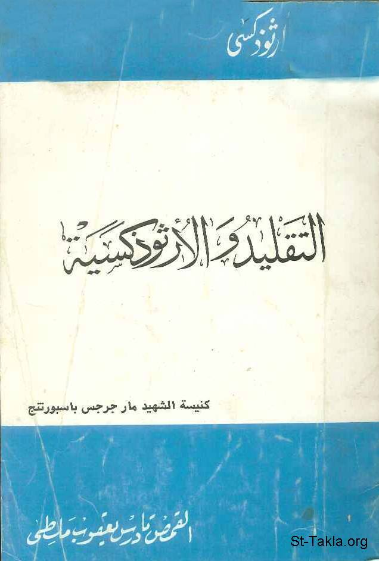

# التقليد والأرثوذكسية

**المؤلف / Author:** القمص تادرس يعقوب ملطي
**المصدر / Source:** [st-takla.org](https://st-takla.org/books/fr-tadros-malaty/tradition/index.html)
**الموضوعات / Topics:** —

📘 **[Download EPUB / تحميل الكتاب](tradition.epub)**

## نبذة

نشكر قدس أبونا القمص تادرس يعقوب ملطي لسماحه لنا في موقع الأنبا تكلاهيمانوت بوضع هذا الكتاب هنا.

## الفصول / Chapters (13)

1. [تقديم عن الكتاب](chapters/01-preface/)
2. [التقليد المقدس: مفهومه ومادته](chapters/02-tradition/)
3. [التقليد في العصر الرسولي](chapters/03-apostolic/)
4. [التقليد الرسولي والإنجيل](chapters/04-bible/)
5. [التقليد عند بابياس](chapters/05-papias/)
6. [التقليد الكنسي عند القديس إيريناؤس](chapters/06-irenaeus/)
7. [التقليد عند ترتليان](chapters/07-tertulianus/)
8. [التقليد عند آباء آخرين](chapters/08-fathers/)
9. [التقليد المسيحي والتقليد اليهودي](chapters/09-jewish/)
10. [التقليد المقدس والحياة الكنسية](chapters/10-church/)
11. [التقليد الكنسي بين رجال الكهنوت والعلمانيين](chapters/11-clergy/)
12. [التقليد الكنسي والحياة الحاضرة](chapters/12-life/)
13. [الخاتمة](chapters/13-outro/)

---
*هذا الكتاب مجاني للنشر والتوزيع لخلاص كل نفس. This book is free to share and distribute for the salvation of every soul.*
