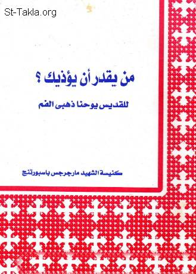

# من يقدر أن يؤذيك؟ (لا يستطيع أحد أن يؤذي إنسانًا ما لم يؤذِ هذا الإنسان ذاته)، للقديس يوحنا الذهبي الفم

**المؤلف / Author:** تعريب: القمص تادرس يعقوب ملطي
**المصدر / Source:** [st-takla.org](https://st-takla.org/books/fr-tadros-malaty/who-can-harm-you/index.html)
**الموضوعات / Topics:** —

📘 **[Download EPUB / تحميل الكتاب](who-can-harm-you.epub)**

## نبذة

نشكر قدس أبونا القمص تادرس يعقوب ملطي لسماحه لنا في موقع الأنبا تكلاهيمانوت بوضع هذا الكتاب هنا. وهذه نسخة الطبعة المنقحة من الكتاب الذي صدرت عام 2007 م.

## الفصول / Chapters (6)

1. [مقدمة - كتاب من يقدر أن يؤذيك؟ للقديس يوحنا الذهبي الفم](chapters/01-introduction/)
2. [هدف المقال - كتاب من يقدر أن يؤذيك؟ للقديس يوحنا الذهبي الفم](chapters/02-article/)
3. [لكل مخلوق عدو يؤذيه - كتاب من يقدر أن يؤذيك؟ للقديس يوحنا الذهبي الفم](chapters/03-enemy/)
4. [لماذا تخاف من مفسد خارجي؟! - كتاب من يقدر أن يؤذيك؟ للقديس يوحنا الذهبي الفم](chapters/04-dont-fret/)
5. [أنت بلا عذر! - كتاب من يقدر أن يؤذيك؟ للقديس يوحنا الذهبي الفم](chapters/05-no-excuse/)
6. [خاتمة - كتاب من يقدر أن يؤذيك؟ للقديس يوحنا الذهبي الفم](chapters/06-epilogue/)

---
*هذا الكتاب مجاني للنشر والتوزيع لخلاص كل نفس. This book is free to share and distribute for the salvation of every soul.*
