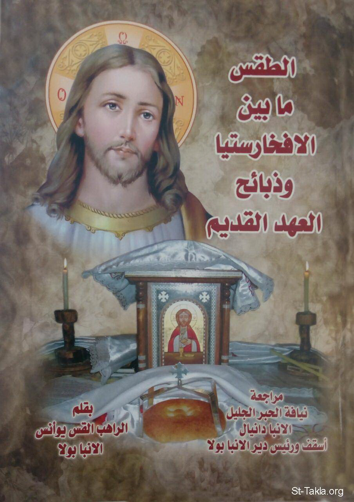

# الطقس ما بين الإفخارستيا وذبائح العهد القديم

**المؤلف / Author:** القمص يوأنس الأنبا بولا
**المصدر / Source:** [st-takla.org](https://st-takla.org/books/fr-yoannes-st-paul/rite-eucharist-old-testament/index.html)
**الموضوعات / Topics:** —

📘 **[Download EPUB / تحميل الكتاب](rite-eucharist-old-testament.epub)**

## نبذة

نشكر قدس أبونا القمص يوأنس الأنبا بولا على السماح لنا في موقع الأنبا تكلا هيمانوت بوضع هذا الكتاب هنا.

## الفصول / Chapters (14)

1. [تقديم الأنبا دانيال](chapters/01-foreword/)
2. [مقدمة الكتاب](chapters/02-introduction/)
3. [تمهيد](chapters/03-preface/)
4. [السيد المسيح في الطقس](chapters/04-christ/)
5. [السيد المسيح ككاهن](chapters/05-christ-as-a-priest/)
6. [السيد المسيح كمذبح](chapters/06-christ-as-an-altar/)
7. [السيد المسيح كذبيحة](chapters/07-christ-as-a-sacrifice/)
8. [الطقس في القداس](chapters/08-liturgy/)
9. [الكاهن 1: ملابس الكهنة](chapters/09-priest-clothing/)
10. [الكاهن 2](chapters/10-priest/)
11. [المذبح](chapters/11-altar/)
12. [الذبيحة](chapters/12-sacrifice/)
13. [القسمة](chapters/13-fraction/)
14. [البركة الختامية](chapters/14-blessing/)

---
*هذا الكتاب مجاني للنشر والتوزيع لخلاص كل نفس. This book is free to share and distribute for the salvation of every soul.*
