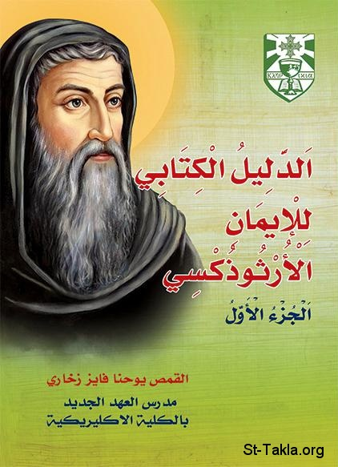

# الدليل الكتابي للإيمان الأرثوذكسي: الجزء الأول

**المؤلف / Author:** القمص يوحنا فايز زخاري
**المصدر / Source:** [st-takla.org](https://st-takla.org/books/fr-youhanna-fayez/biblical-proof-1/index.html)
**الموضوعات / Topics:** —

📘 **[Download EPUB / تحميل الكتاب](biblical-proof-1.epub)**

## نبذة

نشكر أبونا القمص يوحنا فايز زخاري على السماح لنا في موقع الأنبا تكلا هيمانوت بوضع هذا الكتاب هنا. وله جزء ثان لم يصدر بعد.

## الفصول / Chapters (144)

1. [قصة هذا الكتاب - كتاب الدليل الكتابي للإيمان الأرثوذكسي - ج1](chapters/01-story/)
2. [تصدير - كتاب الدليل الكتابي للإيمان الأرثوذكسي - ج1](chapters/02-preface/)
3. [الدليل الكتابي لمعنى السر كنسيا - كتاب الدليل الكتابي للإيمان الأرثوذكسي - ج1](chapters/03-section-1/)
4. [معنى السر كتابيا - كتاب الدليل الكتابي للإيمان الأرثوذكسي - ج1](chapters/04-sacrament-in-bible/)
5. [معنى السر كنسيا - كتاب الدليل الكتابي للإيمان الأرثوذكسي - ج1](chapters/05-sacrament-in-church/)
6. [المصطلحات الكنسية - كتاب الدليل الكتابي للإيمان الأرثوذكسي - ج1](chapters/06-definitions/)
7. [الابن في معناها العام ومعناها الاصطلاحي - كتاب الدليل الكتابي للإيمان الأرثوذكسي - ج1](chapters/07-son/)
8. ["الكلمة" في معناها العام ومعناها الاصطلاحي - كتاب الدليل الكتابي للإيمان الأرثوذكسي - ج1](chapters/08-dogma/)
9. ["سر التقوى" كمثل لشرح معنى "السر" كتابيا وكنسيا - كتاب الدليل الكتابي للإيمان الأرثوذكسي - ج1](chapters/09-godliness/)
10. [الدليل الكتابي أو الصورة المتكاملة](chapters/10-not-proofs/)
11. [النصوص الكتابية تسوقنا ولا نسوقها - كتاب الدليل الكتابي للإيمان الأرثوذكسي - ج1](chapters/11-verses/)
12. [الدليل الكتابي لسر المعمودية - كتاب الدليل الكتابي للإيمان الأرثوذكسي - ج1](chapters/12-section-2/)
13. [سر المعمودية والمعلم الأعظم في البشائر الأربعة - كتاب الدليل الكتابي للإيمان الأرثوذكسي - ج1](chapters/13-section-2-chapter-1/)
14. [معمودية السيد المسيح في نهر الأردن - كتاب الدليل الكتابي للإيمان الأرثوذكسي - ج1](chapters/14-baptism/)
15. [حديث السيد المسيح مع نيقوديموس عن المعمودية - كتاب الدليل الكتابي للإيمان الأرثوذكسي - ج1](chapters/15-baptism-nicodemus/)
16. [حديث الرب عن المعمودية للآباء الرسل بعد القيامة - كتاب الدليل الكتابي للإيمان الأرثوذكسي - ج1](chapters/16-baptism-disciples/)
17. [سر المعمودية في العصر الرسولي في سفر الابركسيس - كتاب الدليل الكتابي للإيمان الأرثوذكسي - ج1](chapters/17-section-2-chapter-2/)
18. [المعمودية في افتتاحية أعمال الرسل - كتاب الدليل الكتابي للإيمان الأرثوذكسي - ج1](chapters/18-baptism-acts/)
19. [المعمودية في يوم الخمسين - كتاب الدليل الكتابي للإيمان الأرثوذكسي - ج1](chapters/19-baptism-pentecost/)
20. [المعمودية في قصة أهل السامرة - كتاب الدليل الكتابي للإيمان الأرثوذكسي - ج1](chapters/20-baptism-samaria/)
21. [المعمودية في قصة الخصي الحبشي - كتاب الدليل الكتابي للإيمان الأرثوذكسي - ج1](chapters/21-baptism-ethiopian/)
22. [قصة معمودية كرنيليس وأهل قيصرية - كتاب الدليل الكتابي للإيمان الأرثوذكسي - ج1](chapters/22-baptism-cornelius/)
23. [معمودية ليدية بائعة الأرجوان - كتاب الدليل الكتابي للإيمان الأرثوذكسي - ج1](chapters/23-baptism-lydia/)
24. [معمودية سجان فيلبي والذين له - كتاب الدليل الكتابي للإيمان الأرثوذكسي - ج1](chapters/24-baptism-jailer/)
25. [معمودية يوستس وكريسبس والكورنثيين - كتاب الدليل الكتابي للإيمان الأرثوذكسي - ج1](chapters/25-baptism-corinthians/)
26. [معمودية الأفسسيين - كتاب الدليل الكتابي للإيمان الأرثوذكسي - ج1](chapters/26-baptism-ephesians/)
27. [معمودية شاول الطرسوسي - كتاب الدليل الكتابي للإيمان الأرثوذكسي - ج1](chapters/27-baptism-saul-of-tarsus/)
28. [سر المعمودية ورسول الأمم في الرسائل البولسية - كتاب الدليل الكتابي للإيمان الأرثوذكسي - ج1](chapters/28-section-2-chapter-3/)
29. [المعمودية صلب لجسد الخطية، وموت مع المسيح، ودفن للإنسان العتيق - كتاب الدليل الكتابي للإيمان الأرثوذكسي - ج1](chapters/29-baptism-cross/)
30. [المعمودية قيامة من الموت مع المسيح - كتاب الدليل الكتابي للإيمان الأرثوذكسي - ج1](chapters/30-baptism-resurrection/)
31. [المعمودية تعطينا الحياة الجديدة - كتاب الدليل الكتابي للإيمان الأرثوذكسي - ج1](chapters/31-baptism-new-life/)
32. [ممارسة سر المعمودية في العصر الرسولي - كتاب الدليل الكتابي للإيمان الأرثوذكسي - ج1](chapters/32-baptism-early-era/)
33. [سر المعمودية وقصة العبور - كتاب الدليل الكتابي للإيمان الأرثوذكسي - ج1](chapters/33-baptism-passover/)
34. [بالمعموديةِ نحن مسيحيون - كتاب الدليل الكتابي للإيمان الأرثوذكسي - ج1](chapters/34-baptism-christian/)
35. [المعمودية واحدة لا تعاد - كتاب الدليل الكتابي للإيمان الأرثوذكسي - ج1](chapters/35-baptism-once/)
36. [بين الختان والمعمودية - كتاب الدليل الكتابي للإيمان الأرثوذكسي - ج1](chapters/36-baptism-circumcision/)
37. [المعمودية كشرط للخلاص - كتاب الدليل الكتابي للإيمان الأرثوذكسي - ج1](chapters/37-baptism-salvation/)
38. [سر المعمودية في رسائل الكاثوليكون - كتاب الدليل الكتابي للإيمان الأرثوذكسي - ج1](chapters/38-section-2-chapter-4/)
39. [سر المعمودية وقصة الفلك - كتاب الدليل الكتابي للإيمان الأرثوذكسي - ج1](chapters/39-baptism-noah-ark/)
40. [بين الإيمان الكتابي الأرثوذكسي وأفكار واعتراضات الجماعات البروتستانتية حول المعمودية - كتاب الدليل الكتابي للإيمان الأرثوذكسي - ج1](chapters/40-baptism-protestants/)
41. [المعمودية سر هام في حياة المؤمنين: هل المعمودية علامة ظاهرية لا أهمية جوهرية لها؟ - كتاب الدليل الكتابي للإيمان الأرثوذكسي - ج1](chapters/41-baptism-sacrament/)
42. [المعمودية شرط للخلاص الأبدي والدخول إلى الملكوت: هل المعمودية علامة خارجية ترمز لمسيحيتنا فقط؟ - كتاب الدليل الكتابي للإيمان الأرثوذكسي - ج1](chapters/42-baptism-condition/)
43. [المعمودية هي الولادة الثانية الجديدة الفوقانية من الله: أم هي فقط التوبة؟ - كتاب الدليل الكتابي للإيمان الأرثوذكسي - ج1](chapters/43-baptism-birth/)
44. [سر المعمودية لمغفرة الخطية: هل المعمودية لا تغفر الخطايا؟ - كتاب الدليل الكتابي للإيمان الأرثوذكسي - ج1](chapters/44-baptism-forgiveness/)
45. [سر المعمودية يتم بالتغطيس في الماء وحلول الروح القدس: هل لا دخل للروح القدس في المعمودية؟ - كتاب الدليل الكتابي للإيمان الأرثوذكسي - ج1](chapters/45-baptism-submerge/)
46. [سر المعمودية تجديد للطبيعة إذ هو موت وقيامة: هل المعمودية علامة ظاهرية لا دخل لها بطبيعة الإنسان؟ - كتاب الدليل الكتابي للإيمان الأرثوذكسي - ج1](chapters/46-baptism-mark/)
47. [طريقة ممارسة سر المعمودية أو طقسها: هل وضع الآباء الرسل طريقة ممارسة الأسرار السبعة؟ - كتاب الدليل الكتابي للإيمان الأرثوذكسي - ج1](chapters/47-baptism-rite/)
48. [الدليل الكتابي لسر الميرون - كتاب الدليل الكتابي للإيمان الأرثوذكسي - ج1](chapters/48-section-3/)
49. [سر الميرون والمعلم الأعظم في البشائر الأربعة - كتاب الدليل الكتابي للإيمان الأرثوذكسي - ج1](chapters/49-section-3-chapter-1/)
50. [سر الميرون في العصر الرسولي في سفر الابركسيس - كتاب الدليل الكتابي للإيمان الأرثوذكسي - ج1](chapters/50-section-3-chapter-2/)
51. [سر الميرون ورسائل القديس بولس - كتاب الدليل الكتابي للإيمان الأرثوذكسي - ج1](chapters/51-section-3-chapter-3/)
52. [سر الميرون أحد شروط الخلاص - كتاب الدليل الكتابي للإيمان الأرثوذكسي - ج1](chapters/52-chrism/)
53. [سر الميرون ورسول الحب في رسائل الكاثوليكون - كتاب الدليل الكتابي للإيمان الأرثوذكسي - ج1](chapters/53-section-3-chapter-4/)
54. [الدليل الكتابي لسر التوبة والاعتراف - كتاب الدليل الكتابي للإيمان الأرثوذكسي - ج1](chapters/54-section-4/)
55. [سر التوبة والاعتراف ممتد بين العهدين - كتاب الدليل الكتابي للإيمان الأرثوذكسي - ج1](chapters/55-section-4-chapter-1/)
56. [الاعتراف لله أمام الكاهن في العصر الرسولي في سفر الابركسيس - كتاب الدليل الكتابي للإيمان الأرثوذكسي - ج1](chapters/56-section-4-chapter-2/)
57. [السلطان الممنوح للآباء الرسل يثبت سر التوبة والاعتراف في العهد الجديد - كتاب الدليل الكتابي للإيمان الأرثوذكسي - ج1](chapters/57-section-4-chapter-3/)
58. [التأديبات الكنسية المستخدمة في سر التوبة والاعتراف - كتاب الدليل الكتابي للإيمان الأرثوذكسي - ج1](chapters/58-section-4-chapter-4/)
59. [الدليل الكتابي لسر الافخارستيا - كتاب الدليل الكتابي للإيمان الأرثوذكسي - ج1](chapters/59-section-5/)
60. [سر الافخارستيا والمعلم الأعظم في البشائر الأربعة - كتاب الدليل الكتابي للإيمان الأرثوذكسي - ج1](chapters/60-section-5-chapter-1/)
61. [السيد المسيح يؤسس الافخارستيا - كتاب الدليل الكتابي للإيمان الأرثوذكسي - ج1](chapters/61-eucharist/)
62. [تعبيرات ليست مترادفات في سر الإفخارستيا: الذكرى والرمز - كتاب الدليل الكتابي للإيمان الأرثوذكسي - ج1](chapters/62-eucharist-remember/)
63. [السيد المسيح يشرح سر الافخارستيا - كتاب الدليل الكتابي للإيمان الأرثوذكسي - ج1](chapters/63-eucharist-explain/)
64. [اعتراض المؤمنين بالمسيح على سر الافخارستيا - كتاب الدليل الكتابي للإيمان الأرثوذكسي - ج1](chapters/64-eucharist-protests/)
65. [سر الافخارستيا يعطي الحياة الأبدية - كتاب الدليل الكتابي للإيمان الأرثوذكسي - ج1](chapters/65-eucharist-eternal-life/)
66. [سر التناول امتداد لذبيحة الصليب - كتاب الدليل الكتابي للإيمان الأرثوذكسي - ج1](chapters/66-eucharist-cross/)
67. [سر الافخارستيا يثبتنا في المسيح - كتاب الدليل الكتابي للإيمان الأرثوذكسي - ج1](chapters/67-eucharist-christ/)
68. [سر الافخارستيا مستمر في كنيسة المسيح - كتاب الدليل الكتابي للإيمان الأرثوذكسي - ج1](chapters/68-eucharist-church/)
69. [سر الافخارستيا في العصر الرسولي - كتاب الدليل الكتابي للإيمان الأرثوذكسي - ج1](chapters/69-section-5-chapter-2/)
70. [سر الافخارستيا في رسائل القديس بولس الرسول - كتاب الدليل الكتابي للإيمان الأرثوذكسي - ج1](chapters/70-section-5-chapter-3/)
71. [سر الافخارستيا تسليم سيدي فرسولي - كتاب الدليل الكتابي للإيمان الأرثوذكسي - ج1](chapters/71-eucharist-tradition/)
72. [سر الافخارستيا ليس اشتراك في عشاء الرب - كتاب الدليل الكتابي للإيمان الأرثوذكسي - ج1](chapters/72-eucharist-not-supper/)
73. [مادتا سر الافخارستيا هما الخبز والخمر - كتاب الدليل الكتابي للإيمان الأرثوذكسي - ج1](chapters/73-eucharist-bread-wine/)
74. [سر التناول له صلوات معينة - كتاب الدليل الكتابي للإيمان الأرثوذكسي - ج1](chapters/74-eucharist-prayers/)
75. [في الافخارستيا نتناول جسد الرب ودمه الحقيقيين - كتاب الدليل الكتابي للإيمان الأرثوذكسي - ج1](chapters/75-eucharist-real/)
76. [هيبة سر الافخارستيا - كتاب الدليل الكتابي للإيمان الأرثوذكسي - ج1](chapters/76-eucharist-fear/)
77. [ذبيحة الصليب ممتدة في الافخارستيا عبر الأجيال - كتاب الدليل الكتابي للإيمان الأرثوذكسي - ج1](chapters/77-eucharist-continuous/)
78. [العهد القديم يشير إلى سر الافخارستيا - كتاب الدليل الكتابي للإيمان الأرثوذكسي - ج1](chapters/78-eucharist-old-testament/)
79. [المذبح المسيحي - كتاب الدليل الكتابي للإيمان الأرثوذكسي - ج1](chapters/79-eucharist-christian-altar/)
80. [إشعيا النبي وسر الافخارستيا - كتاب الدليل الكتابي للإيمان الأرثوذكسي - ج1](chapters/80-section-5-chapter-4/)
81. [الافخارستيا امتداد لذبيحة الصليب يكفر عن الخطية - كتاب الدليل الكتابي للإيمان الأرثوذكسي - ج1](chapters/81-eucharist-sacrifice/)
82. [النصوص الكتابية لسر الافخارستيا وطريقة حفظها - كتاب الدليل الكتابي للإيمان الأرثوذكسي - ج1](chapters/82-eucharist-verses/)
83. [خاتمة حول سر الإفخارستيا - كتاب الدليل الكتابي للإيمان الأرثوذكسي - ج1](chapters/83-eucharist-summ/)
84. [تصحيح واجب في صورة العشاء الأخير (الفصح)، وصورة سر الافخارستيا المقدس - كتاب الدليل الكتابي للإيمان الأرثوذكسي - ج1](chapters/84-eucharist-conclusion/)
85. [الصوم - كتاب الدليل الكتابي للإيمان الأرثوذكسي - ج1](chapters/85-section-6/)
86. [الصوم في العهد القديم - كتاب الدليل الكتابي للإيمان الأرثوذكسي - ج1](chapters/86-section-6-chapter-1/)
87. [الصوم في أسفار موسى الخمسة - كتاب الدليل الكتابي للإيمان الأرثوذكسي - ج1](chapters/87-fasting-torah/)
88. [الصوم الأول في جنة عدن أو نباتية الإنسان - كتاب الدليل الكتابي للإيمان الأرثوذكسي - ج1](chapters/88-fasting-eden/)
89. [الصوم في قصة خروج بني إسرائيل - كتاب الدليل الكتابي للإيمان الأرثوذكسي - ج1](chapters/89-fasting-exodus/)
90. [صوم موسى النبي - كتاب الدليل الكتابي للإيمان الأرثوذكسي - ج1](chapters/90-fasting-moses/)
91. [الصوم كما علمه الله صوم ثابت متكرر في زمن محدد من كل عام - كتاب الدليل الكتابي للإيمان الأرثوذكسي - ج1](chapters/91-fasting-fixed/)
92. [الصوم في الأسفار التاريخية - كتاب الدليل الكتابي للإيمان الأرثوذكسي - ج1](chapters/92-fasting-books/)
93. [الصوم والنصرة في الحروب: قصة من سفر القضاة - كتاب الدليل الكتابي للإيمان الأرثوذكسي - ج1](chapters/93-fasting-judges/)
94. [فلنرجع إلى الرب... بالصوم - كتاب الدليل الكتابي للإيمان الأرثوذكسي - ج1](chapters/94-fasting-back/)
95. [صوم في الحزن والألم - كتاب الدليل الكتابي للإيمان الأرثوذكسي - ج1](chapters/95-fasting-sadness/)
96. [صوت وصوم وصورة - كتاب الدليل الكتابي للإيمان الأرثوذكسي - ج1](chapters/96-fasting-voice/)
97. [قبول صوم آخاب - كتاب الدليل الكتابي للإيمان الأرثوذكسي - ج1](chapters/97-fasting-ahab/)
98. [الانتصار ليس بالجهد الحربي بل بالجهاد الروحي: الصوم - كتاب الدليل الكتابي للإيمان الأرثوذكسي - ج1](chapters/98-fasting-win/)
99. [صوم عزرا الكاهن وشعبه - كتاب الدليل الكتابي للإيمان الأرثوذكسي - ج1](chapters/99-fasting-ezra/)
100. [بالصوم تبنى أسوارنا: صوم نحميا - كتاب الدليل الكتابي للإيمان الأرثوذكسي - ج1](chapters/100-fasting-nehemiah/)
101. [الصوم المقرون بالفضائل - كتاب الدليل الكتابي للإيمان الأرثوذكسي - ج1](chapters/101-fasting-virtues/)
102. [صوم أستير الملكة مع كل شعبها - كتاب الدليل الكتابي للإيمان الأرثوذكسي - ج1](chapters/102-fasting-esther/)
103. [الصوم في الأسفار الشعرية والنبوية - كتاب الدليل الكتابي للإيمان الأرثوذكسي - ج1](chapters/103-fasting-other-books/)
104. [الصوم النباتي لداود النبي - كتاب الدليل الكتابي للإيمان الأرثوذكسي - ج1](chapters/104-fasting-david/)
105. [الصوم المختار من الله - كتاب الدليل الكتابي للإيمان الأرثوذكسي - ج1](chapters/105-fasting-chosen/)
106. [الصوم الروحي من أجل كلمة الله: صوم إرميا وكل شعبه - كتاب الدليل الكتابي للإيمان الأرثوذكسي - ج1](chapters/106-fasting-jeremiah/)
107. [الصوم النباتي لحزقيال النبي ثلاثة عشر شهرا - كتاب الدليل الكتابي للإيمان الأرثوذكسي - ج1](chapters/107-fasting-ezekiel/)
108. [دانيال النبي رجل الصوم - كتاب الدليل الكتابي للإيمان الأرثوذكسي - ج1](chapters/108-fasting-daniel/)
109. [صوم دانيال التائب ورؤياه - كتاب الدليل الكتابي للإيمان الأرثوذكسي - ج1](chapters/109-fasting-daniel-revelation/)
110. [الصوم النباتي الزاهد لدانيال النبي - كتاب الدليل الكتابي للإيمان الأرثوذكسي - ج1](chapters/110-fasting-vegetarian/)
111. [الصوم المقدس: صوم يوئيل النبي وجميع الشعب - كتاب الدليل الكتابي للإيمان الأرثوذكسي - ج1](chapters/111-fasting-joel/)
112. [الصوم الذي غير مجرى التاريخ: صوم أهل نينوى - كتاب الدليل الكتابي للإيمان الأرثوذكسي - ج1](chapters/112-fasting-nineveh/)
113. [الأصوام التعبدية المتكررة في ميعاد ثابت وكيف يقبلها الله - كتاب الدليل الكتابي للإيمان الأرثوذكسي - ج1](chapters/113-fasting-time/)
114. [الصوم (الجماعي، النباتي، التعبدي، الثابت، المتكرر) هو تعليم كتابي - كتاب الدليل الكتابي للإيمان الأرثوذكسي - ج1](chapters/114-fasting-biblical/)
115. [الصوم في العهد الجديد - كتاب الدليل الكتابي للإيمان الأرثوذكسي - ج1](chapters/115-section-6-chapter-2/)
116. [الصوم في البشائر الأربعة - كتاب الدليل الكتابي للإيمان الأرثوذكسي - ج1](chapters/116-fasting-gospels/)
117. [حنة النبية الأرملة المتعبدة: أول صائمة فيما بين العهدين - كتاب الدليل الكتابي للإيمان الأرثوذكسي - ج1](chapters/117-fasting-anna/)
118. [يوحنا المعمدان رجل البرية والصوم - كتاب الدليل الكتابي للإيمان الأرثوذكسي - ج1](chapters/118-fasting-baptist/)
119. [المسيح له المجد صائمًا - كتاب الدليل الكتابي للإيمان الأرثوذكسي - ج1](chapters/119-fasting-jesus/)
120. [الصوم في الموعظة على الجبل - كتاب الدليل الكتابي للإيمان الأرثوذكسي - ج1](chapters/120-fasting-sermon/)
121. [تأسيس الصوم في الكنيسة - كتاب الدليل الكتابي للإيمان الأرثوذكسي - ج1](chapters/121-fasting-church/)
122. [سؤال في الصوم: أوقات مناسبة للصوم، وأوقات غير مناسبة - كتاب الدليل الكتابي للإيمان الأرثوذكسي - ج1](chapters/122-fasting-times/)
123. [الصوم وإخراج الشياطين - كتاب الدليل الكتابي للإيمان الأرثوذكسي - ج1](chapters/123-fasting-devil/)
124. [الصوم في كنيسة الرسل - كتاب الدليل الكتابي للإيمان الأرثوذكسي - ج1](chapters/124-fasting-apostles/)
125. [صوم كرنيليوس قائد المائة إلى الساعة التاسعة](chapters/125-fasting-cornelius/)
126. [صوم الكنيسة في أنطاكية: صوم روحي وصوم شكر - كتاب الدليل الكتابي للإيمان الأرثوذكسي - ج1](chapters/126-fasting-antioch/)
127. [الصوم أحد أركان تأسيس الكنيسة - كتاب الدليل الكتابي للإيمان الأرثوذكسي - ج1](chapters/127-fasting-pillar/)
128. [الصوم والميعاد الثابت والصوم المفاجئ - كتاب الدليل الكتابي للإيمان الأرثوذكسي - ج1](chapters/128-fasting-different-times/)
129. [الصوم ورسول الأُمم - كتاب الدليل الكتابي للإيمان الأرثوذكسي - ج1](chapters/129-fasting-paul/)
130. [الصوم والانقطاع المؤقت عن المعاشرة الزواجية - كتاب الدليل الكتابي للإيمان الأرثوذكسي - ج1](chapters/130-fasting-paul-marriage/)
131. [الصوم كفضيلة هامة في حياة القديس بولس الخادم - كتاب الدليل الكتابي للإيمان الأرثوذكسي - ج1](chapters/131-fasting-paul-virtue/)
132. [الصوم كنوع من النسك والزهد في الجسديات - كتاب الدليل الكتابي للإيمان الأرثوذكسي - ج1](chapters/132-fasting-paul-asceticism/)
133. [اعتراضات وردود حول الصوم المقدس - كتاب الدليل الكتابي للإيمان الأرثوذكسي - ج1](chapters/133-section-6-chapter-3/)
134. [الصوم وآية: «ليس ما يدخل الفم» - كتاب الدليل الكتابي للإيمان الأرثوذكسي - ج1](chapters/134-fasting-mouth/)
135. [الصوم وآية: «أما الضعيف فيأكل بقولا» - كتاب الدليل الكتابي للإيمان الأرثوذكسي - ج1](chapters/135-fasting-legumes/)
136. [الصوم وآية: «الطعام لا يقدمنا إلى الله» - كتاب الدليل الكتابي للإيمان الأرثوذكسي - ج1](chapters/136-fasting-food/)
137. [الصوم وآية: «لا يحكم عليكم أحد» - كتاب الدليل الكتابي للإيمان الأرثوذكسي - ج1](chapters/137-fasting-lead/)
138. [الصوم وآية: «آمرين أن يمتنع عن أطعمة قد خلقها الله» - كتاب الدليل الكتابي للإيمان الأرثوذكسي - ج1](chapters/138-fasting-order/)
139. [الصوم والترتيب البشري - كتاب الدليل الكتابي للإيمان الأرثوذكسي - ج1](chapters/139-fasting-human/)
140. [أسماء الصوم - كتاب الدليل الكتابي للإيمان الأرثوذكسي - ج1](chapters/140-fasting-names/)
141. [أوقات وطريقة الصوم وسُلْطَان الكنيسة - كتاب الدليل الكتابي للإيمان الأرثوذكسي - ج1](chapters/141-fasting-way/)
142. [الأصوام المتكررة في ميعاد ثابت - كتاب الدليل الكتابي للإيمان الأرثوذكسي - ج1](chapters/142-fasting-recurring/)
143. [كتابية الصوم الأرثوذكسي - كتاب الدليل الكتابي للإيمان الأرثوذكسي - ج1](chapters/143-fasting-in-bible/)
144. [خاتمة حول موضوع كتابية الصوم - كتاب الدليل الكتابي للإيمان الأرثوذكسي - ج1](chapters/144-fasting-conclusion/)

---
*هذا الكتاب مجاني للنشر والتوزيع لخلاص كل نفس. This book is free to share and distribute for the salvation of every soul.*
