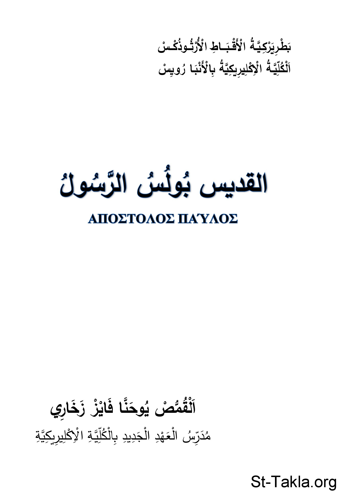

# القديس بولس الرسول

**المؤلف / Author:** القمص يوحنا فايز زخاري
**المصدر / Source:** [st-takla.org](https://st-takla.org/books/fr-youhanna-fayez/st-paul/index.html)
**الموضوعات / Topics:** —

📘 **[Download EPUB / تحميل الكتاب](st-paul.epub)**

## نبذة

نشكر أبونا القمص يوحنا فايز زخاري على السماح لنا في موقع الأنبا تكلا هيمانوت بوضع هذا الكتاب هنا.

## الفصول / Chapters (15)

1. [حياة ونشأة القديس بولس الرسول](chapters/01-life/)
2. [كرازة القديس بولس وقصة مجيئه إلى مكدونية](chapters/02-kerygma/)
3. [رسولية القديس بولس](chapters/03-apostle/)
4. [بولس العبد والأسير](chapters/04-slave/)
5. [ماربولس وروح الفريق](chapters/05-teamwork/)
6. [كتابات القديس بولس الرسول](chapters/06-writings/)
7. [رسالتا تسالونيكي أقدم الأسفار](chapters/07-epistles/)
8. [رسالتا كورنثوس ورسالتا غلاطية ورومية](chapters/08-epistles1/)
9. [رسائل أسر بولس الرسول الأول الأربعة](chapters/09-epistles2/)
10. [الرسائل إلى تيموثاوس الأولى وتيطس والعبرانيين](chapters/10-epistles3/)
11. [الرسالة الثانية لتيموثاوس في أَسر بولس الأخير](chapters/11-epistles4/)
12. [الرسائل الأربعة عشر أنواعها وأهدافها](chapters/12-epistles-table/)
13. [رسائل البولس في طقس الكنيسة](chapters/13-pauline/)
14. [ملخص لحياة القديس بولس الرسول](chapters/14-summary/)
15. [الرد على الاعتراضات حول أن بولس الرسول هو كاتب الرسالة إلى العبرانيين](chapters/15-Hebrews/)

---
*هذا الكتاب مجاني للنشر والتوزيع لخلاص كل نفس. This book is free to share and distribute for the salvation of every soul.*
