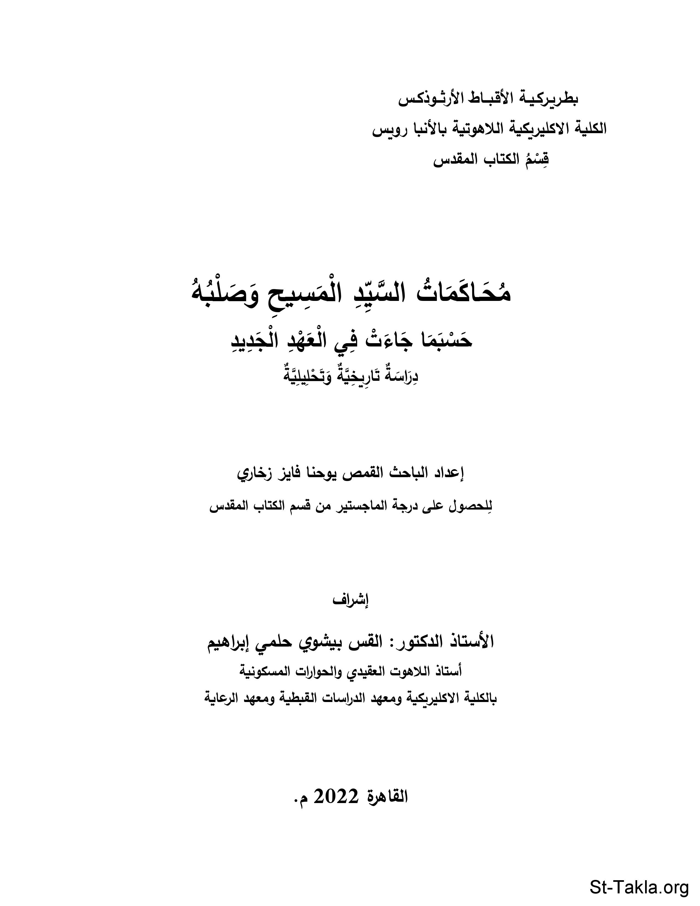

# محاكمات السيد المسيح وصلبه (حسبما جاءت في العهد الجديد): دراسة تاريخية وتحليلية

**المؤلف / Author:** القمص يوحنا فايز زخاري
**المصدر / Source:** [st-takla.org](https://st-takla.org/books/fr-youhanna-fayez/trials-of-jesus/index.html)
**الموضوعات / Topics:** —

📘 **[Download EPUB / تحميل الكتاب](trials-of-jesus.epub)**

## نبذة

نشكر أبونا القمص يوحنا فايز زخاري على السماح لنا في موقع الأنبا تكلا هيمانوت بوضع هذا الكتاب هنا.

## الفصول / Chapters (62)

1. [شكر وتقدير - كتاب محاكمات السيد المسيح وصلبه](chapters/01-acknowledgments/)
2. [الإطار العام - كتاب محاكمات السيد المسيح وصلبه](chapters/02-general/)
3. [المدخل إلى البحث - كتاب محاكمات السيد المسيح وصلبه](chapters/03-enntry/)
4. [صلب السيد المسيح بين التدبير الإلهي والتخطيط البشري - كتاب محاكمات السيد المسيح وصلبه](chapters/04-cross/)
5. [التدبير الإلهي](chapters/05-divine-planning/)
6. [التخطيط البشري وكيف نمت فكرة صلب السيد المسيح لدى رؤساء اليهود وقادتهم؟ - كتاب محاكمات السيد المسيح وصلبه](chapters/06-grew/)
7. [محاكمة السيد المسيح - كتاب محاكمات السيد المسيح وصلبه](chapters/07-section-1/)
8. [مقدمة عامة في محاكمة السيد المسيح - كتاب محاكمات السيد المسيح وصلبه](chapters/08-religious-introduction/)
9. [المحاكمات الدينية الثلاثة أمام رؤساء الكهنة ومجمع السنهدريم - كتاب محاكمات السيد المسيح وصلبه](chapters/09-section-1-chapter-1/)
10. [المحاكمة الدينية الأولى: أمام حنان رئيس الكهنة السابق - كتاب محاكمات السيد المسيح وصلبه](chapters/10-first-religious/)
11. [المحاكمة الدينية الثانية: أمام مجمع السنهدريم برئاسة قيافا - كتاب محاكمات السيد المسيح وصلبه](chapters/11-second-religious/)
12. [المحاكمة الدينية الثالثة: أمام مجمع السنهدريم برئاسة قيافا - كتاب محاكمات السيد المسيح وصلبه](chapters/12-third-religious/)
13. [ملخص المحاكمات الدينية الثلاثة - كتاب محاكمات السيد المسيح وصلبه](chapters/13-religious-summary/)
14. [المحاكمات المدنية الثلاثة أمام القضاء الروماني - كتاب محاكمات السيد المسيح وصلبه](chapters/14-section-1-chapter-2/)
15. [مقدمة في المحاكمات المدنية - كتاب محاكمات السيد المسيح وصلبه](chapters/15-civil-introduction/)
16. [المحاكمات المدنية الثلاثة - كتاب محاكمات السيد المسيح وصلبه](chapters/16-civil/)
17. [المحاكمة الرومانية الأولى: أمام بيلاطس الوالي - كتاب محاكمات السيد المسيح وصلبه](chapters/17-first-civil/)
18. [المحاكمة الرومانية الثانية: أمام هيرودس في أورشليم، صباح الجمعة - كتاب محاكمات السيد المسيح وصلبه](chapters/18-second-civil/)
19. [المحاكمة الرومانية الثالثة: أمام بيلاطس للمرة الثانية - كتاب محاكمات السيد المسيح وصلبه](chapters/19-third-civil/)
20. [ملخص المحاكمات المدنية الثلاثة - كتاب محاكمات السيد المسيح وصلبه](chapters/20-civil-summary/)
21. [ملاحظات على محاكمة الرب ونتائجها](chapters/21-notes/)
22. [القديس بطرس، ويهوذا الخائن أثناء المحاكمة - كتاب محاكمات السيد المسيح وصلبه](chapters/22-section-2/)
23. [القديس بطرس الرسول وإنكاره للسيد المسيح - كتاب محاكمات السيد المسيح وصلبه](chapters/23-section-2-chapter-1/)
24. [تتبع القديس بطرس الرسول للسيد المسيح من بعيد - كتاب محاكمات السيد المسيح وصلبه](chapters/24-peter-follow/)
25. [إنكار مار بطرس ثلاث مرات - كتاب محاكمات السيد المسيح وصلبه](chapters/25-peter-denial/)
26. [صياح الديك - كتاب محاكمات السيد المسيح وصلبه](chapters/26-rooster/)
27. [توبة القديس بطرس - كتاب محاكمات السيد المسيح وصلبه](chapters/27-peter-repentance/)
28. [يهوذا التلميذ الخائن وندمه وانتحاره - كتاب محاكمات السيد المسيح وصلبه](chapters/28-section-2-chapter-2/)
29. [من هو يهوذا الإسخريوطي؟ - كتاب محاكمات السيد المسيح وصلبه](chapters/29-judas-iscariot/)
30. [الآراء حول الأسباب والدوافع وراء تسليم يهوذا للسيد المسيح لرؤساء اليهود - كتاب محاكمات السيد المسيح وصلبه](chapters/30-judas-reasons/)
31. [نهاية الخائن يهوذا الإسخريوطي - كتاب محاكمات السيد المسيح وصلبه](chapters/31-judas-end/)
32. [بين يهوذا ومار بطرس - كتاب محاكمات السيد المسيح وصلبه](chapters/32-peter-vs-judas/)
33. [خطية يهوذا الإسخريوطي - كتاب محاكمات السيد المسيح وصلبه](chapters/33-judas-sin/)
34. [خاتمة الباب الثاني - كتاب محاكمات السيد المسيح وصلبه](chapters/34-section-2-conclusion/)
35. [صليب الجلجثة - كتاب محاكمات السيد المسيح وصلبه](chapters/35-section-3/)
36. [صليب الرب فوق جبل الجلجثة](chapters/36-golgotha/)
37. [إجراءات تنفيذ الحكم بالصلب - كتاب محاكمات السيد المسيح وصلبه](chapters/37-section-3-chapter-1/)
38. [أسلمه ليصلب - كتاب محاكمات السيد المسيح وصلبه](chapters/38-to-be-crucified/)
39. [«حمل الصليب» - كتاب محاكمات السيد المسيح وصلبه](chapters/39-carry-cross/)
40. [«موضع الجمجمة» - كتاب محاكمات السيد المسيح وصلبه](chapters/40-skull/)
41. [الرب ملك على خشبة - كتاب محاكمات السيد المسيح وصلبه](chapters/41-section-3-chapter-2/)
42. [الصلب - كتاب محاكمات السيد المسيح وصلبه](chapters/42-the-crucifixion/)
43. [«أحصي مع أثمة» - كتاب محاكمات السيد المسيح وصلبه](chapters/43-with-thieves/)
44. [عنوان على الصليب - كتاب محاكمات السيد المسيح وصلبه](chapters/44-inri/)
45. [كلمات السيد المسيح السبعة على الصليب - كتاب محاكمات السيد المسيح وصلبه](chapters/45-section-3-chapter-3/)
46. [الكلمات الأربعة الأولى - كتاب محاكمات السيد المسيح وصلبه](chapters/46-last-words-1-3/)
47. [ساعات الظلمة - كتاب محاكمات السيد المسيح وصلبه](chapters/47-last-words-4/)
48. [الكلمات الثلاثة الأخيرة - كتاب محاكمات السيد المسيح وصلبه](chapters/48-last-words-5-7/)
49. [الأحداث المصاحبة للصلب - كتاب محاكمات السيد المسيح وصلبه](chapters/49-section-3-chapter-4/)
50. [آيات حدثت في الطبيعة أثناء الصلب - كتاب محاكمات السيد المسيح وصلبه](chapters/50-miracles/)
51. [اعتراف لونجينوس قائد المئة - كتاب محاكمات السيد المسيح وصلبه](chapters/51-longinus/)
52. [نساء تبعن السيد المسيح أثناء الصلب - كتاب محاكمات السيد المسيح وصلبه](chapters/52-women-follow/)
53. [موت السيد المسيح ودفنه وقيامته - كتاب محاكمات السيد المسيح وصلبه](chapters/53-section-3-chapter-5/)
54. [موت السيد المسيح - كتاب محاكمات السيد المسيح وصلبه](chapters/54-death/)
55. [تكفين الرب ووضعه في القبر - كتاب محاكمات السيد المسيح وصلبه](chapters/55-tomb/)
56. [حرسوا قبر المسيح وخافوه - كتاب محاكمات السيد المسيح وصلبه](chapters/56-soldiers/)
57. [خاتمة الباب الأخير - كتاب محاكمات السيد المسيح وصلبه](chapters/57-section-3-conclusion/)
58. [نتائج الرسالة - كتاب محاكمات السيد المسيح وصلبه](chapters/58-results/)
59. [توصيات الرسالة - كتاب محاكمات السيد المسيح وصلبه](chapters/59-recommendations/)
60. [ملاحق الرسالة - كتاب محاكمات السيد المسيح وصلبه](chapters/60-appendixes/)
61. [المصادر والمراجع - كتاب محاكمات السيد المسيح وصلبه](chapters/61-references/)
62. [ملخص البحث - كتاب محاكمات السيد المسيح وصلبه](chapters/62-research-summary/)

---
*هذا الكتاب مجاني للنشر والتوزيع لخلاص كل نفس. This book is free to share and distribute for the salvation of every soul.*
