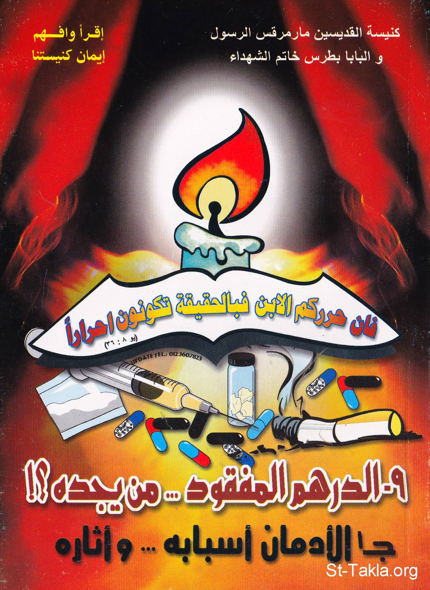

# الإدمان: أسبابه وآثاره + الوقاية والعلاج: الدرهم المفقود.. من يجده؟

**المؤلف / Author:** أ. حلمي القمص يعقوب
**المصدر / Source:** [st-takla.org](https://st-takla.org/books/helmy-elkommos/addiction/index.html)
**الموضوعات / Topics:** —

📘 **[Download EPUB / تحميل الكتاب](addiction.epub)**

## نبذة

نشكر الأستاذ حلمي القمص يعقوب على السماح لنا في موقع الأنبا تكلا هيمانوت بوضع هذا الكتاب هنا. وهو أحد كتب سلسلة " أقرأ وافهم إيمان كنيستنا ".

## الفصول / Chapters (72)

1. [مقدمة - كتاب الإدمان: أسبابه وآثاره: الدرهم المفقود.. من يجده؟](chapters/01-intro/)
2. [تمهيد - كتاب الإدمان: أسبابه وآثاره: الدرهم المفقود.. من يجده؟](chapters/02-preface/)
3. [أسباب الإدمان - كتاب الإدمان: أسبابه وآثاره: الدرهم المفقود.. من يجده؟](chapters/03-reasons/)
4. [الأسباب النفسية للإدمان - كتاب الإدمان: أسبابه وآثاره: الدرهم المفقود.. من يجده؟](chapters/04-psychological/)
5. [الاستعداد النفسي للإدمان](chapters/05-personalities/)
6. [الهروب من التوتر والقلق والاكتئاب - كتاب الإدمان: أسبابه وآثاره: الدرهم المفقود.. من يجده؟](chapters/06-running/)
7. [التأخر الدراسي وغياب الهدف - كتاب الإدمان: أسبابه وآثاره: الدرهم المفقود.. من يجده؟](chapters/07-study/)
8. [حب الاستطلاع وروح المغامرة - كتاب الإدمان: أسبابه وآثاره: الدرهم المفقود.. من يجده؟](chapters/08-curiosity/)
9. [الاعتقاد ببعض المفاهيم الخاطئة - كتاب الإدمان: أسبابه وآثاره: الدرهم المفقود.. من يجده؟](chapters/09-concepts/)
10. [الأسباب البيولوجية للإدمان - كتاب الإدمان: أسبابه وآثاره: الدرهم المفقود.. من يجده؟](chapters/10-biological/)
11. [الأسباب الاجتماعية للإدمان - كتاب الإدمان: أسبابه وآثاره: الدرهم المفقود.. من يجده؟](chapters/11-social/)
12. [المشاكل الأسرية - كتاب الإدمان: أسبابه وآثاره: الدرهم المفقود.. من يجده؟](chapters/12-family/)
13. [الاستجابة لضغوط الأصدقاء - كتاب الإدمان: أسبابه وآثاره: الدرهم المفقود.. من يجده؟](chapters/13-friends/)
14. [الفراغ والبطالة - كتاب الإدمان: أسبابه وآثاره: الدرهم المفقود.. من يجده؟](chapters/14-unemployment/)
15. [قبول المجتمع - كتاب الإدمان: أسبابه وآثاره: الدرهم المفقود.. من يجده؟](chapters/15-society/)
16. [سهولة توفر المادة - كتاب الإدمان: أسبابه وآثاره: الدرهم المفقود.. من يجده؟](chapters/16-money/)
17. [حجم مشكلة الإدمان و المخدرات - كتاب الإدمان: أسبابه وآثاره: الدرهم المفقود.. من يجده؟](chapters/17-problem/)
18. [بعض المصطلحات الخاصة بالإدمان والمدمنين والمخدرات - كتاب الإدمان: أسبابه وآثاره: الدرهم المفقود.. من يجده؟](chapters/18-etymology/)
19. [أثر الإدمان على المدمن وعلى الآخرين - كتاب الإدمان: أسبابه وآثاره: الدرهم المفقود.. من يجده؟](chapters/19-effects/)
20. [أثر الإدمان والمخدرات على المدمن - كتاب الإدمان: أسبابه وآثاره: الدرهم المفقود.. من يجده؟](chapters/20-effect/)
21. [الإدمان والمشاكل - كتاب الإدمان: أسبابه وآثاره: الدرهم المفقود.. من يجده؟](chapters/21-problems/)
22. [أثر المخدرات والإدمان على الأسرة - كتاب الإدمان: أسبابه وآثاره: الدرهم المفقود.. من يجده؟](chapters/22-house/)
23. [أثر الإدمان والمخدرات على المجتمع - كتاب الإدمان: أسبابه وآثاره: الدرهم المفقود.. من يجده؟](chapters/23-community/)
24. [فكرة عن المواد المخدرة التي تسبب الإدمان](chapters/24-drugs/)
25. [مجموعة الأفيونات - كتاب الإدمان: أسبابه وآثاره: الدرهم المفقود.. من يجده؟](chapters/25-opium/)
26. [الأفيون - كتاب الإدمان: أسبابه وآثاره: الدرهم المفقود.. من يجده؟](chapters/26-papaver-somniferum/)
27. [المورفين - كتاب الإدمان: أسبابه وآثاره: الدرهم المفقود.. من يجده؟](chapters/27-morphine/)
28. [الكودايين - كتاب الإدمان: أسبابه وآثاره: الدرهم المفقود.. من يجده؟](chapters/28-codeine/)
29. [الهيروين - كتاب الإدمان: أسبابه وآثاره: الدرهم المفقود.. من يجده؟](chapters/29-heroin/)
30. [مجموعة القنبيات - كتاب الإدمان: أسبابه وآثاره: الدرهم المفقود.. من يجده؟](chapters/30-hemp/)
31. [القنب - كتاب الإدمان: أسبابه وآثاره: الدرهم المفقود.. من يجده؟](chapters/31-hashish/)
32. [الحشيش - كتاب الإدمان: أسبابه وآثاره: الدرهم المفقود.. من يجده؟](chapters/32-cannabis/)
33. [البانجو - كتاب الإدمان: أسبابه وآثاره: الدرهم المفقود.. من يجده؟](chapters/33-cannabis2/)
34. [القات - كتاب الإدمان: أسبابه وآثاره: الدرهم المفقود.. من يجده؟](chapters/34-khat/)
35. [المثبطات](chapters/35-inhibitors/)
36. [المنشطات - كتاب الإدمان: أسبابه وآثاره: الدرهم المفقود.. من يجده؟](chapters/36-stimulants/)
37. [الكوكايين - كتاب الإدمان: أسبابه وآثاره: الدرهم المفقود.. من يجده؟](chapters/37-cocaine/)
38. [الكراك - كتاب الإدمان: أسبابه وآثاره: الدرهم المفقود.. من يجده؟](chapters/38-crack/)
39. [الامفيتامينات: الكبتاجون، الريتالين، الديكسامفيتامين، الميثامفيتامين - كتاب الإدمان: أسبابه وآثاره: الدرهم المفقود.. من يجده؟](chapters/39-amphetamines/)
40. [الماكستون فورت - كتاب الإدمان: أسبابه وآثاره: الدرهم المفقود.. من يجده؟](chapters/40-maxeton-forte/)
41. [المهلوسات - كتاب الإدمان: أسبابه وآثاره: الدرهم المفقود.. من يجده؟](chapters/41-hallucinogens/)
42. [السيكالين - كتاب الإدمان: أسبابه وآثاره: الدرهم المفقود.. من يجده؟](chapters/42-secalin/)
43. [الداي أيثيل تربتامين: إل إس دي - كتاب الإدمان: أسبابه وآثاره: الدرهم المفقود.. من يجده؟](chapters/43-lsd/)
44. [تراب الملائكة: بي سي بي - كتاب الإدمان: أسبابه وآثاره: الدرهم المفقود.. من يجده؟](chapters/44-pcp/)
45. [المستنشقات](chapters/45-inhalants/)
46. [الكحولات](chapters/46-alcohol/)
47. [التبغ](chapters/47-tobacco/)
48. [الكفايين](chapters/48-caffeine/)
49. [مصطلحات المدمنون و المخدرات - كتاب الإدمان: أسبابه وآثاره: الدرهم المفقود.. من يجده؟](chapters/49-expressions/)
50. [تمهيد الجزء الثاني من الكتاب - كتاب الإدمان: الوقاية والعلاج: الدرهم المفقود.. من يجده؟](chapters/50-part2/)
51. [مراحل الإدمان - كتاب الإدمان: الوقاية والعلاج: الدرهم المفقود.. من يجده؟](chapters/51-stages/)
52. [مرحلة التجربة](chapters/52-trial/)
53. [مرحلة التعاطي](chapters/53-taking/)
54. [مرحلة الانشغال بالمخدرات - كتاب الإدمان: الوقاية والعلاج: الدرهم المفقود.. من يجده؟](chapters/54-occupancy/)
55. [مرحلة ضرورة المخدر لاستمرار الحياة الطبيعية - كتاب الإدمان: أسبابه وآثاره: الدرهم المفقود.. من يجده؟](chapters/55-life/)
56. [طرق الوقاية من الإدمان - كتاب الإدمان: الوقاية والعلاج: الدرهم المفقود.. من يجده؟](chapters/56-protection/)
57. [دور كل فرد ومؤسسة في القيام بدور الوقاية من الإدمان - كتاب الإدمان: الوقاية والعلاج: الدرهم المفقود.. من يجده؟](chapters/57-role/)
58. [دور الفرد في الوقاية من الإدمان - كتاب الإدمان: الوقاية والعلاج: الدرهم المفقود.. من يجده؟](chapters/58-man/)
59. [دور الأسرة في الوقاية من الإدمان - كتاب الإدمان: الوقاية والعلاج: الدرهم المفقود.. من يجده؟](chapters/59-home/)
60. [دور الكنيسة في الوقاية من الإدمان - كتاب الإدمان: الوقاية والعلاج: الدرهم المفقود.. من يجده؟](chapters/60-church/)
61. [دور المدرسة في الوقاية من الإدمان - كتاب الإدمان: الوقاية والعلاج: الدرهم المفقود.. من يجده؟](chapters/61-school/)
62. [دور الدولة في الوقاية من المخدرات - كتاب الإدمان: الوقاية والعلاج: الدرهم المفقود.. من يجده؟](chapters/62-country/)
63. [نماذج من برامج الوقاية من الإدمان - كتاب الإدمان: الوقاية والعلاج: الدرهم المفقود.. من يجده؟](chapters/63-examples/)
64. [طرق العلاج من الإدمان - كتاب الإدمان: الوقاية والعلاج: الدرهم المفقود.. من يجده؟](chapters/64-cure/)
65. [الاكتشاف المبكر للإدمان - كتاب الإدمان: الوقاية والعلاج: الدرهم المفقود.. من يجده؟](chapters/65-discovery/)
66. [قرار التوقف عن الإدمان وبدء العلاج - كتاب الإدمان: الوقاية والعلاج: الدرهم المفقود.. من يجده؟](chapters/66-stop/)
67. [علاج أعراض الانسحاب من إدمان المخدرات - كتاب الإدمان: الوقاية والعلاج: الدرهم المفقود.. من يجده؟](chapters/67-withdrawal/)
68. [فترة التأهيل في علاج المدمنين - كتاب الإدمان: الوقاية والعلاج: الدرهم المفقود.. من يجده؟](chapters/68-rehabilitation/)
69. [صور عن برامج بيوت التأهيل من الإدمان - كتاب الإدمان: الوقاية والعلاج: الدرهم المفقود.. من يجده؟](chapters/69-rehab/)
70. [مرحلة المتابعة بعد علاج المدمنون - كتاب الإدمان: الوقاية والعلاج: الدرهم المفقود.. من يجده؟](chapters/70-follow-up/)
71. [مبادئ أساسية في علاج الإدمان من المخدرات - كتاب الإدمان: الوقاية والعلاج: الدرهم المفقود.. من يجده؟](chapters/71-fundamentals/)
72. [الشق القانوني للإدمان](chapters/72-law/)

---
*هذا الكتاب مجاني للنشر والتوزيع لخلاص كل نفس. This book is free to share and distribute for the salvation of every soul.*
