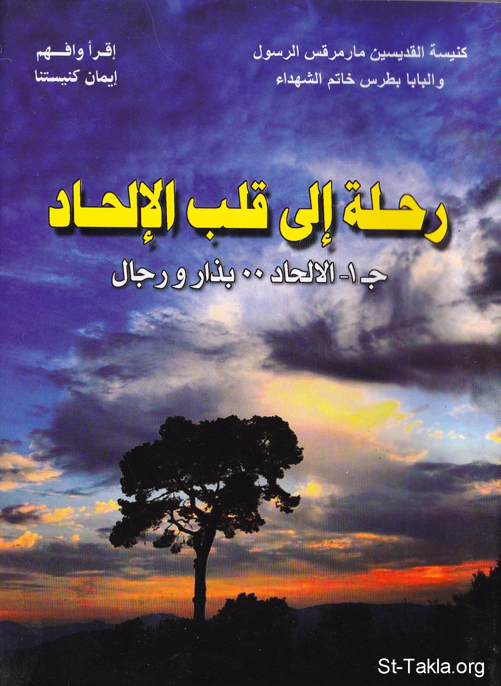

# رحلة إلى قلب الإلحاد

**المؤلف / Author:** أ. حلمي القمص يعقوب
**المصدر / Source:** [st-takla.org](https://st-takla.org/books/helmy-elkommos/atheism/index.html)
**الموضوعات / Topics:** —

📘 **[Download EPUB / تحميل الكتاب](atheism.epub)**

## نبذة

نشكر الأستاذ حلمي القمص يعقوب على السماح لنا في موقع الأنبا تكلا هيمانوت بوضع هذا الكتاب هنا. وهو أحد كتب سلسلة " أقرأ وافهم إيمان كنيستنا ".

## الفصول / Chapters (62)

1. [تقديم - كتاب الإلحاد: رحلة إلى قلب الإلحاد](chapters/01-intro/)
2. [شجرة الإلحاد - كتاب الإلحاد: رحلة إلى قلب الإلحاد](chapters/02-tree/)
3. [ذئب شيوعي تصطاده الحملان 1 - كتاب الإلحاد: رحلة إلى قلب الإلحاد](chapters/03-wolf1/)
4. [ما هو الإلحاد؟ أنواع الإلحاد - اللادين - اللاأدرية](chapters/04-what/)
5. [الصراع البروتستانتي الكاثوليكي - كتاب الإلحاد: رحلة إلى قلب الإلحاد](chapters/05-protestant/)
6. [نظرية التطور والبقاء للأصلح - كتاب الإلحاد: رحلة إلى قلب الإلحاد](chapters/06-evolution/)
7. [الظلم والطغيان - كتاب الإلحاد: رحلة إلى قلب الإلحاد](chapters/07-injustice/)
8. [شهوة الكبرياء - كتاب الإلحاد: رحلة إلى قلب الإلحاد](chapters/08-pride/)
9. [الكوارث والحروب والعقاب الأبدي - كتاب الإلحاد: رحلة إلى قلب الإلحاد](chapters/09-wars/)
10. [الخلط بين المسيحية والشيوعية - كتاب الإلحاد: رحلة إلى قلب الإلحاد](chapters/10-communism/)
11. [نظرة تأمل 1 - كتاب الإلحاد: رحلة إلى قلب الإلحاد](chapters/11-contemplation1/)
12. [ذئب شيوعي تصطاده الحملان 2 - كتاب الإلحاد: رحلة إلى قلب الإلحاد](chapters/12-wolf2/)
13. [كارل ماركس (1818-1883م.) - كتاب الإلحاد: رحلة إلى قلب الإلحاد](chapters/13-marx/)
14. [فلاديمير لينين (1870-1924م.) - كتاب الإلحاد: رحلة إلى قلب الإلحاد](chapters/14-lenin/)
15. [جوزيف ستالين (1879-1953م.) - كتاب الإلحاد: رحلة إلى قلب الإلحاد](chapters/15-stalin/)
16. [هولباخ (1723-1789م.) - كتاب الإلحاد: رحلة إلى قلب الإلحاد](chapters/16-holbach/)
17. [جورج هيجل (1770-1831م.) - كتاب الإلحاد: رحلة إلى قلب الإلحاد](chapters/17-hegel/)
18. [آرثر شوبنهاور (1788-1860م.) - كتاب الإلحاد: رحلة إلى قلب الإلحاد](chapters/18-schopenhauer/)
19. [فريدريك نيتشه (1844-1900م.) - كتاب الإلحاد: رحلة إلى قلب الإلحاد](chapters/19-nietzsche/)
20. [أدولف هتلر (1889-1945م.) - كتاب الإلحاد: رحلة إلى قلب الإلحاد](chapters/20-hitler/)
21. [ماوتسي تونج (1893-1876م.) - كتاب الإلحاد: رحلة إلى قلب الإلحاد](chapters/21-zedong/)
22. [برتراند راسل (1872-1970م.) - كتاب الإلحاد: رحلة إلى قلب الإلحاد](chapters/22-russell/)
23. [جان بول سارتر (1905-1980م.) - كتاب الإلحاد: رحلة إلى قلب الإلحاد](chapters/23-sartre/)
24. [نظرة تأمل 2 - كتاب الإلحاد: رحلة إلى قلب الإلحاد](chapters/24-contemplation2/)
25. [ذئب شيوعي تصطاده الحملان 3 - كتاب الإلحاد: رحلة إلى قلب الإلحاد](chapters/25-wolf3/)
26. [إنكار وجود الله - كتاب الإلحاد: رحلة إلى قلب الإلحاد](chapters/26-god/)
27. [المبررات التي أعتمد عليها بعض الفلاسفة في إنكار وجود الله - كتاب الإلحاد: رحلة إلى قلب الإلحاد](chapters/27-disbelief/)
28. [هل يمكن أن تكون فكرة وجود الله من صنع الإنسان وخياله؟ - كتاب الإلحاد: رحلة إلى قلب الإلحاد](chapters/28-man/)
29. [الكون الذي نعيش فيه - كتاب الإلحاد: رحلة إلى قلب الإلحاد](chapters/29-universe/)
30. [هل يمكن أن يكون الكون أزليًّا؟ - كتاب الإلحاد: رحلة إلى قلب الإلحاد](chapters/30-eternal/)
31. [لو كان الكون وليد الصدفة، فمن الذي وضع قوانين الكون؟ - كتاب الإلحاد: رحلة إلى قلب الإلحاد](chapters/31-chance/)
32. [لو كان الكون وليد الصدفة، فمن الذي أوجد العناصر؟ - كتاب الإلحاد: رحلة إلى قلب الإلحاد](chapters/32-elements/)
33. [لو كان الكون وليد الصدفة، فمن الذي يضبط الكون؟ - كتاب الإلحاد: رحلة إلى قلب الإلحاد](chapters/33-control/)
34. [كيف تشهد أعضاء الإنسان وأجهزته على وجود الله؟ - كتاب الإلحاد: رحلة إلى قلب الإلحاد](chapters/34-body/)
35. [ما هو دليل القصد أو الغاية؟ وكيف ينطبق على العين والمُخ والقلب؟ - كتاب الإلحاد: رحلة إلى قلب الإلحاد](chapters/35-brain/)
36. [كيف تشهد عظمة الخلية الحيَّة على وجود الله؟ - كتاب الإلحاد: رحلة إلى قلب الإلحاد](chapters/36-cell/)
37. [لقطة للتاريخ - كتاب الإلحاد: رحلة إلى قلب الإلحاد](chapters/37-history1/)
38. [الفصل الثاني: الاعتقاد بأزلية المادة وتطورها - كتاب الإلحاد: رحلة إلى قلب الإلحاد](chapters/38-matter/)
39. [هل يمكن أن تكون المادة أزلية؟ - كتاب الإلحاد: رحلة إلى قلب الإلحاد](chapters/39-cant/)
40. [هل يمكن أن تتطور المادة إلى كائنات حية؟ - كتاب الإلحاد: رحلة إلى قلب الإلحاد](chapters/40-living/)
41. [هل هناك أدلة تثبت بطلان نظرية التطور؟ - كتاب الإلحاد: رحلة إلى قلب الإلحاد](chapters/41-theory/)
42. [هل يمكن أن يكون الإنسان وليد تطور القردة؟ - كتاب الإلحاد: رحلة إلى قلب الإلحاد](chapters/42-ape/)
43. [هل استطاع المُلحدون تفسير ظاهرة الموت؟ - كتاب الإلحاد: رحلة إلى قلب الإلحاد](chapters/43-death/)
44. [هل عدم إدراك الله بالحواس يعني عدم وجوده؟ - كتاب الإلحاد: رحلة إلى قلب الإلحاد](chapters/44-touch/)
45. [لقطة للتاريخ 2](chapters/45-history2/)
46. [تأليه الإنسان ورفض السلطة الإلهية - كتاب الإلحاد: رحلة إلى قلب الإلحاد](chapters/46-idolization/)
47. [هل وجود الله يحد من حرية الإنسان ويلغي كرامته ووجوده؟ وهل نجح الإلحاد في أن يهب السعادة للإنسان؟ - كتاب الإلحاد: رحلة إلى قلب الإلحاد](chapters/47-freedom/)
48. [هل اللاأدرية تهب السعادة والحرية للإنسان؟ - كتاب الإلحاد: رحلة إلى قلب الإلحاد](chapters/48-happiness/)
49. [لقطة للتاريخ 3](chapters/49-history3/)
50. [الفصل الرابع: الدين أفيون الشعوب - كتاب الإلحاد: رحلة إلى قلب الإلحاد](chapters/50-opium/)
51. [ماذا رأى المُلحدون في الدين؟ - كتاب الإلحاد: رحلة إلى قلب الإلحاد](chapters/51-religion/)
52. [هل دعت المسيحية للخنوع والجبن والمهانة والخسة؟ - كتاب الإلحاد: رحلة إلى قلب الإلحاد](chapters/52-christianity/)
53. [ربط الإلحاديون العلم بالإلحاد، والدين بالخرافات والأساطير - كتاب الإلحاد: رحلة إلى قلب الإلحاد](chapters/53-myths/)
54. [لقطة للتاريخ 4 - كتاب الإلحاد: رحلة إلى قلب الإلحاد](chapters/54-history/)
55. [نظرة تأمل 4 - كتاب الإلحاد: رحلة إلى قلب الإلحاد](chapters/55-contemplation4/)
56. [الكتاب المقدَّس و سفر الإلحاد - كتاب الإلحاد: رحلة إلى قلب الإلحاد](chapters/56-book/)
57. [كيف قاوم الملحدون الكتاب المقدس، وكيف تصدى الكتاب المقدَّس للإلحاد؟ - كتاب الإلحاد: رحلة إلى قلب الإلحاد](chapters/57-bible/)
58. [سفر الإلحاد، ودعاية الشيوعية له - كتاب الإلحاد: رحلة إلى قلب الإلحاد](chapters/58-atheism/)
59. [سقوط الشيوعية على يد "ميخائيل جوربتشوف" - كتاب الإلحاد: رحلة إلى قلب الإلحاد](chapters/59-gorbachev/)
60. [لقطة للتاريخ 5 - كتاب الإلحاد: رحلة إلى قلب الإلحاد](chapters/60-history5/)
61. [نظرة تأمل 5 - كتاب الإلحاد: رحلة إلى قلب الإلحاد](chapters/61-contemplation5/)
62. [المراجع - كتاب الإلحاد: رحلة إلى قلب الإلحاد](chapters/62-ref/)

---
*هذا الكتاب مجاني للنشر والتوزيع لخلاص كل نفس. This book is free to share and distribute for the salvation of every soul.*
