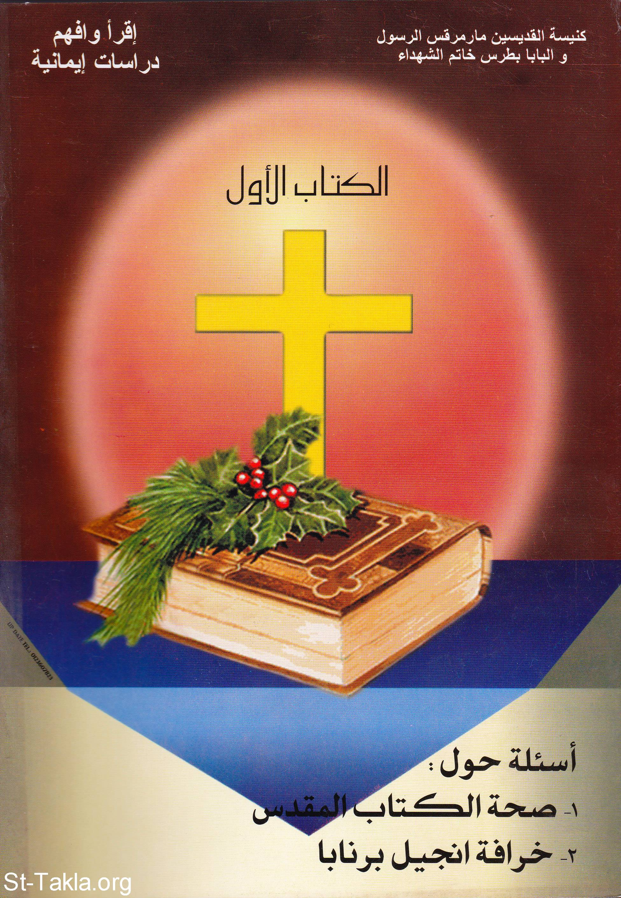

# أسئلة حول صحة الكتاب المقدس - خرافة إنجيل برنابا

**المؤلف / Author:** أ. حلمي القمص يعقوب
**المصدر / Source:** [st-takla.org](https://st-takla.org/books/helmy-elkommos/bible-gospel/index.html)
**الموضوعات / Topics:** —

📘 **[Download EPUB / تحميل الكتاب](bible-gospel.epub)**

## نبذة

نشكر الأستاذ حلمي القمص يعقوب على السماح لنا في موقع الأنبا تكلا هيمانوت بوضع هذا الكتاب هنا. وهو أحد كتب سلسلة اقرأ وأفهم: دراسات إيمانية .

## الفصول / Chapters (71)

1. [مقدمة - كتاب أسئلة حول صحة الكتاب المقدس](chapters/01-intro/)
2. [فكرة عامة عن الكتاب المقدس - كتاب أسئلة حول صحة الكتاب المقدس](chapters/02-ketab/)
3. [كم من الوقت استغرق الكتاب المقدس في كتابته؟ - كتاب أسئلة حول صحة الكتاب المقدس](chapters/03-time/)
4. [كم شخص اشترك في كتابة الأسفار المقدسة؟ - كتاب أسئلة حول صحة الكتاب المقدس](chapters/04-how-many/)
5. [هل كتب جميع الكتَّاب في منطقة واحدة؟ - كتاب أسئلة حول صحة الكتاب المقدس](chapters/05-place/)
6. [بأي لغة كُتِبت الأسفار المقدسة؟ - كتاب أسئلة حول صحة الكتاب المقدس](chapters/06-language/)
7. [هل الكتابة كانت قد عُرِفت وقت موسى النبي؟ - كتاب أسئلة حول صحة الكتاب المقدس](chapters/07-moses/)
8. [هل عاش جميع الكتَّاب في بيئة واحدة? - كتاب أسئلة حول صحة الكتاب المقدس](chapters/08-similar/)
9. [ما هو السرُّ في وحدة الكتاب المقدس؟ - كتاب أسئلة حول صحة الكتاب المقدس](chapters/09-unity/)
10. [مفهوم الوحي في المسيحية: كل الكتاب هو موحى به من الله - كتاب أسئلة حول صحة الكتاب المقدس](chapters/10-inspiration/)
11. [قوة الكتاب المقدس - كتاب أسئلة حول صحة الكتاب المقدس](chapters/11-power/)
12. [قوة وتأثير الكتاب المقدس على الأشخاص والشعوب - كتاب أسئلة حول صحة الكتاب المقدس](chapters/12-people/)
13. [هل صمد الكتاب المقدس ضد هجمات الشيطان؟ - كتاب أسئلة حول صحة الكتاب المقدس](chapters/13-devil/)
14. [دليل مادي ملموس على قوة وصحة الكتاب المقدس - كتاب أسئلة حول صحة الكتاب المقدس](chapters/14-proof/)
15. [كيف شهد مشاهير التاريخ لقوة وصحة الكتاب المقدس؟ - كتاب أسئلة حول صحة الكتاب المقدس](chapters/15-celebs/)
16. [مخطوطات الكتاب المقدس - كتاب أسئلة حول صحة الكتاب المقدس](chapters/16-manuscripts/)
17. [النسخ الأصلية للأسفار المقدسة قد فُقدت، فهل ما بعدها نسخة طبق الأصل؟ - كتاب أسئلة حول صحة الكتاب المقدس](chapters/17-original/)
18. [كيف كانت تتم نساخة الأسفار المقدسة؟ - كتاب أسئلة حول صحة الكتاب المقدس](chapters/18-reproduction/)
19. [المواد التي دوَّنت عليها الأسفار القانونية - كتاب أسئلة حول صحة الكتاب المقدس](chapters/19-materials/)
20. [ما هي أهم النسخ التاريخية للأسفار المقدسة؟ - كتاب أسئلة حول صحة الكتاب المقدس](chapters/20-copies/)
21. [ترجمات الكتاب المقدس - كتاب أسئلة حول صحة الكتاب المقدس](chapters/21-translations/)
22. [هل هناك أخطاء في ترجمة الإنجيل؟ وألا تعتبر الترجمات المختلفة واختلاف الألفاظ نوعًا من التحريف؟ - كتاب أسئلة حول صحة الكتاب المقدس](chapters/22-translating/)
23. [هل هناك ترجمات كتابية غيرت في العقائد المسيحية؟ - كتاب أسئلة حول صحة الكتاب المقدس](chapters/23-dogma/)
24. [ما هي أهم ترجمات الكتاب المقدس؟ - كتاب أسئلة حول صحة الكتاب المقدس](chapters/24-top/)
25. [شهادة الكتاب المقدس لنفسه - كتاب أسئلة حول صحة الكتاب المقدس](chapters/25-testimony/)
26. [هل يشهد الكتاب المقدس لنفسه؟ وهل شهادته هي حق؟ - كتاب أسئلة حول صحة الكتاب المقدس](chapters/26-itself/)
27. [هل تحققت نبوءات الكتاب التي كان يصعب تصديقها؟ - كتاب أسئلة حول صحة الكتاب المقدس](chapters/27-prophecies/)
28. [شهادة العقل والمنطق لصحة الإنجيل - كتاب أسئلة حول صحة الكتاب المقدس](chapters/28-mind/)
29. [هل العقل والمنطق يشهدان لصحة الكتاب المقدس؟ - كتاب أسئلة حول صحة الكتاب المقدس](chapters/29-ration/)
30. [اقتباسات آباء الكنيسة بها العهد الجديد بالكامل - كتاب أسئلة حول صحة الكتاب المقدس](chapters/30-new-testament/)
31. [ما هو موقف القرآن من التوراة والإنجيل؟ - كتاب أسئلة حول صحة الكتاب المقدس](chapters/31-quran/)
32. [بعض تساؤلات غير المؤمنين - كتاب أسئلة حول صحة الكتاب المقدس](chapters/32-questions/)
33. [هل يوجد أكثر من ديانة؟ وهل المسيحية ألغت اليهودية؟ - كتاب أسئلة حول صحة الكتاب المقدس](chapters/33-religions/)
34. [ألم ينزل على المسيح بن مريم إنجيل واحد، فلماذا يوجد أربعة أناجيل؟ - كتاب أسئلة حول صحة الكتاب المقدس](chapters/34-one-gospel/)
35. [مشكلة عدم تدوين كتاب الإنجيل أسمائهم في كتاباتهم - كتاب أسئلة حول صحة الكتاب المقدس](chapters/35-names/)
36. [الوحي الإلهي ما بين كلام الله، كلام المسيح، تعليق الكاتِب - كتاب أسئلة حول صحة الكتاب المقدس](chapters/36-three-kinds/)
37. [خمسون ألف خطأ فى الكتاب المقدس: هل معقول؟! - كتاب أسئلة حول صحة الكتاب المقدس](chapters/37-50000-mistakes/)
38. [عصمة الأنبياء في الكتاب المقدس، وأخطائهم المذكورة - كتاب أسئلة حول صحة الكتاب المقدس](chapters/38-torah/)
39. [يقيم لك الرب إلهك نبيًّا في وسطك مثلى له تسمعون: هل هو محمد - كتاب أسئلة حول صحة الكتاب المقدس](chapters/39-prophet/)
40. [المعزى الروح القدس الذي سيرسله الآب بأسمى: الباراكليت، محمود - كتاب أسئلة حول صحة الكتاب المقدس](chapters/40-paraclet/)
41. [تساؤلات أخرى لغير المؤمنين - كتاب أسئلة حول صحة الكتاب المقدس](chapters/41-inquire/)
42. [هل موسى النبي لم يكتب التوراة الحالية؟ - كتاب أسئلة حول صحة الكتاب المقدس](chapters/42-write/)
43. [هل كتاب يحوى هذا التحريض السافر على القتل بلا تمييز يكون هو كتاب الله؟ - كتاب أسئلة حول صحة الكتاب المقدس](chapters/43-kill/)
44. [هل هذه أسفار كتابية: سفر ياشر، سفر ناثان، سفر جاد، إنجيل بولس - كتاب أسئلة حول صحة الكتاب المقدس](chapters/44-books/)
45. [هل تكرار بعض الأمور هو سرقات كتابية غير موحى بها؟ - كتاب أسئلة حول صحة الكتاب المقدس](chapters/45-plagiarize/)
46. [هل يحوي الكتاب المقدس يحوى الكثير من المتناقضات؟ - كتاب أسئلة حول صحة الكتاب المقدس](chapters/46-contradictions/)
47. [ثلاثة أيام موت المسيح، كيف تتطابق مع زمن وجود يونان النبي في بطن الحوت؟ - كتاب أسئلة حول صحة الكتاب المقدس](chapters/47-three-days/)
48. [العلم يقف إجلالًا لعظمة ودقة الكتاب الكريم - كتاب أسئلة حول صحة الكتاب المقدس](chapters/48-great/)
49. [هل تأثر الكتاب المقدس بالأخطاء العلمية والخرافات التي كانت سائدة حينذاك؟ - كتاب أسئلة حول صحة الكتاب المقدس](chapters/49-myths/)
50. [هل يشهد العلم للحقائق العلمية التي وردت بالكتاب المقدس؟ - كتاب أسئلة حول صحة الكتاب المقدس](chapters/50-facts/)
51. [مدارس النقد والتشكيك - كتاب أسئلة حول صحة الكتاب المقدس](chapters/51-criticism/)
52. [ما هي مدارس النقد والتشكيك في الكتاب المقدس؟ - كتاب أسئلة حول صحة الكتاب المقدس](chapters/52-nakd/)
53. [هل الكتاب المقدس غير كامل بدليل وجود الأسفار المحذوفة منفصلة عنه؟ - كتاب أسئلة حول صحة الكتاب المقدس](chapters/53-missing/)
54. [هل شهد أحد من الملحدين للكتاب المقدس؟ - كتاب أسئلة حول صحة الكتاب المقدس](chapters/54-atheist/)
55. [أسئلة وإجابات ومنوعات - كتاب أسئلة حول صحة الكتاب المقدس](chapters/55-various/)
56. [كيف وصلت إلينا الأسفار المقدسة خلال رحلة زمنية تصل إلى أكثر من ثلاثة آلاف عام؟ - كتاب أسئلة حول صحة الكتاب المقدس](chapters/56-reach/)
57. [هل أسفار العهد القديم لابد أن تكون قد تعرضت للضياع أكثر من مرة؟ - كتاب أسئلة حول صحة الكتاب المقدس](chapters/57-lost/)
58. [هل الكتاب المقدس كتاب واحد أو كتابين؟ العهد القديم، العهد الجديد - كتاب أسئلة حول صحة الكتاب المقدس](chapters/58-testament/)
59. [لماذا لم تقبل الكنيسة سوى أربعة أناجيل من أناجيل عديدة؟ - كتاب أسئلة حول صحة الكتاب المقدس](chapters/59-four-gospels/)
60. [هل كُتِبت الأسفار المقدسة بنفس الطريقة التي نقرأها بها الآن من حيث الإصحاحات والآيات؟ - كتاب أسئلة حول صحة الكتاب المقدس](chapters/60-writing/)
61. [ما هي جداول الكتاب المقدس؟ - كتاب أسئلة حول صحة الكتاب المقدس](chapters/61-tables/)
62. [هل هناك قراءات مختلفة للكتاب المقدس؟ - كتاب أسئلة حول صحة الكتاب المقدس](chapters/62-readings/)
63. [هل هذه الآيات ضد الوحي: وأما الباقون فأقول لهم أنا لا الرب؛ الذي أتكلم به لست أتكلم به بحسب الرب - كتاب أسئلة حول صحة الكتاب المقدس](chapters/63-me/)
64. [هل سفر النشيد هو كلام غزل وغرام من سليمان لابنة فرعون وليس وحيًا إلهيًا - كتاب أسئلة حول صحة الكتاب المقدس](chapters/64-songs/)
65. [هل يوجد في الآثار ما يشهد لصحة الكتاب المقدس؟ - كتاب أسئلة حول صحة الكتاب المقدس](chapters/65-monuments/)
66. [خرافة إنجيل برنابا - كتاب أسئلة حول خرافة إنجيل برنابا](chapters/66-bernaba-gospel/)
67. [فكرة عامة عن إنجيل برنابا - كتاب أسئلة حول خرافة إنجيل برنابا](chapters/67-barnabas/)
68. [شخصية السيد المسيح في إنجيل برنابا - كتاب أسئلة حول خرافة إنجيل برنابا](chapters/68-christ/)
69. [إنجيل برنابا - كتاب أسئلة حول خرافة إنجيل برنابا](chapters/69-fake-gosepl/)
70. [هل يتوافق كتاب برنابا مع القرآن؟ - كتاب أسئلة حول خرافة إنجيل برنابا](chapters/70-koran/)
71. [الخرافات والتجاديف والأخطاء في إنجيل برنابا - كتاب أسئلة حول خرافة إنجيل برنابا](chapters/71-superstitions/)

---
*هذا الكتاب مجاني للنشر والتوزيع لخلاص كل نفس. This book is free to share and distribute for the salvation of every soul.*
