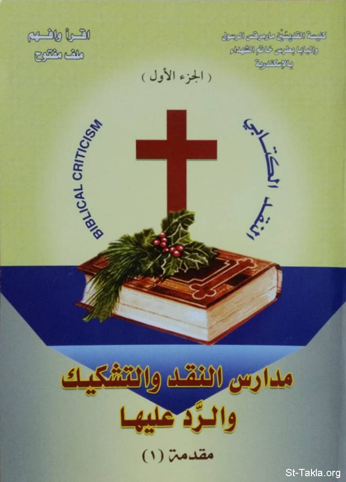

# مقدمة للنقد الكتابي: كتاب مدارس النقد (في الكتاب المقدس) والتشكيك والرد عليها: ج1

**المؤلف / Author:** أ. حلمي القمص يعقوب
**المصدر / Source:** [st-takla.org](https://st-takla.org/books/helmy-elkommos/biblical-criticism/index1.html)
**الموضوعات / Topics:** —

📘 **[Download EPUB / تحميل الكتاب](biblical-criticism.epub)**

## نبذة

نشكر الأستاذ حلمي القمص يعقوب على السماح لنا في موقع الأنبا تكلا هيمانوت بوضع هذا الكتاب هنا.

## الفصول / Chapters (3)

1. [تقديم للأنبا باخوميوس - كتاب مدارس النقد والتشكيك والرد عليها](chapters/01-1a/)
2. [إهداء - كتاب مدارس النقد والتشكيك والرد عليها](chapters/02-1c/)
3. [قصة هذا الكتاب - كتاب مدارس النقد والتشكيك والرد عليها](chapters/03-1b/)

---
*هذا الكتاب مجاني للنشر والتوزيع لخلاص كل نفس. This book is free to share and distribute for the salvation of every soul.*
