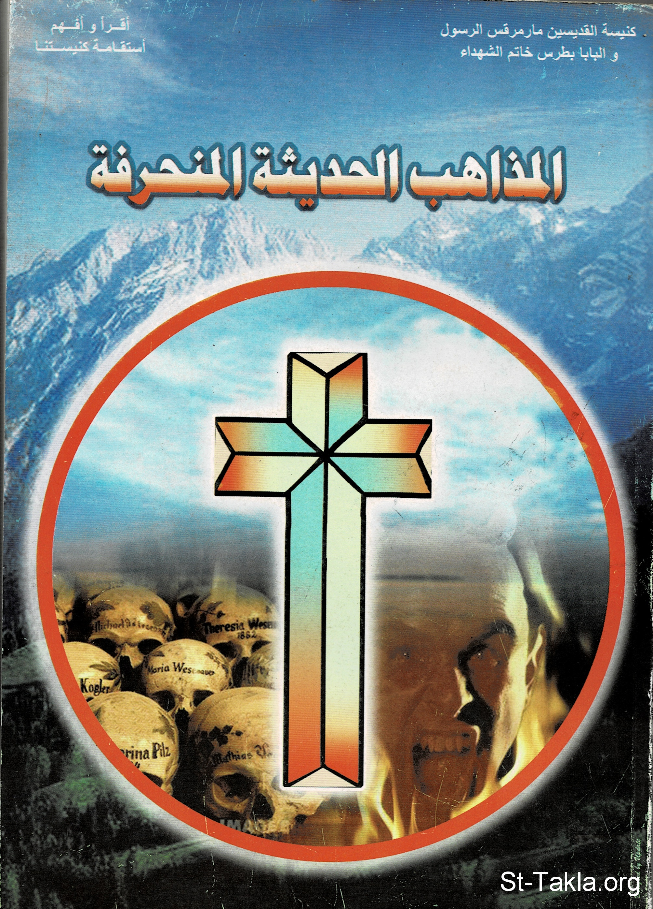

# المذاهب الحديثة المنحرفة

**المؤلف / Author:** أ. حلمي القمص يعقوب
**المصدر / Source:** [st-takla.org](https://st-takla.org/books/helmy-elkommos/crooked-denominations/index.html)
**الموضوعات / Topics:** —

📘 **[Download EPUB / تحميل الكتاب](crooked-denominations.epub)**

## نبذة

نشكر الأستاذ حلمي القمص يعقوب على السماح لنا في موقع الأنبا تكلا هيمانوت بوضع هذا الكتاب هنا. وهو أحد كتب سلسلة اقرأ وأفهم استقامة كنيستنا .

## الفصول / Chapters (46)

1. [تقديم](chapters/01-introduction/)
2. [تمهيد](chapters/02-preface/)
3. [الماسونية](chapters/03-freemasonry/)
4. [كنسية العلم المسيحي](chapters/04-christian-science-church/)
5. [كنيسة الله في كل أنحاء العالم](chapters/05-worldwide-church-of-god/)
6. [جماعة الطريق](chapters/06-the-way-international/)
7. [جماعة أطفال الرب](chapters/07-children-of-god/)
8. [المونير](chapters/08-moonies/)
9. [المورمون](chapters/09-mormonism/)
10. [الفيدية](chapters/10-vedic-religion/)
11. [الهندوسية](chapters/11-hinduism/)
12. [الجينية](chapters/12-jainism/)
13. [البوذية](chapters/13-buddhism/)
14. [السامكيهية](chapters/14-samkhya/)
15. [مهير بابا](chapters/15-meher-baba/)
16. [هاري كريشنا](chapters/16-hare-krishna/)
17. [الصابئة](chapters/17-sabianism-mandaeism/)
18. [معبد الشعب](chapters/18-peoples-temple/)
19. [الأهراميون](chapters/19-pyramidism/)
20. [البابية والبهائية](chapters/20-babism-bahai-faith/)
21. [اليزيدية](chapters/21-yazidis/)
22. [الثيؤصوفية](chapters/22-theosophy/)
23. [القاديانية](chapters/23-qadiyani-ahmadiyya/)
24. [الشامانية](chapters/24-shamanism/)
25. [السانتيريا](chapters/25-santeria/)
26. [كنيسة السينتولوجي](chapters/26-scientology/)
27. [مذهب التأمل الذي يفوق الطبيعة](chapters/27-transcendental-meditation/)
28. [كنيسة الأميرة ديانا](chapters/28-princess-diana/)
29. [مدرسة الوحدة المسيحية](chapters/29-christian-unity/)
30. [مذهب يسوع وحده](chapters/30-jesus-only/)
31. [بانا ويف لابورا توري](chapters/31-pana-wave-laboratory/)
32. [جماعة نداء الملكوت](chapters/32-call-of-the-kingdom/)
33. [موسيقى الروك](chapters/33-rock-music/)
34. [حركة العصر الحديث](chapters/34-new-age/)
35. [ادعاء العنصر الأنثوي في اللاهوت](chapters/35-feminist-theology/)
36. [سيامة المرأة في الكهنوت](chapters/36-female-clergy/)
37. [سيامة الشواذ جنسيًا في رتب الكهنوت](chapters/37-homosexual-clergy/)
38. [جماعة المسيحيين الصرحاء](chapters/38-frank-christians/)
39. [العرافة](chapters/39-fortune-telling/)
40. [الزار](chapters/40-zar/)
41. [التنويم المغناطيسي](chapters/41-hypnosis/)
42. [تحضير الأرواح](chapters/42-evocation/)
43. [تناسخ الأرواح](chapters/43-reincarnation/)
44. [السحر](chapters/44-magic/)
45. [عبادة الشيطان](chapters/45-satanism/)
46. [المراجع](chapters/46-references/)

---
*هذا الكتاب مجاني للنشر والتوزيع لخلاص كل نفس. This book is free to share and distribute for the salvation of every soul.*
